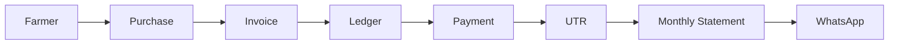
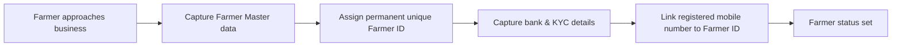
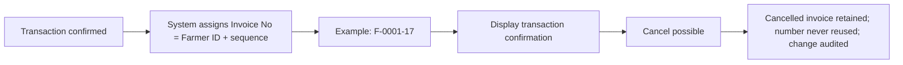
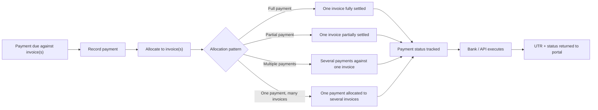
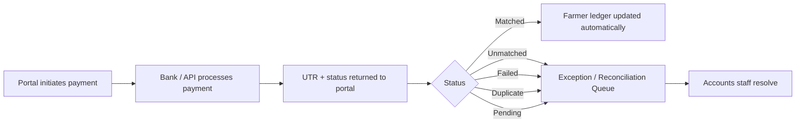
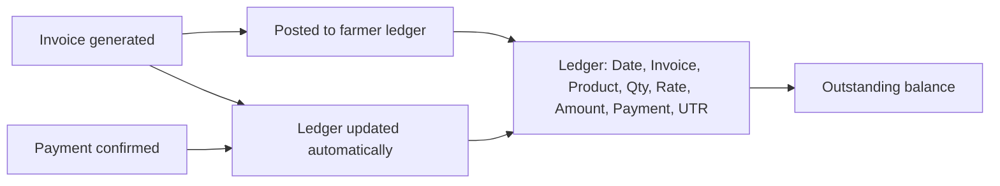
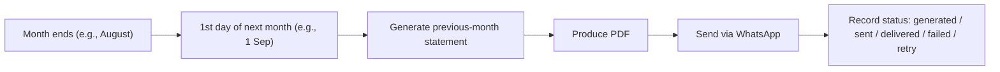
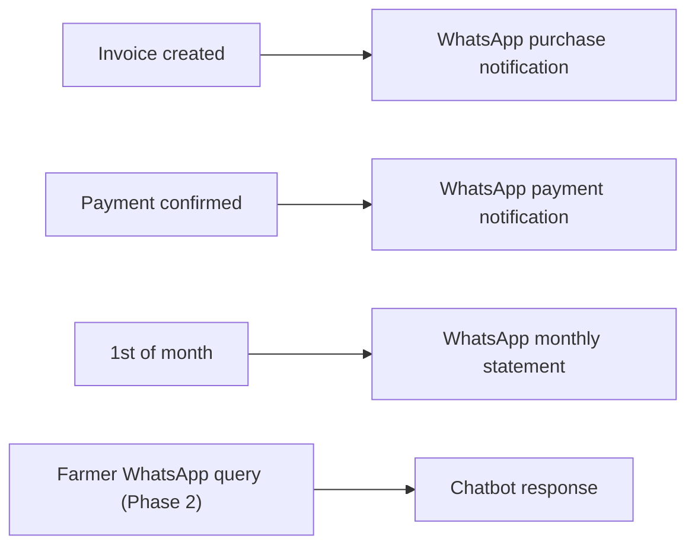
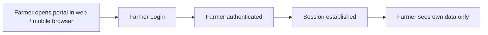
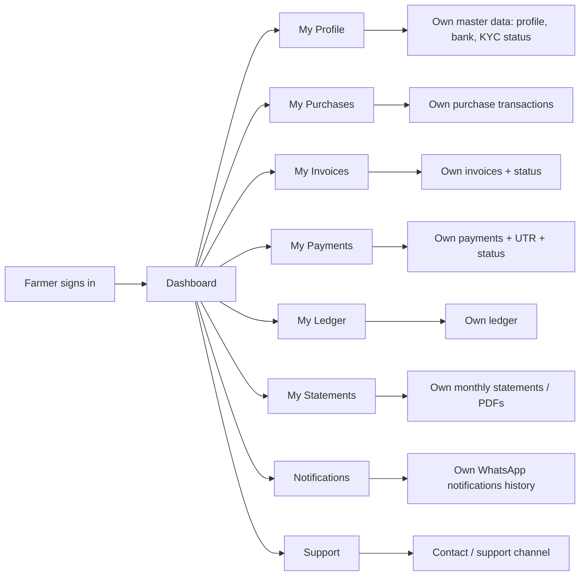

# Agri Procurement & Farmer Management System
## Business Requirements Document (BRD)

---

## 1. Document Information

| Item | Value |
|---|---|
| Product name | Agri Procurement & Farmer Management System |
| Document | Business Requirements Document (BRD) |
| Version | v1.0 |
| Status | Draft — aligned to PRD v1.0; open business questions in §25 pending closure |
| Date | 2026-09-16 |
| Purpose | Define the business processes, actors, rules, exceptions and risks the system must support — in business language, free of implementation detail |
| Source | 1. `AgriProcurement & Farmer Management.pdf` (primary source of truth) 2. `docs/00_DOCUMENTATION_INDEX.md` 3. `docs/01_PRODUCT_REQUIREMENTS_DOCUMENT.md` (PRD v1.0 — functional counterpart) |

### How requirements are distinguished in this document

| Tag | Meaning |
|---|---|
| **Source requirement** | Stated in the original PDF (referenced as `[SOURCE §n]`). Must be honoured as-is. |
| **Newly approved Farmer Portal requirement** | New project decision — Farmer Login / Farmer Web Portal (`[NEW]`). Not in the original PDF. |
| **Proposed Enhancement** | Suggested by this document or the PRD; requires explicit business approval before build. |
| **Undefined requirement** | Not described in the source document; tracked as an open business question (§25). |

> Financial policies and operational rules that do not appear in the source document have **not** been invented here; they are recorded as undefined or as proposed enhancements.

---

## 2. Business Overview

The business purchases agricultural produce directly from a large, distributed base of farmers and exports it. This system is the central, web-based portal through which that purchase operation is run:

- **Employees** record purchases from farmers in the field and generate invoices on the spot.
- **Super Admin** manages the operation: farmers, employees, permissions, settings, WhatsApp and banking integrations.
- **Farmers** are kept informed automatically via WhatsApp (purchase, payment, monthly statement) and — under the newly approved requirement — can log in to a responsive web portal for self-service (`[NEW]`).

The entire operation runs around a **permanent Farmer ID** and an **Employee ID**, so every purchase, invoice, payment and statement is attributable and auditable. Scale: initial ~10,000 farmers and ~100 employees, growing to 50,000 farmers and 500 employees without a fundamental redesign (`[SOURCE §1, §19]`).

Source: `[SOURCE §1–§3]`; PRD §2.

---

## 3. Business Problem

- Farmer and transaction records are not centrally and reliably managed; identity and history are scattered.
- Invoicing is manual and prone to numbering mistakes; no dependable per-farmer document trail.
- Farmers get no consolidated view of their purchases and payments.
- Payment confirmations are slow and opaque; statuses and UTRs are not centrally reconciled.
- Monthly statements are not produced automatically and reliably, and there is no dependable delivery channel.
- Farmers cannot see their own records without visiting the office (`[NEW]` — portal).

Source: `[SOURCE §1–§3, §10–§13]`; PRD §3.

---

## 4. Business Objectives

1. Every farmer purchase is recorded under a permanent, unique identity with a full audit trail (`[SOURCE §2, §3, §17]`).
2. Every purchase automatically produces a correctly numbered, unique invoice that is never typed manually and never reuses a cancelled number (`[SOURCE §6]`).
3. A complete farmer-wise ledger is maintained and updated automatically against confirmed payments (`[SOURCE §9, §11]`).
4. Farmers automatically receive WhatsApp notifications for purchases and confirmed payments (`[SOURCE §8, §12]`).
5. A monthly farmer statement (previous month) is generated and delivered automatically on the 1st of each month (`[SOURCE §13]`).
6. The operation scales to 50,000 farmers / 500 employees without a fundamental redesign (`[SOURCE §1, §19]`).
7. Farmers gain self-service access to their own records through a responsive web portal — no native mobile app in Phase 1 (`[NEW]`).

---

## 5. Stakeholders

| Stakeholder | Interest | Source |
|---|---|---|
| Farmers (sellers) | Accurate records of their produce, invoices, payments and outstanding; receive notifications and statements; `[NEW]` self-service portal access | `[SOURCE §3, §8, §12, §13, §21]` |
| Procurement employees | Fast, accurate purchase entry and invoice generation in the field under their own Employee ID | `[SOURCE §2, §5]` |
| Super Admin / Admin | Full control: masters, permissions, integrations, all financial data and audit | `[SOURCE §2]` |
| Accounts / reconciliation staff | Exception/Reconciliation Queue for unmatched, failed, pending and duplicate payments | `[SOURCE §11]` |
| Management | Overall visibility (incl. area-wise performance in Phase 2), area/employee administration | `[SOURCE §23]` |
| Banking / API provider | Executes payments and returns status + UTR to the system | `[SOURCE §11]` |
| WhatsApp provider | Delivers purchase, payment and statement messages to farmers | `[SOURCE §8, §12, §13]` |

---

## 6. User Types

| User type | Business role | Source |
|---|---|---|
| Super Admin | Runs the whole system; configures permissions, integrations, settings; sees everything, incl. audit logs | `[SOURCE §2]` |
| Procurement Employee | Records purchases and generates invoices while collecting material from farmers; limited to what procurement needs | `[SOURCE §2, §16]` |
| Accounts / reconciliation staff | Works the Exception/Reconciliation Queue to resolve payment mismatches | `[SOURCE §11]` (business role) |
| Farmer (web portal) | `[NEW]` Newly approved — logs in to a responsive web portal to see own profile, purchases, invoices, payments, ledger, statements and notifications | New decision |
| Farmer (WhatsApp, Phase 2) | Indirect user — queries own records via WhatsApp chatbot (Phase 2) | `[SOURCE §21]` |

---

## 7. Current / Expected Business Process

> The **current (as-is) process is not documented in the source requirements** (undefined). The source describes the **expected (target) business process**; that is what this document specifies.

The expected end-to-end business process chain is:

Source: `[SOURCE §1]` — core transaction chain: Farmer → Purchase → Invoice → Ledger → Payment → UTR → Monthly Statement → WhatsApp.

The sections below break this chain into the individual business processes the system must execute.

---

## 8. Farmer Registration Process

Requirements in this section: **source** where the Farmer Master fields are defined; the **onboarding workflow itself is undefined** in the source.

| # | Process step | Detail | Source | Tag |
|---|---|---|---|---|
| 8.1 | Farmer Master data capture | Farmer name, mobile, address, village, taluka, district, state | `[SOURCE §3]` | Source requirement |
| 8.2 | Bank capture | Bank name, account number, IFSC | `[SOURCE §3]` | Source requirement |
| 8.3 | KYC capture | KYC information/documents where required | `[SOURCE §3]` | Source requirement |
| 8.4 | Farmer ID assignment | Permanent unique Farmer ID (e.g., F-0001); the primary business identity | `[SOURCE §3]` | Source requirement |
| 8.5 | Mobile linking | Registered mobile is linked to the Farmer ID for WhatsApp identification | `[SOURCE §3]` | Source requirement |
| 8.6 | Registration date & status | Registration date and status captured | `[SOURCE §3]` | Source requirement |
| 8.7 | Products supplied | Products the farmer normally supplies | `[SOURCE §3]` | Source requirement |
| 8.8 | Internal remarks | Free-text internal remarks | `[SOURCE §3]` | Source requirement |
| 8.9 | Onboarding/initiation of registration | Who initiates registration, approval steps, document verification workflow | **Undefined requirement** (see OQ-10, OQ-15) | Undefined |
| 8.10 | Duplicate account handling | Same mobile/WhatsApp against a second Farmer ID | **Undefined requirement** (see OQ-13) | Undefined |

---

## 9. Procurement Process

Source requirement — the complete workflow is defined in `[SOURCE §5]`.

| # | Process step | Detail | Source |
|---|---|---|---|
| 9.1 | Login | Individual employee login | `[SOURCE §2]` |
| 9.2 | Select/search farmer | Farmer identified by ID/name | `[SOURCE §5]` |
| 9.3 | Select product | Product chosen from system options | `[SOURCE §5]` |
| 9.4 | Enter weight/quantity | Quantity/weight with unit | `[SOURCE §5]` |
| 9.5 | Enter rate | Rate per unit | `[SOURCE §5]` |
| 9.6 | Calculate amount | Amount = Quantity × Rate (automatic) | `[SOURCE §5]` |
| 9.7 | Deduction | Deduction, if applicable → net amount | `[SOURCE §5]` |
| 9.8 | Confirm & generate invoice | Confirm → Generate Invoice | `[SOURCE §5]` |
| 9.9 | Attribution | Transaction records the creating employee (backend trail) | `[SOURCE §2]` |
| 9.10 | Notification | WhatsApp purchase notification sent after invoice creation | `[SOURCE §8]` |
| 9.11 | Deduction rules | Deduction types, reasons, approvals | **Undefined requirement** (OQ-06) |
| 9.12 | Product & rate governance | Product catalogue, rate deviation approval | **Undefined requirement** (OQ-05) |

---

## 10. Invoice Process

Source requirement — numbering and confirmation rules are fully defined.

| # | Process step | Detail | Source |
|---|---|---|---|
| 10.1 | Automatic numbering | Invoice number generated from Farmer ID + per-farmer transaction sequence (e.g., F-0001-01, F-0001-02) | `[SOURCE §6]` |
| 10.2 | Uniqueness | Invoice number unique | `[SOURCE §6]` |
| 10.3 | Sequence isolation | Sequence maintained separately per farmer | `[SOURCE §6]` |
| 10.4 | Confirmation display | Farmer, Invoice, Date, Product, Quantity, Rate, Total, Employee | `[SOURCE §7]` |
| 10.5 | Cancellation | Cancelled invoices remain in system; numbers not reused; modifications audited | `[SOURCE §6, §17]` |
| 10.6 | No manual entry | Employees do not type invoice numbers | `[SOURCE §6]` |
| 10.7 | Invoice output | Whether the confirmation is printable/PDF and reprint rules | **Undefined requirement** (OQ-07) |
| 10.8 | Cancellation authorisation | Who cancels, reason capture, ledger impact | **Undefined requirement** (OQ-08) |
| 10.9 | Corrections | Correction of erroneous invoices (mentioned only as a Phase 2 reporting scope item, "Corrections and cancellations") | `[SOURCE §24]` — scope listed; procedure undefined |

---

## 11. Payment Process

Source requirement — payment recording and allocation rules are defined.

| # | Process step | Detail | Source |
|---|---|---|---|
| 11.1 | Payment record | Farmer ID, invoice number/allocation, amount, date, status, mode, bank reference, UTR, remarks | `[SOURCE §10]` |
| 11.2 | Full payment | One invoice fully paid | `[SOURCE §10]` |
| 11.3 | Partial payment | One invoice partially paid | `[SOURCE §10]` |
| 11.4 | Multiple payments per invoice | Several payments settle one invoice | `[SOURCE §10]` |
| 11.5 | Multiple invoices per payment | One payment settles several invoices | `[SOURCE §10]` |
| 11.6 | Payment modes | Accepted payment modes / methods | **Undefined requirement** (OQ-03 related) |
| 11.7 | Manual payment confirmation if no API support | Handling when provider does not return UTR/status automatically | **Undefined requirement** (OQ-03) |

---

## 12. Bank Reconciliation Process

Source requirement — automated reconciliation workflow.

| # | Process step | Detail | Source |
|---|---|---|---|
| 12.1 | Portal → Bank/API | Payment initiated from portal to bank/API | `[SOURCE §11]` |
| 12.2 | UTR/status return | Payment → UTR/status → Portal, automatically wherever supported | `[SOURCE §11]` |
| 12.3 | Ledger update | Ledger updated automatically on confirmation | `[SOURCE §11]` |
| 12.4 | Statuses | matched, unmatched, failed, pending, duplicate maintained | `[SOURCE §11]` |
| 12.5 | Exception queue | Exception/Reconciliation Queue for accounts staff | `[SOURCE §11]` |
| 12.6 | Queue resolution rules | How each queue item is resolved / re-attempted | **Undefined requirement** (OQ-03 related) |

---

## 13. Ledger Process

Source requirement.

| # | Process step | Detail | Source |
|---|---|---|---|
| 13.1 | Farmer-wise ledger | Complete ledger maintained per farmer within the system | `[SOURCE §9]` |
| 13.2 | Ledger content | Date, invoice, product, quantity, rate, amount, payment, UTR | `[SOURCE §9]` |
| 13.3 | Automatic update | Confirmed payments update the ledger automatically | `[SOURCE §11]` |
| 13.4 | Outstanding | Outstanding balance derivable per farmer | Derived from `[SOURCE §9, §14, §15]` |
| 13.5 | Cancelled-invoice handling in ledger | Treatment of cancelled invoices in the ledger | **Undefined requirement** (OQ-08) |

---

## 14. Monthly Statement Process

Source requirement — fully defined.

| # | Process step | Detail | Source |
|---|---|---|---|
| 14.1 | Trigger | 1st day of every month; statement for previous month (e.g., 1 Sep → 1–31 Aug) | `[SOURCE §13]` |
| 14.2 | Content | Farmer ID + name, statement period, opening balance (if applicable), all purchase invoices (product, qty, rate, amount), all payments (dates + UTRs), closing/outstanding balance | `[SOURCE §13]` |
| 14.3 | Format | PDF | `[SOURCE §13]` |
| 14.4 | Delivery | Automatic WhatsApp delivery | `[SOURCE §13]` |
| 14.5 | Status tracking | generated / sent / delivered / failed / retry recorded | `[SOURCE §13]` |
| 14.6 | Generation time/timezone & retry parameters | Exact time, timezone, retry frequency | **Undefined requirement** (OQ-14) |

---

## 15. WhatsApp Notification Process

Source requirements for the three notification types plus the Phase 2 chatbot.

| Notification | Trigger | Content (indicative) | Source |
|---|---|---|---|
| 15.1 Purchase notification | Invoice created successfully | Invoice no., date, product, quantity, rate, total | `[SOURCE §8]` |
| 15.2 Payment notification | Bank/API confirms payment | Amount credited, UTR, date, invoice reference | `[SOURCE §12]` |
| 15.3 Monthly statement | 1st of month | Statement PDF, period, balances | `[SOURCE §13]` |
| 15.4 Phase 2 chatbot | Farmer WhatsApp query | Outstanding, ledger, purchases, payments, last payment, last purchase, invoice details, statement, payment status | `[SOURCE §21]` |

| # | Process step | Detail | Source |
|---|---|---|---|
| 15.5 | Identification | Farmer identified by registered mobile linked to Farmer ID | `[SOURCE §3]` |
| 15.6 | Provider & message policy | Provider and utility-vs-template usage for business-initiated messages | **Undefined requirement** (OQ-04) |
| 15.7 | Failure handling | Retry/failure handling for purchase & payment notifications (statement retry is specified in §13) | **Undefined requirement** (OQ-04 related) |

---

## 16. Farmer Login Process

**Newly approved Farmer Portal requirement (`[NEW]`)** — not part of the original PDF.

| # | Process step | Detail | Tag |
|---|---|---|---|
| 16.1 | Portal access | Responsive web / mobile-browser based | Newly approved requirement (`[NEW]`, N-01/N-02) |
| 16.2 | No native app in Phase 1 | Portal is not a native mobile application in Phase 1 | Newly approved boundary (`[NEW]`, N-03; consistent with `[SOURCE §1]`) |
| 16.3 | Authentication | Secure login required; **OTP via registered mobile is a Proposed Enhancement**; final method pending | Newly approved requirement; OTP = Proposed Enhancement |
| 16.4 | Data boundary | Farmer sees only own records | Newly approved requirement (derived from `[SOURCE §22]` access philosophy) |
| 16.5 | Activation/onboarding | How portal accounts are activated and farmers are invited | **Undefined requirement** (OQ-15) |
| 16.6 | Language | Portal languages / display preferences | **Undefined requirement** (OQ-17) |

---

## 17. Farmer Self-Service Process

**Newly approved Farmer Portal requirement (`[NEW]`)** — module list below is the approved module set; the detailed behaviour of each is undefined (feature scope pending, OQ-01).

| # | Module | Business purpose | Tag |
|---|---|---|---|
| 17.1 | Dashboard | Farmer's own summary: purchases, payments, outstanding | Newly approved (`[NEW]`) |
| 17.2 | My Profile | View/edit own master data (bank, KYC visibility pending OQ-18) | Newly approved (`[NEW]`) |
| 17.3 | My Purchases | Itemised list of own purchases | Newly approved (`[NEW]`) |
| 17.4 | My Invoices | Own invoices and their status | Newly approved (`[NEW]`) |
| 17.5 | My Payments | Own payments incl. date, mode, UTR, status | Newly approved (`[NEW]`) |
| 17.6 | My Ledger | Own ledger view | Newly approved (`[NEW]`) |
| 17.7 | My Statements | Own monthly statement PDFs | Newly approved (`[NEW]`) |
| 17.8 | Notifications | History of notifications the farmer received | Newly approved (`[NEW]`) |
| 17.9 | Support | Channel for farmer queries/complaints | Newly approved (`[NEW]`); channel undefined (OQ-16) |
| 17.10 | Edit permissions | What farmers may edit vs view-only | **Undefined requirement** (OQ-18) |
| 17.11 | Read-only/integrity | Portal reflects the system of record; farmer cannot tamper with financial entries | Newly approved (derived from `[SOURCE §17]` no-silent-overwrite rule) |

---

## 18. Admin Operations

Source requirement.

| # | Operation | Detail | Source |
|---|---|---|---|
| 18.1 | Full access | Super Admin full access to entire system | `[SOURCE §2]` |
| 18.2 | Manage masters | Manage employees and farmers | `[SOURCE §2]` |
| 18.3 | View everything | All areas, procurement, invoices, payments, ledgers, reports | `[SOURCE §2]` |
| 18.4 | Settings & integrations | Manage settings, WhatsApp and banking integrations | `[SOURCE §2]` |
| 18.5 | Audit | View audit logs | `[SOURCE §2]` |
| 18.6 | Dashboard | KPIs: total farmers, active farmers, total employees, today's procurement, today's procurement value, monthly procurement, pending farmer payments, payments made, total outstanding, number of invoices, unreconciled bank transactions; date filters | `[SOURCE §15]` |
| 18.7 | Permissions | Permission matrix configurable by Admin | `[SOURCE §16]` |
| 18.8 | Phase 2 — areas | Create/manage areas; assign farmers & employees; reassign; transfer; area-wise performance | `[SOURCE §23]` |

---

## 19. Reporting Requirements

Source requirement.

| Report category | Reports the business needs | Source |
|---|---|---|
| Farmer | Farmer-wise purchase, payment, outstanding, ledger, monthly statement | `[SOURCE §14]` |
| Procurement | Date-wise, product-wise, employee-wise, farmer-wise, quantity-wise, rate-wise | `[SOURCE §14]` |
| Payment | Payment register, UTR register, paid, partially paid, pending, unreconciled | `[SOURCE §14]` |
| Export formats | Excel, PDF, CSV where appropriate | `[SOURCE §14]` |
| Phase 2 — Area-wise | Farmer count, procurement, payment, outstanding per area | `[SOURCE §24]` |
| Phase 2 — Employee performance | Farmers handled, invoices created, quantity purchased, purchase value, average rate | `[SOURCE §24]` |
| Phase 2 — Corrections | Corrections and cancellations reporting | `[SOURCE §24]` (scope listed) |
| Report definitions/scheduling | Exact report structures, filters, schedules | **Undefined requirement** (OQ related) |

---

## 20. Audit Requirements

Source requirement.

| # | Requirement | Detail | Source |
|---|---|---|---|
| 20.1 | Trail fields | User/employee ID, date & time, action, original value, new value, record affected | `[SOURCE §17]` |
| 20.2 | Context | IP/device information where appropriate | `[SOURCE §17]` |
| 20.3 | Invoice changes | All invoice modifications captured | `[SOURCE §6]` |
| 20.4 | No silent overwrite | Historical financial records never silently overwritten | `[SOURCE §17]` |
| 20.5 | Visibility | Super Admin can view audit logs | `[SOURCE §2]` |
| 20.6 | Retention | How long audit data is kept / archived | **Undefined requirement** (OQ-11) |

---

## 21. Business Rules

Business rules from the source (must be honoured as-is; no new rules invented).

| # | Business rule | Source |
|---|---|---|
| 21.1 | Farmer ID is permanent, unique, and the farmer's primary business identity (e.g., F-0001) | `[SOURCE §3]` |
| 21.2 | Registered mobile is linked to Farmer ID and is the WhatsApp identity | `[SOURCE §3, §21]` |
| 21.3 | Invoice number = Farmer ID + transaction sequence (e.g., F-0001-17); stored as separate fields | `[SOURCE §6]` |
| 21.4 | Invoice numbers unique; per-farmer sequence independent | `[SOURCE §6]` |
| 21.5 | Cancelled invoices remain; numbers never reused | `[SOURCE §6]` |
| 21.6 | Employees never type invoice numbers; all invoice changes audited | `[SOURCE §6, §17]` |
| 21.7 | Invoice amount = Quantity × Rate, calculated automatically | `[SOURCE §5]` |
| 21.8 | Every transaction is attributed to the creating employee | `[SOURCE §2]` |
| 21.9 | Statements generated on the 1st of each month for the previous month | `[SOURCE §13]` |
| 21.10 | Historical financial records never silently overwritten | `[SOURCE §17]` |
| 21.11 | Payments: full, partial, multiple-per-invoice, and multi-invoice per payment | `[SOURCE §10]` |
| 21.12 | Payment statuses: matched, unmatched, failed, pending, duplicate | `[SOURCE §11]` |
| 21.13 | (Phase 2) Employees access only their assigned area farmers; enforced at backend/database level | `[SOURCE §22]` |
| 21.14 | (Phase 1) No native mobile application for farmers | `[SOURCE §1]`; `[NEW]` N-03 |

---

## 22. Exception Scenarios

| # | Exception scenario | Handling | Source / tag |
|---|---|---|---|
| 22.1 | Invoice cancelled after creation | Invoice retained; number not reused; change audited | `[SOURCE §6, §17]` |
| 22.2 | Payment fails at bank | Status = failed; routed to reconciliation queue | `[SOURCE §11]` |
| 22.3 | Payment UTR not matched to invoice | Status = unmatched; reconciliation queue | `[SOURCE §11]` |
| 22.4 | Duplicate payment received | Status = duplicate; reconciliation queue | `[SOURCE §11]` |
| 22.5 | Payment still in progress | Status = pending | `[SOURCE §11]` |
| 22.6 | Statement delivery fails | Status = failed, retry available; statuses recorded | `[SOURCE §13]` |
| 22.7 | Purchase/payment notification fails | Handling not defined for these two notification types | Undefined requirement (OQ-04 related) |
| 22.8 | Farmer not found / mobile not on WhatsApp | No defined handling | Undefined requirement |
| 22.9 | Data-entry error (rate/weight) on an invoice | Audit trail records changes; correction procedure unspecified ("corrections and cancellations" appears only as Phase 2 reporting scope) | `[SOURCE §17, §24]` — procedure undefined |
| 22.10 | Employee searches a farmer outside assigned area (Phase 2) | Blocked at backend/database authorization level | `[SOURCE §22]` |

---

## 23. Business Risks

| # | Risk | Business impact | Source / note |
|---|---|---|---|
| 23.1 | Banking/API provider delays or gaps in UTR/status | Reconciliation backlog, disputes | `[SOURCE §11]` dependence; proposed mitigation depends on OQ-03 |
| 23.2 | WhatsApp provider or policy change (utility vs template) | Notifications/statements cannot be sent | OQ-04 |
| 23.3 | Wrong/stale farmer mobile numbers | Failed notifications, missed statements | Not explicitly in source; flagged as risk |
| 23.4 | Duplicate farmer records (same person, multiple IDs) | Split ledgers, double payments | OQ-13 |
| 23.5 | Data-entry errors in rate/weight | Wrong invoices and payments | Mitigated by audit `[SOURCE §17]`; correction procedure undefined |
| 23.6 | Incomplete KYC | Delays in bank payments/farmer validation | OQ-10 |
| 23.7 | Statement run failure at month start | Farmers miss monthly statements | `[SOURCE §13]` statuses enable tracking |
| 23.8 | Scale pressure (50k farmers / 500 employees) | Performance degradation without redesign | `[SOURCE §19]` mandates scale by design |
| 23.9 | Sensitive bank data exposure | Compliance/trust damage | `[SOURCE §18]` restricted access required |
| 23.10 | Farmer portal adoption/support load | Field staff diverted to answering portal queries | New risk from `[NEW]` portal; support channel undefined (OQ-16) |

---

## 24. Business Out-of-Scope Items

| # | Item | Basis |
|---|---|---|
| 24.1 | Native farmer mobile application in Phase 1 | `[SOURCE §1]`; `[NEW]` N-03 |
| 24.2 | WhatsApp chatbot for farmers | `[SOURCE §21]` — Phase 2 |
| 24.3 | Area-wise farmer/employee allocation | `[SOURCE §22–§24]` — Phase 2 |
| 24.4 | Activation of future-ready fields (Area, Collection centre, GPS, Quality/grade, Lot, Batch, Warehouse, Packing, Export shipment) | `[SOURCE §20]` — inactive in Phase 1 |
| 24.5 | Export/shipment and packing operations management | `[SOURCE §20]` — future |
| 24.6 | Tax/statutory computation (GST, levies) | Not in source (OQ-12) |
| 24.7 | Marketplaces, inventory, direct farmer-to-buyer features | Not in source |
| 24.8 | Multi-currency handling | Not in source |

---

## 25. Open Business Questions

Each item is tied to the formal register in `docs/00_DOCUMENTATION_INDEX.md` (§15) and the PRD §28.

| # | Business question | Origin |
|---|---|---|
| 25.1 (OQ-01) | Should the Farmer Portal ship in Phase 1 or Phase 2, and which modules exactly? | Newly approved — scope undefined |
| 25.2 (OQ-02) | How should farmers authenticate — OTP on registered mobile (proposed) vs credentials vs both? | Newly approved — undefined |
| 25.3 (OQ-03) | Which banking/API provider, and how are UTR/status received (automatic vs manual)? | Undefined |
| 25.4 (OQ-04) | Which WhatsApp provider, and which message policy applies to business-initiated messages? | Undefined |
| 25.5 (OQ-05) | Is there an official product master (products, units, rates) and who approves rate changes? | Undefined |
| 25.6 (OQ-06) | What are the deduction types, reasons and approval rules affecting net amount? | Undefined |
| 25.7 (OQ-07) | Must the invoice confirmation be printable/PDF, and what are the reprint rules? | Undefined |
| 25.8 (OQ-08) | Who may cancel/correct invoices, with what reason capture and ledger effect? | Undefined |
| 25.9 (OQ-09) | What is the full employee role/permission catalogue? | Undefined |
| 25.10 (OQ-10) | What KYC documents and validation level are required? | Undefined |
| 25.11 (OQ-11) | How long is audit data retained and how is it archived? | Undefined |
| 25.12 (OQ-12) | How are taxes/levies handled (GST etc.)? | Undefined |
| 25.13 (OQ-13) | How do we handle the same mobile number against two Farmer IDs? | Undefined |
| 25.14 (OQ-14) | What exact time/timezone and retry policy govern monthly statement runs? | Undefined |
| 25.15 (OQ-15) | How are farmer portal accounts activated and farmers onboarded? | Newly approved — undefined |
| 25.16 (OQ-16) | What is the farmer support channel and process? | Newly approved — undefined |
| 25.17 (OQ-17) | What languages/display formats should the portal support? | Newly approved — undefined |
| 25.18 (OQ-18) | Which data (bank details, KYC) may farmers view or edit in the portal? | Newly approved — undefined |

---

*End of Business Requirements Document v1.0. Next artifact in the documentation sequence: `03_FUNCTIONAL_REQUIREMENTS.md` (or per index reading order).*