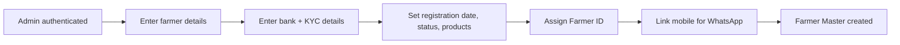
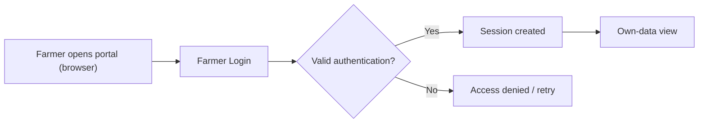
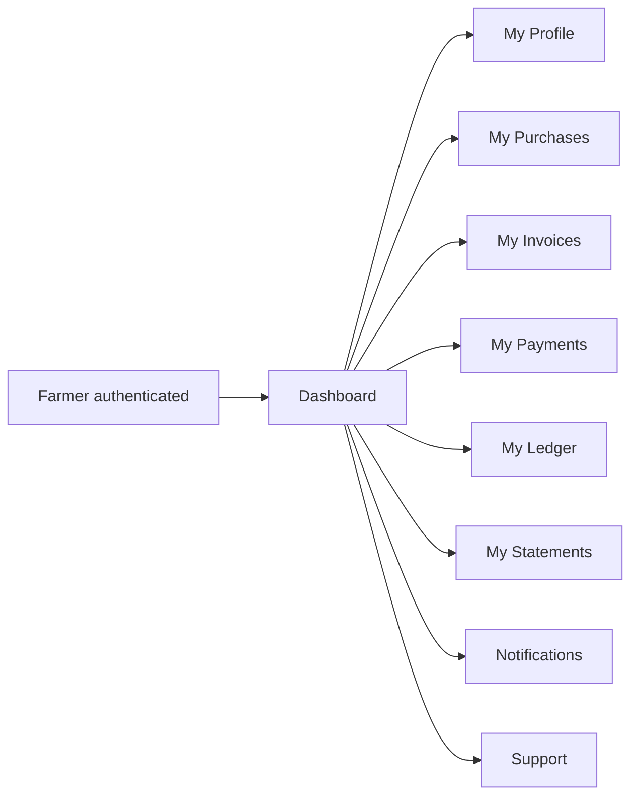
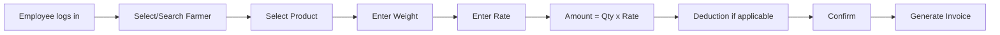
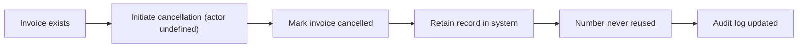
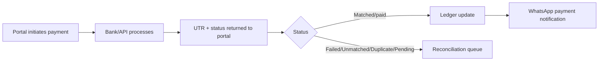
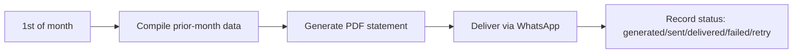
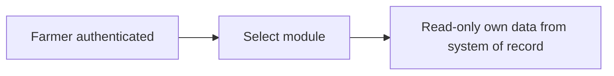
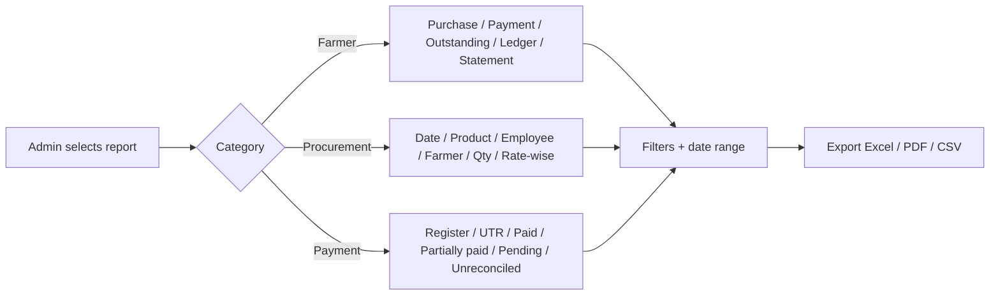
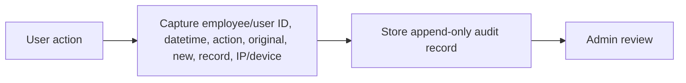

# Agri Procurement & Farmer Management System
## Business Workflows

---

## 1. Document Information

| Item | Value |
|---|---|
| Product name | Agri Procurement & Farmer Management System |
| Document | Business Workflows |
| Version | v1.0 |
| Status | Draft — aligned to PRD v1.0 and BRD v1.0 |
| Date | 2026-09-16 |
| Purpose | End-to-end description of every important business workflow: purpose, actors, triggers, preconditions, main/alternative/exception flows, result, data, audit, notifications, permissions |
| Source | 1. `AgriProcurement & Farmer Management.pdf` (primary source of truth) 2. `docs/01_PRODUCT_REQUIREMENTS_DOCUMENT.md` (PRD v1.0) 3. `docs/02_BUSINESS_REQUIREMENTS_DOCUMENT.md` (BRD v1.0) |

### Tagging conventions

| Tag | Meaning |
|---|---|
| `[SOURCE §n]` | Rule/behaviour stated in the original PDF |
| `[NEW]` | Newly approved Farmer Portal requirement (project decision) |
| Proposed Enhancement | Suggested capability; not yet approved |
| Undefined | Not described in source; listed in PRD §28 / BRD §25 open questions |

Where a step is undefined, this is stated explicitly; no rules are invented.

---

## 2. Workflow Index

| # | Workflow | Primary actor | Source |
|---|---|---|---|
| W01 | Farmer Registration | Admin | `[SOURCE §3]` |
| W02 | Farmer ID Generation | System | `[SOURCE §3]` |
| W03 | Farmer Login | Farmer | `[NEW]` |
| W04 | Farmer OTP Authentication | Farmer | `[NEW]` (OTP = Proposed Enhancement) |
| W05 | Farmer Dashboard Access | Farmer | `[NEW]` |
| W06 | Employee Login | Employee | `[SOURCE §2]` |
| W07 | Admin Login | Super Admin | `[SOURCE §2]` |
| W08 | Procurement Entry | Procurement Employee | `[SOURCE §5]` |
| W09 | Invoice Generation | System (on procurement) | `[SOURCE §6, §7]` |
| W10 | Invoice Cancellation | Undefined (see note) | `[SOURCE §6]` |
| W11 | Purchase WhatsApp Notification | System | `[SOURCE §8]` |
| W12 | Payment Creation | Undefined (see note) | `[SOURCE §10]` |
| W13 | Partial Payment | Undefined (see note) | `[SOURCE §10]` |
| W14 | Multiple Payments Against Invoice | Undefined (see note) | `[SOURCE §10]` |
| W15 | Payment Against Multiple Invoices | Undefined (see note) | `[SOURCE §10]` |
| W16 | Bank/API Payment Processing | System + Bank/API | `[SOURCE §11]` |
| W17 | Payment Reconciliation | Accounts staff | `[SOURCE §11]` |
| W18 | UTR Processing | System | `[SOURCE §11]` |
| W19 | Ledger Update | System | `[SOURCE §9, §11]` |
| W20 | Monthly Statement Generation | System | `[SOURCE §13]` |
| W21 | Statement PDF Generation | System | `[SOURCE §13]` |
| W22 | Statement WhatsApp Delivery | System | `[SOURCE §13]` |
| W23 | Failed WhatsApp Message Retry | System | `[SOURCE §13]` |
| W24 | Farmer Viewing Purchase History | Farmer | `[NEW]` |
| W25 | Farmer Viewing Payment History | Farmer | `[NEW]` |
| W26 | Farmer Viewing Ledger | Farmer | `[NEW]` |
| W27 | Farmer Viewing Invoice | Farmer | `[NEW]` |
| W28 | Farmer Viewing Statement | Farmer | `[NEW]` |
| W29 | Admin Reporting | Super Admin | `[SOURCE §14, §24]` |
| W30 | Audit Logging | System | `[SOURCE §17]` |

---

## W01. Farmer Registration

- **Purpose:** Capture a new farmer into the Farmer Master so the farmer can participate in procurement.
- **Actor:** Super Admin (`[SOURCE §2]` — admin manages farmers). Initiation/approval steps undefined (OQ-10, OQ-15).
- **Trigger:** A farmer is brought into the business relationship.
- **Preconditions:** Admin is authenticated; farmer's KYC documentation available where applicable.
- **Main flow:**
  1. Admin opens Farmer Master / create.
  2. Admin enters farmer name, mobile, address, village, taluka, district, state.
  3. Admin enters bank name, account number, IFSC.
  4. KYC information/documents captured where required.
  5. Admin records registration date, status, products normally supplied, internal remarks.
  6. System links the registered mobile number to the Farmer ID for WhatsApp identification.
- **Alternative flow:** Products normally supplied may be updated later rather than at registration. Not specified in the source requirements.
- **Exception flow:** Duplicate mobile/WhatsApp against an existing Farmer ID — handling undefined (OQ-13). Agent cannot proceed until KYC completed — undefined (OQ-10).
- **Result:** A permanent Farmer Master record with unique Farmer ID.
- **Data affected:** Farmer Master.
- **Audit requirements:** Registration/creation changes recorded per audit trail (`[SOURCE §17]`); explicit requirement for master creation not stated — treated as standard auditable change.
- **Notifications:** None at registration (not specified in source).
- **Permissions:** Admin full access (`[SOURCE §2]`); procurement employees limited to farmer info required for procurement (`[SOURCE §16]`).

---

## W02. Farmer ID Generation

- **Purpose:** Issue the permanent, unique Farmer ID that is the primary business identity.
- **Actor:** System (automatic), during registration.
- **Trigger:** Farmer registration workflow (W01) reaches ID assignment.
- **Preconditions:** Farmer record data captured; no duplicate ID allowed.
- **Main flow:**
  1. System generates a unique Farmer ID (format example: F-0001, F-0002, F-0003).
  2. System stores the ID as the permanent primary key of the farmer's identity.
- **Alternative flow:** None. ID is permanent and never reassigned.
- **Exception flow:** ID collision — must be prevented (IDs are unique). Prevention mechanism at database level; not specified in the source requirements (Proposed Enhancement: enforce uniqueness in data model).
- **Result:** Permanent unique Farmer ID issued.
- **Data affected:** Farmer Master — Farmer ID field.
- **Audit requirements:** Assignment logged (original/new values per `[SOURCE §17]`).
- **Notifications:** None.
- **Permissions:** Grant = any, assignment is system-managed.
- **Source:** `[SOURCE §3]`.

---

## W03. Farmer Login

- **Purpose:** Allow a farmer to access the Farmer Web Portal.
- **Actor:** Farmer.
- **Trigger:** Farmer opens the portal in a web/mobile browser.
- **Preconditions:** Farmer's portal account exists (activation flow undefined, OQ-15); portal is responsive web/mobile-browser based (`[NEW]`, N-03); no native mobile app in Phase 1.
- **Main flow:**
  1. Farmer opens portal URL.
  2. Farmer submits login credentials (mechanism undefined — see W04).
  3. System authenticates and creates a session.
  4. Farmer is restricted to own data only (backend enforced).
- **Alternative flow:** Login failure → system denies access; retry allowed subject to security controls (rate limiting, session management `[SOURCE §18]`).
- **Exception flow:** Suspended/inactive farmer → access denied. Farmer status transitions undefined.
- **Result:** Authenticated portal session scoped to the farmer's own data.
- **Data affected:** Farm session only; no financial data mutated.
- **Audit requirements:** Portal login events — not specified in source; login/session event logging is a Proposed Enhancement consistent with `[SOURCE §18]` (audit logging, session management).
- **Notifications:** None.
- **Permissions:** Farmer — own data only (`[NEW]`; derived from backend-level restriction philosophy `[SOURCE §22]`).

---

## W04. Farmer OTP Authentication

- **Purpose:** Verify the farmer's identity before portal access.
- **Actor:** Farmer; System (issues/validates OTP).
- **Trigger:** Farmer attempts login (W03).
- **Preconditions:** Registered mobile number is linked to the Farmer ID (`[SOURCE §3]`).
- **Main flow:**
  1. System sends a one-time password (OTP) to the registered mobile number.
  2. Farmer enters the OTP.
  3. System validates it and completes authentication.
- **Alternative flow:** OTP resend / expiry handling — not specified in the source requirements (Proposed Enhancement).
- **Exception flow:** OTP not received (mobile unreachable / not on WhatsApp) → retry or alternate channel; not defined.
- **Result:** Farmer authenticated.
- **Data affected:** No persistent business data.
- **Audit requirements:** OTP issuance/validation logging — Proposed Enhancement (consistent with `[SOURCE §18]` audit logging).
- **Notifications:** OTP is delivered via the authentication mechanism; **OTP via registered mobile number is a Proposed Enhancement** — the final authentication method is undefined (OQ-02).
- **Permissions:** Farmer — self only.
- **Source:** `[NEW]` (authentication required); OTP detail = Proposed Enhancement.

---

## W05. Farmer Dashboard Access

- **Purpose:** Give the farmer an at-a-glance view of their own position.
- **Actor:** Farmer (authenticated).
- **Trigger:** Post-login navigation.
- **Preconditions:** Farmer authenticated (W03/W04).
- **Main flow:**
  1. Farmer opens Dashboard.
  2. Dashboard shows own summary — e.g., recent purchases, payments, outstanding (exact widgets undefined, OQ-01).
  3. Farmer can navigate to My Profile, Purchases, Invoices, Payments, Ledger, Statements, Notifications, Support.
- **Alternative flow:** None defined.
- **Exception flow:** Data not yet generated for farmer (no transactions) → empty-state view; not specified in source.
- **Result:** Farmer sees own consolidated position.
- **Data affected:** Read-only display of own farmer data.
- **Audit requirements:** View events — not specified (screen-view audit is a Proposed Enhancement only if required by policy; not in source).
- **Notifications:** None.
- **Permissions:** Farmer — own data only.
- **Source:** `[NEW]` (module set approved; detail undefined OQ-01).

---

## W06. Employee Login

- **Purpose:** Authenticate a procurement employee for portal use.
- **Actor:** Employee.
- **Trigger:** Employee accesses the portal.
- **Preconditions:** Employee record exists with authentication credentials (`[SOURCE §4]`); employee status valid.
- **Main flow:**
  1. Employee logs in with individual credentials.
  2. System authenticates and enforces role-based authorization (`[SOURCE §18]`).
  3. Employee gains procurement access per role (`[SOURCE §16]`).
- **Alternative flow:** Failed login → denied; retry governed by security controls (rate limiting, session management).
- **Exception flow:** Disabled employee → access denied (status transitions undefined).
- **Result:** Authenticated employee session.
- **Data affected:** Session; no business data.
- **Audit requirements:** Authentication/session events recorded per `[SOURCE §17, §18]` framework (audit + session management).
- **Notifications:** None.
- **Permissions:** Procurement employee — farmer info required for procurement + procurement entry (`[SOURCE §16]`).
- **Source:** `[SOURCE §2]`.

---

## W07. Admin Login

- **Purpose:** Authenticate the Super Admin for full system access.
- **Actor:** Super Admin.
- **Trigger:** Admin accesses the portal.
- **Preconditions:** Admin credentials valid; strong password policy/2FA controls per `[SOURCE §18]`.
- **Main flow:**
  1. Admin logs in.
  2. System authenticates and grants full access.
  3. Admin can manage masters, settings, integrations, view all data, reports and audit logs.
- **Alternative flow:** 2FA/OTP enforced "where appropriate" (`[SOURCE §18]`).
- **Exception flow:** Lockout/dormant admin — not specified in source; session/security controls apply.
- **Result:** Full-access admin session.
- **Data affected:** Session only.
- **Audit requirements:** All admin actions recorded (audit trail `[SOURCE §17]`, logs viewable by admin `[SOURCE §2]`).
- **Notifications:** None.
- **Permissions:** Full access `[SOURCE §2]`.
- **Source:** `[SOURCE §2]`.

---

## W08. Procurement Entry

- **Purpose:** Record a farmer purchase during collection and produce the transaction record.
- **Actor:** Procurement Employee.
- **Trigger:** Employee collects material from a farmer.
- **Preconditions:** Farmer registered (W01); employee authenticated; employee within permitted scope (`[SOURCE §16]`; Phase 2: assigned area only `[SOURCE §22]`).
- **Main flow:**
  1. Employee logs in.
  2. Employee selects/searches the farmer.
  3. Employee selects the product.
  4. Employee enters weight/quantity and unit.
  5. Employee enters rate.
  6. System calculates amount = quantity × rate.
  7. Deduction applied if applicable → net amount.
  8. Employee confirms and invoice generation is initiated (W09).
- **Alternative flow:** Remarks captured against the transaction.
- **Exception flow:** Farmer not found / product not listed (catalogue undefined, OQ-05) → blocked or open entry (undefined). Rate approval for deviations — undefined (OQ-05).
- **Result:** Confirmed purchase transaction recorded and ready for invoicing.
- **Data affected:** Procurement transaction, Employee ID attribution.
- **Audit requirements:** Transaction creation is recorded; every transaction records the creating employee (backend trail) (`[SOURCE §2]`); audit trail fields per `[SOURCE §17]`.
- **Notifications:** Trigger for purchase WhatsApp notification (W11) post-invoicing.
- **Permissions:** Procurement Employee (limited), Admin (full) (`[SOURCE §16]`).

---

## W09. Invoice Generation

- **Purpose:** Automatically create a unique, correctly numbered invoice for the confirmed purchase.
- **Actor:** System (no manual invoice numbering by employees).
- **Trigger:** Procurement confirmation (W08).
- **Preconditions:** Confirmed transaction; Farmer ID and employee attribution present.
- **Main flow:**
  1. System reads Farmer ID and the farmer's next transaction sequence.
  2. System generates invoice number from Farmer ID + sequence (e.g., F-0001-17), stored as separate fields.
  3. System records the invoice as unique.
  4. Transaction confirmation is displayed: Farmer, Invoice, Date, Product, Quantity, Rate, Total, Employee.
- **Alternative flow:** None — numbering is always automatic.
- **Exception flow:** Cannot reuse a cancelled number; cancelled invoices remain in system (`[SOURCE §6]`).
- **Result:** Unique invoice created; confirmation displayed.
- **Data affected:** Invoice records; invoice sequence per farmer.
- **Audit requirements:** Invoice creation/modification recorded (`[SOURCE §6, §17]`).
- **Notifications:** Enables purchase WhatsApp notification (W11) (`[SOURCE §8]`).
- **Permissions:** Creation tied to employee; numbering system-managed.
- **Source:** `[SOURCE §6, §7]`.

---

## W10. Invoice Cancellation

- **Purpose:** Invalidate an invoice while preserving history.
- **Actor:** **Undefined** — the source does not state who may cancel (authorisation, reason capture, ledger impact undefined; OQ-08). Presumed authorised staff; do not assume — pending decision.
- **Trigger:** A generated invoice must be cancelled.
- **Preconditions:** Invoice exists.
- **Main flow:**
  1. Authorised user initiates cancellation (actor undefined, OQ-08).
  2. System marks the invoice cancelled.
  3. System retains the invoice in the system.
  4. System ensures the cancelled invoice number is never reused.
  5. The change is recorded in the audit log.
- **Alternative flow:** Reason capture / reviewer approval — undefined (OQ-08).
- **Exception flow:** Invoice linked to ledger/outstanding — impact undefined (OQ-08); correction procedure not defined (Phase 2 scope mentions "corrections and cancellations" reporting only, `[SOURCE §24]`).
- **Result:** Invoice cancelled but retained; sequence preserved.
- **Data affected:** Invoice status.
- **Audit requirements:** Modification recorded (`[SOURCE §6, §17]`).
- **Notifications:** None specified for cancellation.
- **Permissions:** Not specified in the source requirements (OQ-08).
- **Source:** `[SOURCE §6]`.

---

## W11. Purchase WhatsApp Notification

- **Purpose:** Immediately inform the farmer that a purchase was recorded and invoiced.
- **Actor:** System (automatic).
- **Trigger:** Successful invoice creation (W09).
- **Preconditions:** Farmer's mobile number valid on WhatsApp (linked to Farmer ID).
- **Main flow:**
  1. System sends a WhatsApp utility notification to the farmer.
  2. Message conveys purchase confirmation (e.g., invoice number, date, product, quantity, rate, total).
- **Alternative flow:** None.
- **Exception flow:** Undeliverable message → undefined handling for purchase notifications (statement has retry; purchase/payment retry undefined, OQ-04). Provider/message-policy dependency undefined (OQ-04).
- **Result:** Farmer notified of the purchase/invoice.
- **Data affected:** Notification delivery record (delivery status tracking not mandated for this message type in source).
- **Audit requirements:** Delivery tracking — undefined for this type (Proposed Enhancement).
- **Notifications:** This is the notification itself.
- **Permissions:** None required beyond permitted transaction.
- **Source:** `[SOURCE §8]`.

---

## W12. Payment Creation

- **Purpose:** Initiate a payment against a farmer's invoice(s).
- **Actor:** **Undefined** — source does not state who records payments (likely accounts/admin; propose Admin/Accounts staff — Proposed Enhancement; pending OQ). Reconciliation queue is assigned to accounts staff (`[SOURCE §11]`).
- **Trigger:** A payment is due for a farmer.
- **Preconditions:** Invoice exists; farmer bank details captured; payment mode valid.
- **Main flow:**
  1. User creates a payment record with Farmer ID, invoice allocation, amount, date, status, mode, bank reference, remarks.
  2. UTR captured/added (final or later).
  3. Payment routed to bank/API processing (W16).
- **Alternative flow:** Payment entered manually and reconciled against bank data (see W17).
- **Exception flow:** Allocation exceeds remaining invoice dues → system must prevent over-allocation. Not specified in the source requirements (Proposed Enhancement for validation).
- **Result:** Payment record with status.
- **Data affected:** Payment records; invoice allocation.
- **Audit requirements:** Creation/modification logged (`[SOURCE §17]`).
- **Notifications:** Enables payment WhatsApp notification after bank confirmation (W16/W18) (`[SOURCE §12]`).
- **Permissions:** Not specified in the source requirements (accounts staff implied by `[SOURCE §11]`).
- **Source:** `[SOURCE §10]`.

---

## W13. Partial Payment

- **Purpose:** Settle only part of an invoice's value.
- **Actor:** Same as W12 (undefined).
- **Trigger:** Farmer/marketing decision to pay less than full invoice.
- **Preconditions:** Invoice with outstanding balance.
- **Main flow:**
  1. Create a payment for an amount less than the invoice total (allocated to the invoice).
  2. Invoice remains partially outstanding.
  3. Status reflects partial settlement (reports include "partially paid" `[SOURCE §14]`).
- **Alternative flow:** Subsequent partial payments complete the invoice (W14).
- **Exception flow:** Over-allocation guard — undefined (Proposed Enhancement).
- **Result:** Invoice partially paid; outstanding updated.
- **Data affected:** Payment + invoice allocation.
- **Audit requirements:** Logged (`[SOURCE §17]`).
- **Notifications:** Payment notification on confirmation (W16) (`[SOURCE §12]`).
- **Permissions:** As W12.
- **Source:** `[SOURCE §10]`.

---

## W14. Multiple Payments Against Invoice

- **Purpose:** Allow an invoice to be settled by several payments.
- **Actor:** Same as W12 (undefined).
- **Trigger:** Farmer pays an invoice over multiple instalments.
- **Preconditions:** Invoice exists with outstanding.
- **Main flow:**
  1. Each payment is recorded against the same invoice.
  2. System accumulates paid amounts against the invoice.
  3. Invoice becomes fully paid when cumulative payments reach the total.
- **Alternative flow:** Payments made on different dates/modes.
- **Exception flow:** Cumulative payments exceed invoice total → prevention undefined (Proposed Enhancement).
- **Result:** Invoice settled across multiple payments.
- **Data affected:** Payment + invoice allocation.
- **Audit requirements:** Logged (`[SOURCE §17]`).
- **Notifications:** Each confirmed payment triggers WhatsApp notification (W16).
- **Permissions:** As W12.
- **Source:** `[SOURCE §10]`.

---

## W15. Payment Against Multiple Invoices

- **Purpose:** Allocate one payment across several invoices of the same farmer.
- **Actor:** Same as W12 (undefined).
- **Trigger:** A single payout settles multiple invoices.
- **Preconditions:** Multiple invoice dues for the same farmer.
- **Main flow:**
  1. Create one payment record.
  2. Allocate it across several invoices.
  3. Each invoice's outstanding is reduced by its allocated share.
- **Alternative flow:** Allocation order/split rule (FIFO by date etc.) — undefined (Proposed Enhancement).
- **Exception flow:** Allocation exceeds some invoices' dues — prevention undefined.
- **Result:** Multiple invoices settled by one payment.
- **Data affected:** Payment + multiple invoice allocations.
- **Audit requirements:** Logged (`[SOURCE §17]`).
- **Notifications:** Payment notification on confirmation (W16).
- **Permissions:** As W12.
- **Source:** `[SOURCE §10]`.

---

## W16. Bank/API Payment Processing

- **Purpose:** Execute the payment and receive authoritative status/UTR.
- **Actor:** System + banking/API provider.
- **Trigger:** Payment record created (W12–W15).
- **Preconditions:** Banking/API integration configured; provider supports status/UTR return (fully or partially).
- **Main flow:**
  1. Portal sends payment to bank/API.
  2. Bank/API processes the payment.
  3. System receives UTR + payment status.
  4. System updates status (matched/unmatched/failed/pending/duplicate).
  5. Confirmed payments trigger ledger update (W19) and WhatsApp payment notification (`[SOURCE §12]`).
- **Alternative flow:** Provider does not return status automatically → manual handling; undefined (OQ-03).
- **Exception flow:** Failed payment → status failed, routed to reconciliation queue (W17).
- **Result:** Payment status and UTR captured in the portal.
- **Data affected:** Payment status, UTR.
- **Audit requirements:** Integration activity logged (`[SOURCE §17, §18]` secure API auth).
- **Notifications:** Automatic payment WhatsApp notification on confirmation (`[SOURCE §12]`).
- **Permissions:** System-to-system (secure API authentication `[SOURCE §18]`).
- **Source:** `[SOURCE §11]`.

---

## W17. Payment Reconciliation

- **Purpose:** Match bank-confirmed payments to invoices and resolve exceptions.
- **Actor:** System (matching); Accounts staff (exception queue).
- **Trigger:** New payment statuses/UTR from bank/API (W16).
- **Preconditions:** Integration returns statuses; queue configured.
- **Main flow:**
  1. System matches received UTR/status to payment/invoice records.
  2. Matched payments update the ledger automatically (W19).
  3. Unmatched, failed, pending and duplicate payments appear in the Exception/Reconciliation Queue.
  4. Accounts staff review and resolve items.
- **Alternative flow:** Manual reconciliation where provider support is partial.
- **Exception flow:** Unmatched UTR persists → stays in queue until resolved; resolution rules undefined (OQ-03).
- **Result:** Payment positioned as matched/unmatched/failed/pending/duplicate.
- **Data affected:** Payment statuses, ledger (on match).
- **Audit requirements:** Queue actions logged (`[SOURCE §17]`).
- **Notifications:** Confirmed payments trigger WhatsApp notification (W16).
- **Permissions:** Exception queue for accounts staff (`[SOURCE §11]`).
- **Source:** `[SOURCE §11]`.

---

## W18. UTR Processing

- **Purpose:** Capture the bank reference (UTR) on the correct payment/invoice.
- **Actor:** System (automatic, wherever supported).
- **Trigger:** Bank/API returns UTR (W16).
- **Preconditions:** Payment record exists.
- **Main flow:**
  1. System receives UTR + status.
  2. System attaches UTR to the payment record.
  3. Ledger and notifications use the UTR (statement includes payment dates and UTRs).
- **Alternative flow:** UTR entered manually if provider doesn't return it — undefined (OQ-03).
- **Exception flow:** Duplicate/foreign UTR → status = duplicate, reconciliation queue.
- **Result:** UTR recorded against the payment.
- **Data affected:** Payment UTR; statement content.
- **Audit requirements:** Logged (`[SOURCE §17]`).
- **Notifications:** UTR appears in payment WhatsApp notification (`[SOURCE §12]`) and monthly statement (`[SOURCE §13]`).
- **Permissions:** System (secure API auth).
- **Source:** `[SOURCE §11, §12, §13]`.

---

## W19. Ledger Update

- **Purpose:** Keep each farmer's ledger current after transactions and payments.
- **Actor:** System (automatic).
- **Trigger:** Invoice posting or confirmed payment.
- **Preconditions:** Transaction/payment confirmed.
- **Main flow:**
  1. Invoice posts to the farmer's ledger (date, invoice, product, quantity, rate, amount).
  2. Confirmed payment updates the ledger (payment, UTR) automatically.
  3. Outstanding is maintained per farmer.
- **Alternative flow:** None — ledger is system-maintained; no silent overwrite (`[SOURCE §17]`).
- **Exception flow:** Cancelled invoice ledger impact — undefined (OQ-08).
- **Result:** Up-to-date farmer-wise ledger.
- **Data affected:** Farmer ledger.
- **Audit requirements:** Changes auditable; no silent overwrite of historical records (`[SOURCE §17]`).
- **Notifications:** Ledger feeds statements (W20) and portal view (W26).
- **Permissions:** Read access per role (admin full; employee limited; farmer self).
- **Source:** `[SOURCE §9, §11]`.

---

## W20. Monthly Statement Generation

- **Purpose:** Produce each farmer's previous-month statement automatically.
- **Actor:** System (automatic, scheduled).
- **Trigger:** 1st day of each month (e.g., 1 Sep generates 1–31 Aug).
- **Preconditions:** Month closed/ended; previous-month transactions present.
- **Main flow:**
  1. System selects all active farmers.
  2. System compiles statement content: Farmer ID + name, period, opening balance (if applicable), all purchase invoices (product, qty, rate, amount), all payments (dates + UTRs), closing/outstanding balance.
  3. System generates PDF (W21).
  4. System delivers via WhatsApp (W22).
  5. System records status: generated/sent/delivered/failed/retry.
- **Alternative flow:** Farmer with no activity → statement with zero/opening/closing balance; content rules for such farmers undefined.
- **Exception flow:** Generation/schedule failure → status "failed"/"retry" recorded; exact retry policy undefined (OQ-14).
- **Result:** Monthly statement artifacts with tracked delivery status.
- **Data affected:** Statement records.
- **Audit requirements:** Generation events logged (`[SOURCE §17]`); statuses recorded (`[SOURCE §13]`).
- **Notifications:** The statement is delivered via WhatsApp (W22).
- **Permissions:** System scheduled job (admin visibility).
- **Source:** `[SOURCE §13]`.

---

## W21. Statement PDF Generation

- **Purpose:** Render the monthly statement as a PDF artifact.
- **Actor:** System (automatic).
- **Trigger:** Statement compilation (W20).
- **Preconditions:** Statement data assembled.
- **Main flow:**
  1. System formats statement fields into a PDF.
  2. PDF includes period, opening balance, invoices, payments (dates/UTRs), closing/outstanding.
- **Alternative flow:** None.
- **Exception flow:** Generation error → status failed, retry (policy undefined OQ-14).
- **Result:** PDF statement stored for delivery and portal access (W28).
- **Data affected:** Statement PDF artifact.
- **Audit requirements:** Generation status recorded (`[SOURCE §13]`); logging per `[SOURCE §17]`.
- **Notifications:** Triggers WhatsApp delivery (W22).
- **Permissions:** System; farmer self-view (W28).
- **Source:** `[SOURCE §13]`.

---

## W22. Statement WhatsApp Delivery

- **Purpose:** Automatically send the monthly statement to the farmer.
- **Actor:** System (automatic).
- **Trigger:** Statement PDF generated (W21).
- **Preconditions:** Farmer mobile valid on WhatsApp.
- **Main flow:**
  1. System sends the statement PDF via WhatsApp.
  2. System records status: sent/delivered/failed/retry.
- **Alternative flow:** Retry on failure (W23).
- **Exception flow:** Non-WhatsApp/unreachable number → failed status; resolution undefined.
- **Result:** Farmer receives statement; delivery status recorded.
- **Data affected:** Status feed of farmer's notifications.
- **Audit requirements:** Delivery statuses recorded (`[SOURCE §13]`).
- **Notifications:** This is the delivery.
- **Permissions:** System.
- **Source:** `[SOURCE §13]`.

---

## W23. Failed WhatsApp Message Retry

- **Purpose:** Re-attempt delivery of a failed WhatsApp message (statement).
- **Actor:** System (automatic retry mechanism exists per status; exact policy undefined).
- **Trigger:** Message delivery status = failed.
- **Preconditions:** Retry mechanism configured; status recorded as failed.
- **Main flow:**
  1. System marks message failed.
  2. System retries delivery.
  3. System records the resulting status (delivered/failed/retry).
- **Alternative flow:** Manual re-send by admin (not specified in source — Proposed Enhancement).
- **Exception flow:** Persistent failure → remains failed; escalation rules undefined (OQ-14). Retry applies to statements (`[SOURCE §13]`); purchase/payment notification retry undefined (OQ-04).
- **Result:** Message either delivered or tracked as failed.
- **Data affected:** Delivery status records.
- **Audit requirements:** Status transitions logged (`[SOURCE §17]`).
- **Notifications:** The retried message.
- **Permissions:** System (manual override undefined).
- **Source:** `[SOURCE §13]`.

---

## W24–W28. Farmer Portal Viewing Workflows

> All five viewing workflows are **newly approved Farmer Portal requirements (`[NEW]`)** . The module set is approved; detailed behaviour, fields and empty states are undefined (OQ-01). Data shown is read-only, scoped to the farmer's own records, and reflects the system of record. No business data is mutated.

### W24. Farmer Viewing Purchase History

- **Purpose:** Farmer reviews own purchase transactions.
- **Actor:** Farmer.
- **Trigger:** "My Purchases" selected.
- **Preconditions:** Farmer authenticated; purchase data exists.
- **Main flow:** List own purchases (date, product, quantity, rate, amount, invoice reference).
- **Alternative flow:** None.
- **Exception flow:** No purchases → empty state (undefined).
- **Result:** Purchase history displayed.
- **Data affected:** None (read-only).
- **Audit requirements:** Not specified for view actions (Proposed Enhancement if required).
- **Notifications:** None.
- **Permissions:** Farmer — own data only.
- **Source:** `[NEW]`.

### W25. Farmer Viewing Payment History

- **Purpose:** Farmer reviews own payments.
- **Actor:** Farmer.
- **Trigger:** "My Payments" selected.
- **Preconditions:** Farmer authenticated; payment data exists.
- **Main flow:** List own payments (date, amount, mode, UTR, status) for own invoices.
- **Alternative flow:** None.
- **Exception flow:** No payments → empty state (undefined).
- **Result:** Payment history displayed.
- **Data affected:** None (read-only).
- **Audit requirements:** Not specified for view actions.
- **Notifications:** None.
- **Permissions:** Farmer — own data only.
- **Source:** `[NEW]`.

### W26. Farmer Viewing Ledger

- **Purpose:** Farmer sees own farmer-wise ledger.
- **Actor:** Farmer.
- **Trigger:** "My Ledger" selected.
- **Preconditions:** Farmer authenticated; ledger exists (W19).
- **Main flow:** Display own ledger (date, invoice, product, quantity, rate, amount, payment, UTR) and outstanding.
- **Alternative flow:** None.
- **Exception flow:** Empty ledger → empty state (undefined).
- **Result:** Own ledger and outstanding visible.
- **Data affected:** None (read-only).
- **Audit requirements:** Not specified for view actions.
- **Notifications:** None.
- **Permissions:** Farmer — own data only.
- **Source:** `[NEW]` (ledger content per `[SOURCE §9]`).

### W27. Farmer Viewing Invoice

- **Purpose:** Farmer views own invoice details.
- **Actor:** Farmer.
- **Trigger:** "My Invoices" selected (or invoice drill-down).
- **Preconditions:** Farmer authenticated; invoice exists.
- **Main flow:** Display invoice confirmation (Farmer, Invoice, Date, Product, Quantity, Rate, Total, Employee) and status.
- **Alternative flow:** PDF/printable version — undefined (OQ-07).
- **Exception flow:** Cancelled invoice display — undefined (OQ-08).
- **Result:** Invoice details visible.
- **Data affected:** None (read-only).
- **Audit requirements:** Not specified for view actions.
- **Notifications:** None.
- **Permissions:** Farmer — own data only.
- **Source:** `[NEW]` (invoice content per `[SOURCE §7]`).

### W28. Farmer Viewing Statement

- **Purpose:** Farmer views/downloads own monthly statements.
- **Actor:** Farmer.
- **Trigger:** "My Statements" selected.
- **Preconditions:** Farmer authenticated; statements generated (W20).
- **Main flow:** List own statements by period; view/download PDF (same artifact as delivered via WhatsApp).
- **Alternative flow:** None.
- **Exception flow:** No statement generated yet → empty state (undefined).
- **Result:** Statement PDF accessible.
- **Data affected:** None (read-only).
- **Audit requirements:** Not specified for view actions.
- **Notifications:** None.
- **Permissions:** Farmer — own data only.
- **Source:** `[NEW]` (statement per `[SOURCE §13]`).

---

## W29. Admin Reporting

- **Purpose:** Provide the business with standard and analytical reports.
- **Actor:** Super Admin (report access per role; admin has full access).
- **Trigger:** Admin requests a report.
- **Preconditions:** Admin authenticated; report scope/data available.
- **Main flow:**
  1. Admin selects report category (farmer/procurement/payment).
  2. Farmer reports: farmer-wise purchase, payment, outstanding, ledger, monthly statement.
  3. Procurement reports: date-wise, product-wise, employee-wise, farmer-wise, quantity-wise, rate-wise.
  4. Payment reports: payment register, UTR register, paid, partially paid, pending, unreconciled.
  5. Admin applies filters (e.g., dates) and exports to Excel/PDF/CSV where appropriate.
- **Alternative flow:** Dashboard KPIs (total farmers, active farmers, total employees, today's procurement, today's procurement value, monthly procurement, pending farmer payments, payments made, total outstanding, number of invoices, unreconciled bank transactions; date filters) (`[SOURCE §15]`).
- **Exception flow:** Phase 2 reporting (area-wise, employee-wise performance, corrections and cancellations) — Phase 2 (`[SOURCE §24]`).
- **Result:** Report exported/displayed.
- **Data affected:** None (read-only).
- **Audit requirements:** Report generation/view logs — not specified (Proposed Enhancement if required).
- **Notifications:** None.
- **Permissions:** Admin full access (`[SOURCE §2]`); employees per role (`[SOURCE §16]`).
- **Source:** `[SOURCE §14, §15, §24]`.

---

## W30. Audit Logging

- **Purpose:** Record every business action for accountability and traceability.
- **Actor:** System (automatic capture).
- **Trigger:** Any recorded business action (creation, modification, cancellation, reconciliation, etc.).
- **Preconditions:** Action performed by an identified user/system actor.
- **Main flow:**
  1. System captures: user/employee ID, date and time, action, original value, new value, record affected.
  2. IP/device information captured where appropriate.
  3. Logs are retained for admin review.
- **Alternative flow:** None.
- **Exception flow:** No silent overwrite of historical financial records (`[SOURCE §17]`); corrections create new audit entries.
- **Result:** Complete, reviewable audit trail.
- **Data affected:** Audit log (append-only).
- **Audit requirements:** This workflow is the audit mechanism itself.
- **Notifications:** None.
- **Permissions:** Super Admin can view logs (`[SOURCE §2]`); retention/archival undefined (OQ-11).
- **Source:** `[SOURCE §17]`.

---

## 3. Cross-Workflow Notes (not rules)

- Post-invoice flow chain: W08 → W09 → W11 → W19 (ledger) — and payment chain W12 → W16 → W17/W18 → W19 → W22/W23.
- W24–W28 are read-only portal views over data produced by W08–W23.
- Any step marked "undefined" is registered in PRD §28 / BRD §25 open questions and must be decided before build.

---

*End of Business Workflows v1.0. Next in sequence: `04_FUNCTIONAL_REQUIREMENTS_DOCUMENT.md` (or per index reading order).*