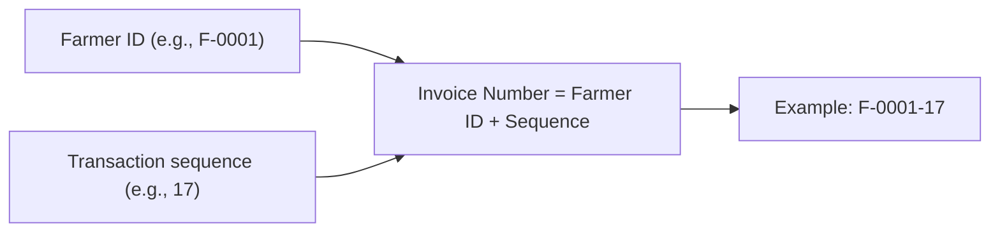

# Agri Procurement & Farmer Management System
## Procurement and Invoice Specification

---

## 1. Document Information

| Item | Value |
|---|---|
| Product name | Agri Procurement & Farmer Management System |
| Document | Procurement and Invoice Specification |
| Version | v1.0 |
| Status | Draft — aligned to PRD v1.0, BRD v1.0, Workflows v1.0, FRS v1.0 |
| Date | 2026-09-16 |
| Purpose | Complete specification of the procurement lifecycle and the invoice lifecycle, including numbering, uniqueness, farmer-specific sequences, cancellation, modification and audit rules |
| Source | 1. `AgriProcurement & Farmer Management.pdf` (primary source of truth) — §5, §6, §7, §8, §17 2. `docs/01_PRODUCT_REQUIREMENTS_DOCUMENT.md` (§11–§12) 3. `docs/02_BUSINESS_REQUIREMENTS_DOCUMENT.md` (§9–§10) 4. `docs/03_BUSINESS_WORKFLOWS.md` (W08–W11) 5. `docs/06_FUNCTIONAL_REQUIREMENTS.md` (FR-PROC-XXX, FR-INV-XXX) 6. `docs/07_FARMER_PORTAL_SPECIFICATION.md` (§11–§12) |

### Conventions

| Tag | Meaning |
|---|---|
| `[SOURCE §n]` | Statement from the original PDF section `n` |
| `[NEW]` | Newly approved Farmer Portal requirement |
| Undefined / Not specified in the source requirements | Behaviour not defined in the source; see open questions |

> No invoice or procurement rule is invented in this document. All rules below are taken from the source PDF (§5, §6, §7). Where the source is silent, this is stated explicitly.

---

## 2. Source Extract — Procurement Entry (§5)

- Workflow: **Login → Select/Search Farmer → Select Product → Enter Weight → Enter Rate → Calculate Amount → Confirm → Generate Invoice** (`[SOURCE §5]`).
- Fields: Farmer ID, farmer name, Employee ID, date and time, product, quantity/weight, unit, rate, gross amount, deduction (if applicable), net amount, remarks (`[SOURCE §5]`).
- **Amount must be calculated automatically as Quantity × Rate** (`[SOURCE §5]`).

## 3. Source Extract — Invoice Numbering (§6)

- Invoice numbers are generated automatically from **Farmer ID and transaction sequence** (`[SOURCE §6]`).
- Farmer ID and transaction sequence are stored as **separate database fields** (`[SOURCE §6]`).
- Invoice number must be **unique** (`[SOURCE §6]`).
- Sequence is maintained **separately for every farmer** (`[SOURCE §6]`).
- **Cancelled invoices remain in the system** (`[SOURCE §6]`).
- **Cancelled invoice numbers must not be reused** (`[SOURCE §6]`).
- **All modifications must be recorded in the audit log** (`[SOURCE §6, §17]`).
- **Employees must not manually type invoice numbers** (`[SOURCE §6]`).

## 4. Source Extract — Invoice Confirmation (§7)

| Field | Example |
|---|---|
| Farmer | F-0001 |
| Invoice | F-0001-17 |
| Date | 14-09-2026 |
| Product | Onion |
| Quantity | 400 kg |
| Rate | ₹28/kg |
| Total | ₹11,200 |
| Employee | EMP-037 |

(`[SOURCE §7]`)

---

## 5. Procurement Lifecycle

(`[SOURCE §5, §8]`)

| Step | Detail | Source |
|---|---|---|
| 1 | Employee logs in with individual credentials | `[SOURCE §2, §5]` |
| 2 | Farmer selected/searched | `[SOURCE §5]` |
| 3 | Product selected | `[SOURCE §5]` |
| 4 | Weight/quantity entered | `[SOURCE §5]` |
| 5 | Rate entered | `[SOURCE §5]` |
| 6 | Amount computed automatically = quantity × rate | `[SOURCE §5]` |
| 7 | Deduction applied if applicable → net amount | `[SOURCE §5]` |
| 8 | Transaction confirmed | `[SOURCE §5]` |
| 9 | Invoice generated | `[SOURCE §5]` |
| 10 | WhatsApp purchase notification sent | `[SOURCE §8]` |

**Undefined items (not specified in the source requirements):** timeouts during entry, draft save/resume, and whether confirmation is editable after generation (see OQ-07/08). Deduction rules (types, approvals) — OQ-06. Product catalogue/rate governance — OQ-05.

---

## 6. Procurement Entry

- **Purpose:** record the purchase of produce directly from a farmer.
- **Actor:** Procurement Employee (individual login).
- **Fields (source-mandated):** Farmer ID, farmer name, Employee ID, date and time, product, quantity/weight, unit, rate, gross amount, deduction (if applicable), net amount, remarks (`[SOURCE §5]`).
- **Inputs by employee:** farmer selection, product, weight, rate, optional deduction, remarks.
- **Computed by system:** gross amount (= quantity × rate) and net amount (= gross − deduction) (`[SOURCE §5]`).
- **Employee ownership:** the transaction is attributed to the creating employee (backend trail) (`[SOURCE §2]`).

**Validation (not specified in the source; proposed guards):** positive weight and rate, deduction ≤ gross. Marked Proposed Enhancement.

---

## 7. Farmer Selection

- The employee selects or searches the farmer at the start of entry (`[SOURCE §5]`).
- The selected farmer provides: **Farmer ID** and **farmer name** for the transaction (`[SOURCE §5]`).
- Farmer data access for procurement employees is limited to the farmer information required for procurement (`[SOURCE §16]`).
- Phase 2: employees may only act on farmers in their assigned area (`[SOURCE §22]`).
- Source of the farmer identity is the Farmer Master (`[SOURCE §3]`); Farmer ID is the permanent primary business identity.

---

## 8. Product Selection

- A product is selected as part of the workflow (`[SOURCE §5]`).
- Unit accompanies the product (see §9). 
- **Product catalogue / units / rate governance: Not specified in the source requirements (OQ-05).**

---

## 9. Quantity / Weight

- Quantity/weight is entered by the employee (`[SOURCE §5]`).
- Captured with its **unit** (e.g., kg) and reflected on the invoice (`[SOURCE §5, §7]`).

## 10. Unit

- Unit is a required field of the transaction (`[SOURCE §5]`).
- Example: kg (`[SOURCE §7]`).
- Unit catalogue is part of the product-master question (OQ-05).

## 11. Rate

- Rate is entered by the employee (`[SOURCE §5]`).
- Expressed per unit (e.g., ₹28/kg) (`[SOURCE §7]`).
- Rate feeds the automatic amount calculation (quantity × rate) (`[SOURCE §5]`).
- **Rate governance/approval for deviations: Not specified in the source requirements (OQ-05).**

## 12. Gross Amount

- **gross amount = quantity × rate, calculated automatically** (`[SOURCE §5]`).
- Example: 400 kg × ₹28/kg = ₹11,200 (`[SOURCE §7]`).
- Not manually typed; computed by the system.

## 13. Deduction

- Deduction applies "if applicable" (`[SOURCE §5]`).
- **Deduction types, reason capture and approval rules: Not specified in the source requirements (OQ-06).**
- When applicable, net amount = gross − deduction (`[SOURCE §5]`).

## 14. Net Amount

- net amount = gross amount − deduction (when deduction applies) (`[SOURCE §5]`).
- Net amount is a source-mandated transaction field.

## 15. Remarks

- Remarks is a source-mandated transaction field (`[SOURCE §5]`).
- Free-form context; length limits not specified.

---

## 16. Employee Ownership / Trail

- Every transaction records the employee who created it (backend trail) (`[SOURCE §2]`).
- The confirmation displays the employee (e.g., EMP-037) (`[SOURCE §7]`).
- Employee identity is part of the audit and invoice record.

---

## 17. Automatic Calculation

- Amount must be calculated automatically as quantity × rate (`[SOURCE §5]`).
- Net amount derived from deduction when applicable (`[SOURCE §5]`).
- Employees do not compute or type amounts manually.

---

## 18. Invoice Generation

- Invoice generation is the final step of the procurement workflow: … → Confirm → **Generate Invoice** (`[SOURCE §5]`).
- Generation is automatic and system-driven; invoice numbering is never manual (`[SOURCE §6]`).

---

## 19. Invoice Numbering

(`[SOURCE §6, §7]`)

- Invoice numbers are generated automatically from **Farmer ID + transaction sequence** (`[SOURCE §6]`).
- Farmer ID and transaction sequence are stored as **separate database fields** (`[SOURCE §6]`).

### Worked examples (source-mandated numbering style)

**Farmer F-0001:**
- F-0001-01
- F-0001-02
- F-0001-03
- … continues through F-0001-17 (per `[SOURCE §6]` example range)

**Farmer F-0002 (independent sequence):**
- F-0002-01
- F-0002-02
- F-0002-03
- …

(`[SOURCE §6]`)

---

## 20. Invoice Uniqueness

- Invoice number must be **unique** (`[SOURCE §6]`).
- Uniqueness is guaranteed because the number combines a unique Farmer ID with a per-farmer sequence that is independent and maintained separately for every farmer (`[SOURCE §3, §6]`).

## 21. Farmer-Specific Transaction Sequence

- Sequence is maintained **separately for every farmer** (`[SOURCE §6]`).
- F-0001 and F-0002 each have their own independent sequences (`[SOURCE §6]`).
- Sequence is stored as a **separate database field** from the Farmer ID (`[SOURCE §6]`).

---

## 22. Cancelled Invoice Handling

- **Cancelled invoices remain in the system** (`[SOURCE §6]`).
- **Cancelled invoice numbers must not be reused** (`[SOURCE §6]`).
- The next invoice after a cancellation continues the sequence without reusing the cancelled number (source rule; the exact skipping behaviour is the direct consequence of "must not be reused").
- Cancellation is a modification and therefore must be recorded in the audit log (`[SOURCE §6, §17]`).
- **Who may cancel, reason capture and ledger impact: Not specified in the source requirements (OQ-08).**

---

## 23. Invoice Modification

- All modifications must be recorded in the audit log (`[SOURCE §6]`).
- Historical financial records must not be silently overwritten (`[SOURCE §17]`).
- Modifications are therefore applied as auditable changes preserving history.
- Any invoice modification is a modification event subject to the audit trail.

---

## 24. Audit Trail

- Trail fields: user/employee ID, date and time, action, original value, new value, record affected, IP/device where appropriate (`[SOURCE §17]`).
- Applies to: invoice creation, modification and cancellation (`[SOURCE §6, §17]`).
- Procurement transaction creation is attributed to the employee (`[SOURCE §2]`).

---

## 25. Invoice Confirmation

- After generation, the system displays the transaction confirmation (`[SOURCE §7]`).

| Field | Example | Source |
|---|---|---|
| Farmer | F-0001 | `[SOURCE §7]` |
| Invoice | F-0001-17 | `[SOURCE §7]` |
| Date | 14-09-2026 | `[SOURCE §7]` |
| Product | Onion | `[SOURCE §7]` |
| Quantity | 400 kg | `[SOURCE §7]` |
| Rate | ₹28/kg | `[SOURCE §7]` |
| Total | ₹11,200 | `[SOURCE §7]` |
| Employee | EMP-037 | `[SOURCE §7]` |

- **Printable/PDF invoice output: Not specified in the source requirements (OQ-07).**
- Confirmation is followed by an automatic WhatsApp purchase notification (`[SOURCE §8]`).

---

## 26. Farmer Access to Invoices

- In the source PDF, farmers had **no login**; they received invoices/transaction details via WhatsApp (purchase notification `[SOURCE §8]`; Phase 2 chatbot "Invoice Details" query `[SOURCE §21]`).
- Under the **newly approved Farmer Portal requirement (`[NEW]`)**, the farmer can view **their own** invoices in the portal (§12 of `docs/07_FARMER_PORTAL_SPECIFICATION.md` — My Invoices).
- **Isolation rule:** a farmer must only ever access their **own** invoices; access to another farmer's invoices is prohibited and enforced at the backend/authorization level (see `docs/07_FARMER_PORTAL_SPECIFICATION.md` §7).
- Invoice numbers are unique per farmer (`[SOURCE §6]`), so the combination Farmer ID + invoice number identifies ownership.

---

## 27. Business Rules — Procurement & Invoice (Consolidated)

All rules below are **source rules** (`[SOURCE §5, §6, §7]`). No rule is invented.

| ID | Rule | Source |
|---|---|---|
| PINV-BR-01 | Amount = quantity × rate, computed automatically. | `[SOURCE §5]` |
| PINV-BR-02 | Workflow order is fixed: Login → Select/Search Farmer → Select Product → Enter Weight → Enter Rate → Calculate Amount → Confirm → Generate Invoice. | `[SOURCE §5]` |
| PINV-BR-03 | Invoice number = Farmer ID + transaction sequence (e.g., F-0001-17). | `[SOURCE §6]` |
| PINV-BR-04 | Farmer ID and transaction sequence are stored as separate database fields. | `[SOURCE §6]` |
| PINV-BR-05 | Invoice number must be unique. | `[SOURCE §6]` |
| PINV-BR-06 | Sequence is maintained separately for every farmer. | `[SOURCE §6]` |
| PINV-BR-07 | Cancelled invoices remain in the system. | `[SOURCE §6]` |
| PINV-BR-08 | Cancelled invoice numbers must not be reused. | `[SOURCE §6]` |
| PINV-BR-09 | All modifications must be recorded in the audit log. | `[SOURCE §6, §17]` |
| PINV-BR-10 | Employees must not manually type invoice numbers. | `[SOURCE §6]` |
| PINV-BR-11 | Confirmation shows Farmer, Invoice, Date, Product, Quantity, Rate, Total, Employee. | `[SOURCE §7]` |
| PINV-BR-12 | Historical financial records must not be silently overwritten. | `[SOURCE §17]` |
| PINV-BR-13 | Farmer access is limited to their own invoices (portal). | `[NEW]` (own-data rule) |

---

## 28. Cross-Reference to Other Documents

| Topic | Reference |
|---|---|
| Procurement functional requirements | FRS FR-PROC-001…006 (`docs/06`) |
| Invoice functional requirements | FRS FR-INV-001…006 (`docs/06`) |
| Procurement workflow | BRD §9, Workflows W08 |
| Invoice workflow | BRD §10, Workflows W09–W10 |
| Farmer portal invoice view | Farmer Portal Spec §12 (`docs/07`) |
| User stories | US-012…020 (`docs/05`) |

---

*End of Procurement and Invoice Specification v1.0. Next in sequence: `09_PAYMENT_AND_RECONCILIATION_SPECIFICATION.md` (or per index reading order).*