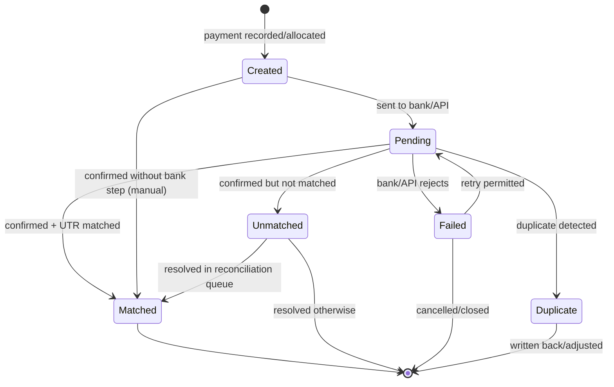
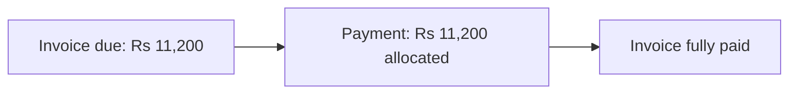
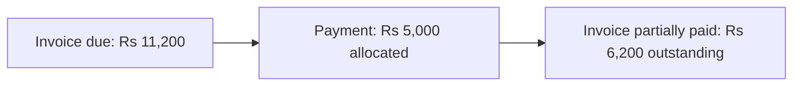
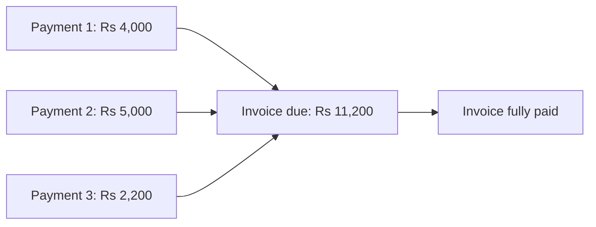
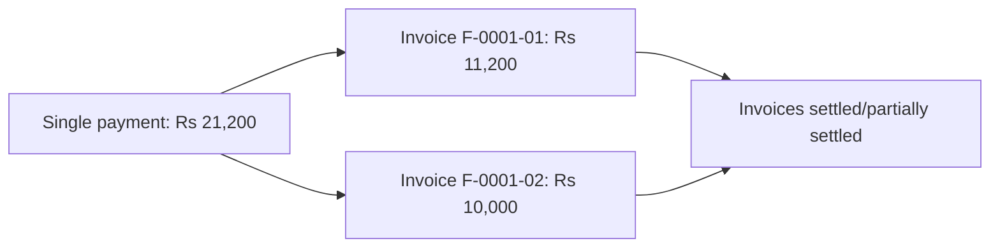
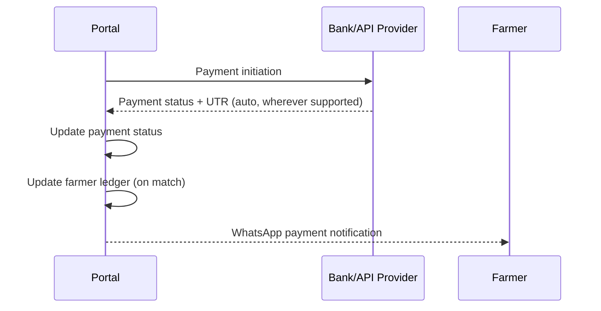
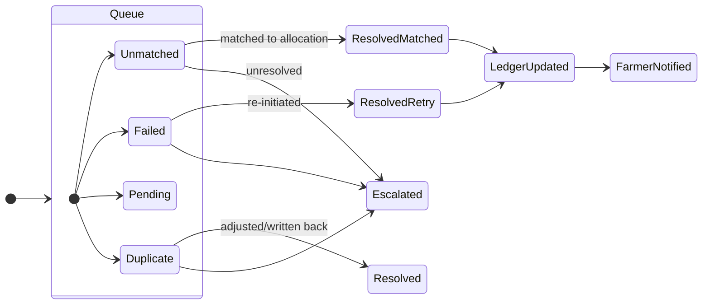
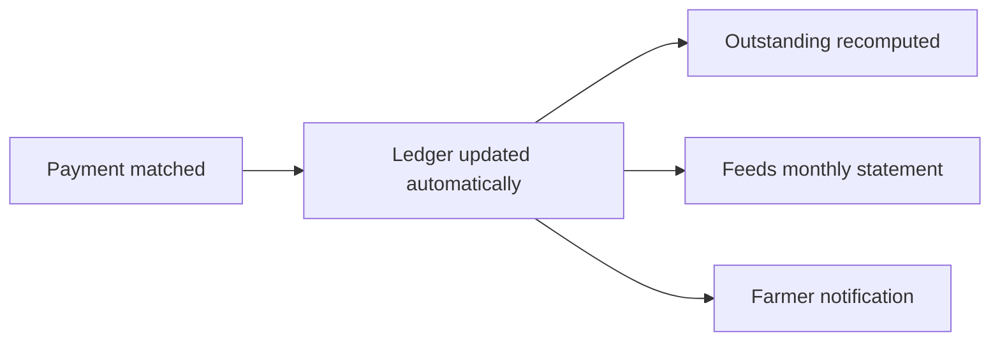

# Agri Procurement & Farmer Management System
## Payment and Reconciliation Specification

---

## 1. Document Information

| Item | Value |
|---|---|
| Product name | Agri Procurement & Farmer Management System |
| Document | Payment and Reconciliation Specification |
| Version | v1.0 |
| Status | Draft — aligned to PRD v1.0, BRD v1.0, Workflows v1.0, FRS v1.0 |
| Date | 2026-09-16 |
| Purpose | Complete specification of the payment domain: lifecycle, allocation models, statuses, banking/API integration, reconciliation, ledger update, notifications, audit and exception handling |
| Source | 1. `AgriProcurement & Farmer Management.pdf` (primary source of truth) — §10, §11, §12, §14, §15, §17 2. `docs/01_PRODUCT_REQUIREMENTS_DOCUMENT.md` (§13) 3. `docs/02_BUSINESS_REQUIREMENTS_DOCUMENT.md` (§11–§12) 4. `docs/03_BUSINESS_WORKFLOWS.md` (W12–W18) 5. `docs/07_FARMER_PORTAL_SPECIFICATION.md` (§13) 6. `docs/08_PROCUREMENT_AND_INVOICE_SPECIFICATION.md` |

### Conventions

| Tag | Meaning |
|---|---|
| `[SOURCE §n]` | Statement from the original PDF section `n` |
| `[NEW]` | Newly approved Farmer Portal requirement |
| Undefined / Not specified in the source requirements | Behaviour not defined in the source; tracked as open questions (§46) |

### Provider-neutrality rule

This document assumes **no specific bank, payment provider, API provider or payment gateway**. The source mandates only the workflow Portal → Bank/API → Payment → UTR/status → Portal (`[SOURCE §11]`) and automatic receipt "wherever supported" (`[SOURCE §11]`). All provider-specific details are marked undefined and listed as open questions (§46).

---

## 2. Source Extract — Payment Module (§10)

- Fields: Farmer ID, invoice number / invoice allocation, payment amount, payment date, payment status, payment mode, bank reference, UTR, remarks (`[SOURCE §10]`).
- Support for: **full payment, partial payment, multiple payments against an invoice, multiple invoices against one payment** — "where required" (`[SOURCE §10]`).

## 3. Source Extract — Banking/API Integration (§11)

- Desired workflow: **Portal → Bank/API → Payment → UTR/status → Portal** (`[SOURCE §11]`).
- **Automatically receive payment status and UTR wherever supported** by the selected provider (`[SOURCE §11]`).
- **Update the farmer ledger automatically** (`[SOURCE §11]`).
- Maintain statuses: **matched, unmatched, failed, pending, duplicate** (`[SOURCE §11]`).
- Provide an **Exception/Reconciliation Queue for accounts staff** (`[SOURCE §11]`).

## 4. Source Extract — Payment Notification (§12)

- When the bank/API confirms a payment, automatically send the farmer a WhatsApp payment notification including amount and UTR (`[SOURCE §12]`).

---

## 5. Payment Lifecycle

*State names are source-mandated (`[SOURCE §11]`). Transitions that presume a specific provider behaviour are marked undefined (§46).*

| Stage | Detail | Source |
|---|---|---|
| Created | Payment record created with Farmer ID, invoice allocation, amount, date, status, mode, bank reference, remarks; UTR may be added | `[SOURCE §10]` |
| Processing | Payment routed Portal → Bank/API → Payment | `[SOURCE §11]` |
| Outcome | Status and UTR returned to the portal | `[SOURCE §11]` |
| Reconciliation | Payment positioned as matched/unmatched/failed/pending/duplicate | `[SOURCE §11]` |
| Ledger & notify | Matched/confirmed payment updates ledger and triggers farmer notification | `[SOURCE §11, §12]` |

---

## 6. Payment Creation

- **Purpose:** initiate a payment against a farmer's invoice(s).
- **Fields (source-mandated):** Farmer ID, invoice number / invoice allocation, payment amount, payment date, payment status, payment mode, bank reference, UTR, remarks (`[SOURCE §10]`).
- **Actor:** the source does **not** specify who creates payments. The reconciliation queue is assigned to accounts staff (`[SOURCE §11]`), which implies accounts/admin operate payments, but the formal payment-creator role is **undefined** (open question Q-PAY-03).
- **Initial status:** Created → Pending when sent to the bank/API (or Matched by manual confirmation where no API path exists — undefined, Q-PAY-05).
- **Validation guards (Proposed Enhancement, not source):** amount > 0; allocation must not exceed the invoice's remaining due; sum of allocations = payment amount.

---

## 7. Full Payment

- A single payment that fully settles one invoice's due (`[SOURCE §10]`).
- Post-state: invoice fully paid; reflected in "paid" payment reporting (`[SOURCE §14]`) and dashboard (`[SOURCE §15]`).

---

## 8. Partial Payment

- A payment that settles less than the invoice's due (`[SOURCE §10]`).
- Post-state: invoice partially outstanding; reflected in "partially paid" payment reporting (`[SOURCE §14]`).

- Over-allocation guard: a partial payment must not exceed the remaining due (Proposed Enhancement — not in source).

---

## 9. Multiple Payments Against One Invoice

- Several payments are recorded against the same invoice over time (`[SOURCE §10]`).
- The invoice is fully paid once the cumulative allocated amount reaches the total due.

---

## 10. Multiple Invoices Against One Payment

- One payment is allocated across several invoices of the same farmer (`[SOURCE §10]`).
- Each invoice's outstanding reduces by its allocation.

- Allocation split rule (e.g., FIFO by date) is **undefined** (Q-PAY-06).

---

## 11. Payment Allocation

- Allocation is the link between a payment and one or more invoices (invoice number / invoice allocation) (`[SOURCE §10]`).
- Allocation determines how each invoice's status and outstanding evolve; it feeds the ledger and statements.
- Sum of allocations must equal the payment amount (Proposed Enhancement guard).
- Allocation to invoices of a **different farmer** than the payment's Farmer ID is prohibited by the source identity model (Farmer ID is the primary business identity, `[SOURCE §3]`).

---

## 12. Payment Status

- Source-mandated statuses: **matched, unmatched, failed, pending, duplicate** (`[SOURCE §11]`).
- Additionally, the source references paid / partially paid / pending / unreconciled in reporting and dashboard terms (`[SOURCE §14, §15]`), which are report/dashboard classifications derived from payment status and allocation state.

| Status | Meaning (source basis) |
|---|---|
| Pending | Payment awaiting confirmation (`[SOURCE §11]`) |
| Matched | Payment confirmed and matched to its invoice allocation (`[SOURCE §11]`) |
| Unmatched | Payment confirmed but not matched to allocation (`[SOURCE §11]`) |
| Failed | Payment did not complete / was rejected (`[SOURCE §11]`) |
| Duplicate | Duplicate payment detected (`[SOURCE §11]`) |

Payment as a record carries "payment status" per `[SOURCE §10]`.

---

## 13. Payment Mode

- Payment mode is a source-mandated field on the payment record (`[SOURCE §10]`).
- **Accepted mode values are not specified in the source requirements** (Q-PAY-07).

---

## 14. Bank Reference

- Bank reference is a source-mandated field on the payment record (`[SOURCE §10]`).
- It is entered (or received) alongside the payment; the exact source of its value (manual vs automatic) is provider-dependent (undefined).

---

## 15. UTR

- UTR is a source-mandated field on the payment record (`[SOURCE §10]`).
- Automatically received wherever supported by the provider (`[SOURCE §11]`).
- Appears in: payment WhatsApp notification (`[SOURCE §12]`), farmer ledger (`[SOURCE §9]`), monthly statement (payment dates and UTRs) (`[SOURCE §13]`), UTR register report (`[SOURCE §14]`).

---

## 16. Bank/API Integration

- Workflow: **Portal → Bank/API → Payment → UTR/status → Portal** (`[SOURCE §11]`).
- Automatic status/UTR receipt **wherever supported** (`[SOURCE §11]`).
- **Provider, integration mode (push/pull, webhook/polling), credentials model, endpoint contracts: Undefined — open question Q-PAY-001** (aligned to OQ-03).
- Secure API authentication required (`[SOURCE §18]`).

---

## 17. Payment Synchronization

- Synchronization means keeping the portal's payment status/UTR in step with the bank/API response (`[SOURCE §11]`).
- Automatic where supported (`[SOURCE §11]`).
- **Synchronization mechanism (callback vs polling vs file), frequency and reconciliation window: Undefined — Q-PAY-002.**
- When no automatic path exists, the source does not define a manual fallback; that is **undefined** (Q-PAY-005).

---

## 18–22. Reconcile-able Statuses

### 18. Matched Payments
- Payment confirmed and matched to its invoice allocation (`[SOURCE §11]`).
- Effects: ledger update (`[SOURCE §11]`), farmer WhatsApp notification (`[SOURCE §12]`).

### 19. Unmatched Payments
- Payment confirmed but not matched (`[SOURCE §11]`).
- Routed to the Exception/Reconciliation Queue (`[SOURCE §11]`).
- Reported as "unreconciled" (`[SOURCE §14, §15]`).
- Resolution procedure: undefined (Q-PAY-003).

### 20. Failed Payments
- Payment that did not complete (`[SOURCE §11]`).
- Routed to the Exception/Reconciliation Queue (`[SOURCE §11]`).
- Retry/re-initiation rules: undefined (Q-PAY-004).

### 21. Pending Payments
- Payment awaiting outcome (`[SOURCE §11]`).
- Reported as "pending" (`[SOURCE §14, §15]`).
- Time-to-outcome / expiry: undefined.

### 22. Duplicate Payments
- Duplicate payment detected (`[SOURCE §11]`).
- Routed to the Exception/Reconciliation Queue (`[SOURCE §11]`).
- Handling/reversal procedure: undefined (Q-PAY-004).

---

## 23. Reconciliation Queue

- The **Exception/Reconciliation Queue** is for **accounts staff** (`[SOURCE §11]`).
- Hosts **failed, unmatched, pending and duplicate** items (`[SOURCE §11]`); "pending" items appear in the queue per the source status list context, with matched items exiting the queue.

| Item | Who handles | Source |
|---|---|---|
| Queue ownership | Accounts staff | `[SOURCE §11]` |
| Queue contents | Unmatched, failed, pending, duplicate | `[SOURCE §11]` |
| Queue state/status model | Undefined | Q-PAY-003 |

---

## 24. Manual Reconciliation

- Manual handling is **not defined in the source**. Where the provider does not return UTR/status automatically, the source only says "wherever supported" (`[SOURCE §11]`).
- Manual matching, manual UTR capture, and manual status adjustments are therefore **undefined** (Q-PAY-005) and must be decided before build.

---

## 25. Ledger Update

- On confirmation, update the farmer ledger **automatically** (`[SOURCE §11]`).
- Matched payments flow into the ledger (payment, UTR) per the ledger content (`[SOURCE §9]`).
- Ledger is the basis for statements (`[SOURCE §13]`) and outstanding (dashboard `[SOURCE §15]`).
- No silent overwrite of historical financial records (`[SOURCE §17]`).

---

## 26. Farmer Notification

- When the bank/API confirms a payment, automatically send a WhatsApp payment notification (amount, invoice, UTR, date) (`[SOURCE §12]`).
- Reflected in the farmer's portal Notifications view (`[NEW]`; `docs/07` §16).
- Failure/retry policy for payment notifications: undefined (Q-PAY-008).

---

## 27. Payment Audit

- All payment actions and status changes are business actions; the audit trail applies: user/employee ID, date/time, action, original value, new value, record affected, IP/device where appropriate (`[SOURCE §17]`).
- No silent overwrite (`[SOURCE §17]`).
- Reconciliation queue actions by accounts staff are auditable (`[SOURCE §17]`).

---

## 28. Exception Handling — Consolidated

| Scenario | Source-mandated handling | Undefined detail | Open question |
|---|---|---|---|
| Unmatched payment | Status unmatched; route to reconciliation queue (`[SOURCE §11]`) | Resolution steps, escalation | Q-PAY-003 |
| Failed payment | Status failed; route to reconciliation queue (`[SOURCE §11]`) | Retry/re-initiation rules | Q-PAY-004 |
| Pending payment | Status pending (`[SOURCE §11]`) | Time-to-outcome, expiry | Q-PAY-009 |
| Duplicate payment | Status duplicate; route to reconciliation queue (`[SOURCE §11]`) | Reversal/adjustment procedure | Q-PAY-004 |
| Provider does not return UTR/status | Not specified in the source | Manual fallback workflow | Q-PAY-005 |
| Payment notification send failure | Not specified for purchase/payment types | Retry policy | Q-PAY-008 |
| Over-allocation of payment | Not specified | Guard behaviour | Q-PAY-006 |

---

## 29–45. State-Transition Tables

### 29. Created → Pending
- **Trigger:** payment sent to bank/API (`[SOURCE §11]`).
- **Condition:** payment record created (`[SOURCE §10]`).
- **Note:** direct Created → Matched possible where manual confirmation applies (undefined, Q-PAY-005).

### 30. Pending → Matched
- **Trigger:** provider returns confirmation; payment matched (`[SOURCE §11]`).
- **Effects:** ledger update (`[SOURCE §11]`), farmer notification (`[SOURCE §12]`).

### 31. Pending → Unmatched
- **Trigger:** provider confirms payment but it cannot be matched to allocation (`[SOURCE §11]`).
- **Effect:** routes to reconciliation queue.

### 32. Pending → Failed
- **Trigger:** payment rejected/not completed (`[SOURCE §11]`).
- **Effect:** routes to reconciliation queue.

### 33. Pending → Duplicate
- **Trigger:** duplicate payment detected (`[SOURCE §11]`).
- **Effect:** routes to reconciliation queue.

### 34. Unmatched → Matched
- **Trigger:** resolution in reconciliation queue (accounts staff) (`[SOURCE §11]`).
- **Effect:** ledger update + notification.

### 35. Failed → Pending (retry)
- **Trigger:** re-initiation after failure.
- **Status:** retry rules undefined (Q-PAY-004).

### 36. Duplicate → Resolved
- **Trigger:** adjustment/write-back by accounts staff.
- **Status:** procedure undefined (Q-PAY-004).

### 37. Matched → (terminal)
- **Effect:** invoice allocation updated; ledger current; done.

### Transition notes
- 34–37 presume queue workflows that are **undefined** in detail (Q-PAY-003). The diagram above marks them for resolution; exact actor rules are open questions.

---

## 46. Open Questions — Payment & Reconciliation

| ID | Question | Origin |
|---|---|---|
| Q-PAY-001 | Which banking/API provider? What is the integration mode (push/pull, webhook/polling)? | Undefined (aligned OQ-03) |
| Q-PAY-002 | Payment synchronization mechanism, frequency and reconciliation window | Undefined |
| Q-PAY-003 | Reconciliation queue states, workflow and escalation for accounts staff | Undefined |
| Q-PAY-004 | Retry/re-initiation rules for failed payments; reversal procedure for duplicates | Undefined |
| Q-PAY-005 | Manual reconciliation fallback when provider returns no UTR/status | Undefined |
| Q-PAY-006 | Allocation split rule (e.g., FIFO) and over-allocation guard | Undefined (guard = Proposed Enhancement) |
| Q-PAY-007 | Accepted payment mode values | Undefined |
| Q-PAY-008 | Payment notification failure/retry policy | Undefined (OQ-04 related) |
| Q-PAY-009 | Pending payment time-to-outcome / expiry | Undefined |
| Q-PAY-010 | Who is authorised to create payments | Undefined (accounts staff implied by `[SOURCE §11]`) |

---

*End of Payment and Reconciliation Specification v1.0. Next in sequence: `10_STATEMENTS_AND_NOTIFICATIONS_SPECIFICATION.md` (or per index reading order).*