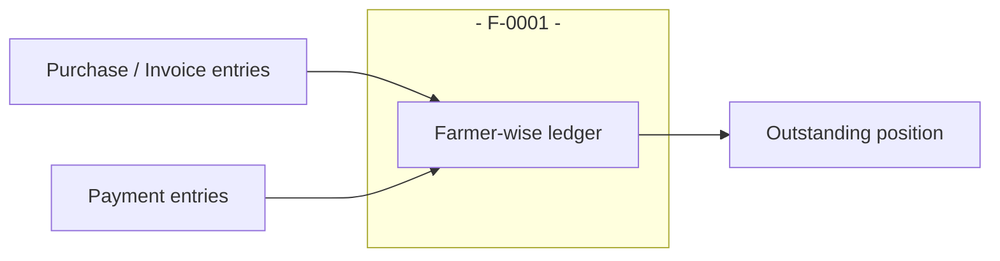
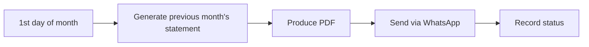
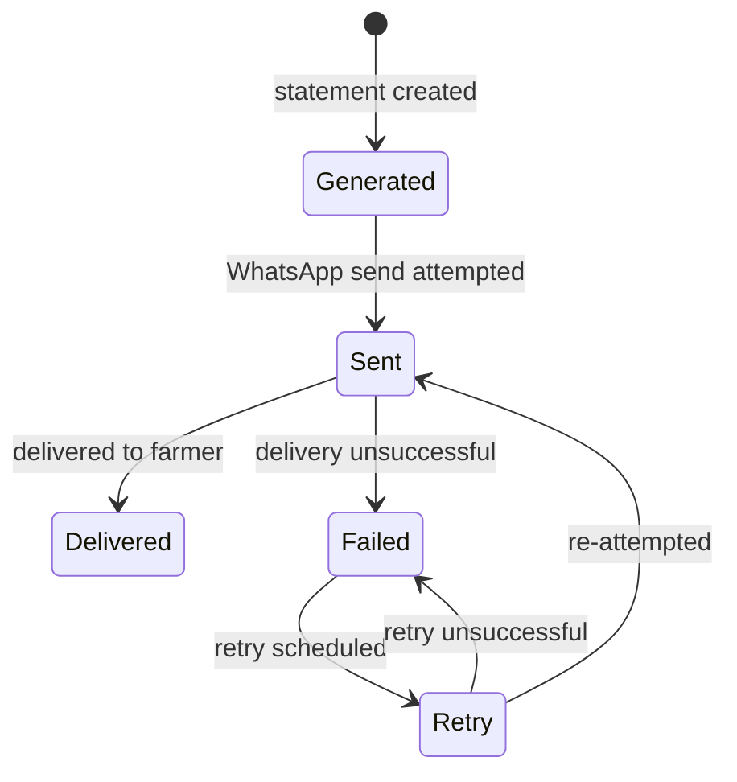
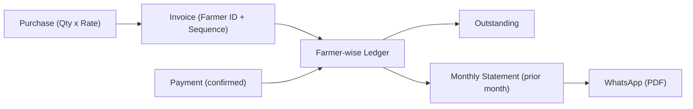

# Agri Procurement & Farmer Management System
## Ledger and Statement Specification

---

## 1. Document Information

| Item | Value |
|---|---|
| Product name | Agri Procurement & Farmer Management System |
| Document | Ledger and Statement Specification |
| Version | v1.0 |
| Status | Draft — aligned to PRD v1.0, BRD v1.0, Workflows v1.0, FRS v1.0 |
| Date | 2026-09-16 |
| Purpose | Complete specification of the farmer-wise ledger and the automatic monthly statement: content, entries, balances, generation, PDF, WhatsApp delivery, statuses, retry, portal history and audit |
| Source | 1. `AgriProcurement & Farmer Management.pdf` (primary source of truth) — §9, §11, §12, §13, §17 2. `docs/01_PRODUCT_REQUIREMENTS_DOCUMENT.md` (§14–§15) 3. `docs/02_BUSINESS_REQUIREMENTS_DOCUMENT.md` (§13–§14) 4. `docs/06_FUNCTIONAL_REQUIREMENTS.md` (FR-LED-XXX, FR-MST-XXX, FR-WH-XXX) 5. `docs/07_FARMER_PORTAL_SPECIFICATION.md` (§14–§15) 6. `docs/09_PAYMENT_AND_RECONCILIATION_SPECIFICATION.md` |

### Conventions

| Tag | Meaning |
|---|---|
| `[SOURCE §n]` | Statement from the original PDF section `n` |
| `[NEW]` | Newly approved Farmer Portal requirement |
| Undefined / Not specified in the source requirements | Behaviour not defined in the source |

> All ledger and statement rules below come from the source PDF (§9, §11, §13). No new financial rules are created. Where content is derived (e.g., outstanding), it is marked as derived and API formulas are treated as summaries, not new rules.

---

## 2. Source Extract — Farmer Ledger (§9)

- Maintain a **complete farmer-wise ledger** within the software (`[SOURCE §9]`).
- Example columns and values (`[SOURCE §9]`):

| Date | Invoice | Product | Quantity | Rate | Amount | Payment | UTR No |
|---|---|---|---|---|---|---|---|
| 01 Aug | F-0001-01 | Onion | 300 kg | ₹27 | ₹8,100 | Paid | XXXXXX |
| 05 Aug | F-0001-02 | Tomato | 200 kg | ₹30 | ₹6,000 | Paid | XXXXXX |
| 10 Aug | F-0001-03 | Onion | 400 kg | ₹28 | ₹11,200 | Pending | NA |

## 3. Source Extract — Monthly Statement (§13)

- On the **1st day of every month**, automatically generate the **previous month's** statement (`[SOURCE §13]`).
- Contains: Farmer ID and farmer name, statement period, **opening balance (if applicable)**, all purchase invoices (product, quantity, rate, invoice amount), all payments (payment dates and UTRs), **closing/outstanding balance** (`[SOURCE §13]`).
- **Generate PDF** (`[SOURCE §13]`); automatically **send through WhatsApp** (`[SOURCE §13]`).
- Record statuses: **generated / sent / delivered / failed / retry** (`[SOURCE §13]`).

## 4. Source Extract — Automatic Ledger Update (§11)

- On bank/API-confirmed payment, **update the farmer ledger automatically** (`[SOURCE §11]`).

---

## 5. Farmer-Wise Ledger

- The system maintains a **complete, farmer-wise ledger** (`[SOURCE §9]`).
- A separate ledger exists per farmer, keyed by Farmer ID (permanent primary business identity, `[SOURCE §3]`).
- It records the farmer's invoiced purchases and their payments (`[SOURCE §9]`).

---

## 6. Ledger Entries

- Ledger entries reflect the farmer's business activity (`[SOURCE §9]`).
- Two source-documented entry types:
  - **Purchase entries** (invoices): date, invoice, product, quantity, rate, amount (`[SOURCE §9]`).
  - **Payment entries**: payment indicator and UTR no. (`[SOURCE §9]`).
- Columns per `[SOURCE §9]`: Date, Invoice, Product, Quantity, Rate, Amount, Payment, UTR No.

---

## 7. Purchase Entries

- A purchase entry appears in the ledger once the purchase is invoiced (`[SOURCE §5, §9]`).
- Captures: date, invoice number, product, quantity, rate, amount (`[SOURCE §9]`).
- Amount is automatically quantity × rate (`[SOURCE §5]`).

### Example (source values, `[SOURCE §9]`)
| Date | Invoice | Product | Quantity | Rate | Amount |
|---|---|---|---|---|---|
| 01 Aug | F-0001-01 | Onion | 300 kg | ₹27 | ₹8,100 |
| 05 Aug | F-0001-02 | Tomato | 200 kg | ₹30 | ₹6,000 |
| 10 Aug | F-0001-03 | Onion | 400 kg | ₹28 | ₹11,200 |

---

## 8. Payment Entries

- A payment entry reflects payment (or pending payment) against the purchase/invoice (`[SOURCE §9]`).
- Example: "Paid" with UTR XXXXXX; "Pending" with UTR NA (`[SOURCE §9]`).
- Ledger is updated automatically on confirmed payment (`[SOURCE §11]`).
- Payment content (amount, UTR, date) is defined in the payment domain (`[SOURCE §10]`); see `docs/09`.

---

## 9. Outstanding Calculation

- The source statements and reports reference an **outstanding balance** (`[SOURCE §13]`) and dashboard/invoices metrics (`[SOURCE §14, §15]`), and the portal shows outstanding (`[NEW]`).
- The source does **not** state a formal formula. **Derived (not a new rule):** outstanding reflects the unpaid portion of the farmer's invoiced amounts against payments received, updated automatically on confirmed payments (`[SOURCE §11]`).
- The exact computation rule is marked **undefined in detail** (open question OQ related; see PRD §28).

---

## 10. Opening Balance

- Opening balance appears on the monthly statement "**if applicable**" (`[SOURCE §13]`).
- Represents the position carried into the statement period from earlier activity.
- The exact carry-forward rule is **not defined in the source** (undefined).

---

## 11. Closing Balance

- The statement shows a **closing/outstanding balance** (`[SOURCE §13]`).
- Closing position for the statement period; equal to the outstanding concept per the statement context (`[SOURCE §13]`).

---

## 12. Invoice References

- Each purchase entry references its invoice number (e.g., F-0001-01) (`[SOURCE §9]`).
- Invoice numbers are generated from Farmer ID + sequence (`[SOURCE §6]`).
- The ledger therefore links to the full invoice records (see `docs/08`).

## 13. Payment References

- Each entry reflects whether the purchase is Paid or Pending (`[SOURCE §9]`).
- Paid entries show a UTR No. (`[SOURCE §9]`).
- Payments link to the payment module records (`[SOURCE §10]`; see `docs/09`).

## 14. UTR

- UTR No. is a ledger column (`[SOURCE §9]`).
- Received automatically from the bank/API wherever supported (`[SOURCE §11]`).
- Appears on the statement with payment dates (`[SOURCE §13]`) and in the UTR register report (`[SOURCE §14]`).

---

## 15. Monthly Statement

- Built from the farmer's ledger for the statement period (`[SOURCE §9, §13]`).
- Mandated content (`[SOURCE §13]`):
  - Farmer ID and farmer name
  - Statement period
  - Opening balance, if applicable
  - All purchase invoices (product, quantity, rate, invoice amount)
  - All payments (payment dates and UTRs)
  - Closing/outstanding balance

---

## 16. Statement Period

- Statement period = the **previous month** to the generation date (`[SOURCE §13]`).
- Example: on **1 September**, generate the statement for **1 August to 31 August** (`[SOURCE §13]`).

---

## 17. Automatic Monthly Generation

- Trigger: **1st day of every month** (`[SOURCE §13]`).
- Scope: the **previous month** (`[SOURCE §13]`).
- Automatic — no manual action specified (`[SOURCE §13]`).
- **Exact run time/timezone: Undefined (OQ-14).**

---

## 18. PDF Generation

- The statement is generated as a **PDF** (`[SOURCE §13]`).
- The PDF contains the statement content (§15) (`[SOURCE §13]`).

---

## 19. WhatsApp Delivery

- The statement is **automatically sent through WhatsApp** (`[SOURCE §13]`).
- The farmer is identified by the registered mobile linked to the Farmer ID (`[SOURCE §3]`).

---

## 20. Delivery Status

- Statuses recorded: **generated / sent / delivered / failed / retry** (`[SOURCE §13]`).

---

## 21. Failed Delivery

- When a statement cannot be delivered, status = **failed** (`[SOURCE §13]`).
- Failure is recorded and the farmer remains on the delivery status record.
- **Exact failure conditions and handling: undefined in detail (OQ-14).**

## 22. Retry

- The status set includes **retry** (`[SOURCE §13]`), so failed deliveries are retryable.
- **Retry policy (frequency, attempts, backoff, manual override): Undefined (OQ-14).**

---

## 23. Farmer Portal Statement History (`[NEW]`)

- Under the newly approved Farmer Portal requirement, the farmer can view and download **their own** monthly statements (`[NEW]`; `docs/07` §15 — My Statements).
- Same PDF artifact as the WhatsApp-delivered statement (`[SOURCE §13]`). 
- Scoped to the logged-in farmer only (own-data rule, `docs/07` §7).
- Statement artifacts served only when the statement's Farmer ID equals the session farmer's ID.

---

## 24. Statement Audit

- Statement generation and delivery are business actions subject to the audit trail: user/employee ID (system where applicable), date/time, action, original/new value, record affected (`[SOURCE §17]`).
- Delivery status transitions (generated/sent/delivered/failed/retry) are recorded (`[SOURCE §13]`).
- No silent overwrite of historical financial records incl. statements (`[SOURCE §17]`).

---

## 25. Relationship: Purchase → Invoice → Payment → Ledger → Outstanding → Monthly Statement

| Link | Description | Source |
|---|---|---|
| Purchase → Invoice | Purchase confirmation generates the invoice; amount = qty × rate | `[SOURCE §5, §6]` |
| Invoice → Ledger | Invoices are ledger purchase entries (date, invoice, product, qty, rate, amount) | `[SOURCE §9]` |
| Payment → Ledger | Confirmed payments update the ledger automatically; paid/pending and UTR recorded | `[SOURCE §9, §11]` |
| Ledger → Outstanding | Outstanding is the unpaid position, updated with each entry | `[SOURCE §9, §11]`; formula detail undefined |
| Ledger → Monthly Statement | Statement = farmer's ledger for the previous month (opening balance, invoices, payments, closing/outstanding) | `[SOURCE §13]` |
| Statement → WhatsApp | PDF statement delivered via WhatsApp | `[SOURCE §13]` |

---

## 26. Worked Example (source-documented values only)

Using `[SOURCE §9]` ledger rows for Farmer F-0001:

| Date | Invoice | Product | Quantity | Rate | Amount | Payment | UTR No. |
|---|---|---|---|---|---|---|---|
| 01 Aug | F-0001-01 | Onion | 300 kg | ₹27 | ₹8,100 | Paid | XXXXXX |
| 05 Aug | F-0001-02 | Tomato | 200 kg | ₹30 | ₹6,000 | Paid | XXXXXX |
| 10 Aug | F-0001-03 | Onion | 400 kg | ₹28 | ₹11,200 | Pending | NA |

- The recurring amounts are exactly as documented (`[SOURCE §9]`); no new values are introduced.
- The August statement for Farmer F-0001 would list these invoices, the payments with dates/UTRs, and the closing/outstanding balance (`[SOURCE §13]`).
- **No additional financial quantities are computed here**; opening/closing/outstanding figures are governed by §9–§13 and their undefined details.

---

## 27. Open Questions — Ledger & Statement

| ID | Question | Origin |
|---|---|---|
| Q-LS-01 | Exact opening/closing balance and outstanding computation rule | Undefined (derived from `[SOURCE §9, §13]`) |
| Q-LS-02 | Statement run time and timezone | Undefined (OQ-14) |
| Q-LS-03 | Statement delivery retry policy (frequency, attempts, manual override) | Undefined (OQ-14) |
| Q-LS-04 | Statement behaviour for farmers with no activity in the period | Undefined |
| Q-LS-05 | Statement PDF layout/template | Undefined |
| Q-LS-06 | Ledger treatment of cancelled invoices | Undefined (OQ-08) |

---

*End of Ledger and Statement Specification v1.0. Next in sequence: `11_REPORTS_AND_DASHBOARD_SPECIFICATION.md` (or per index reading order).*