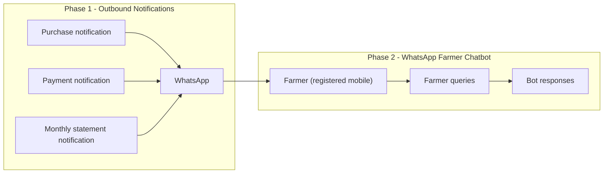
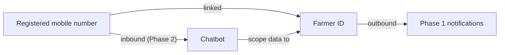
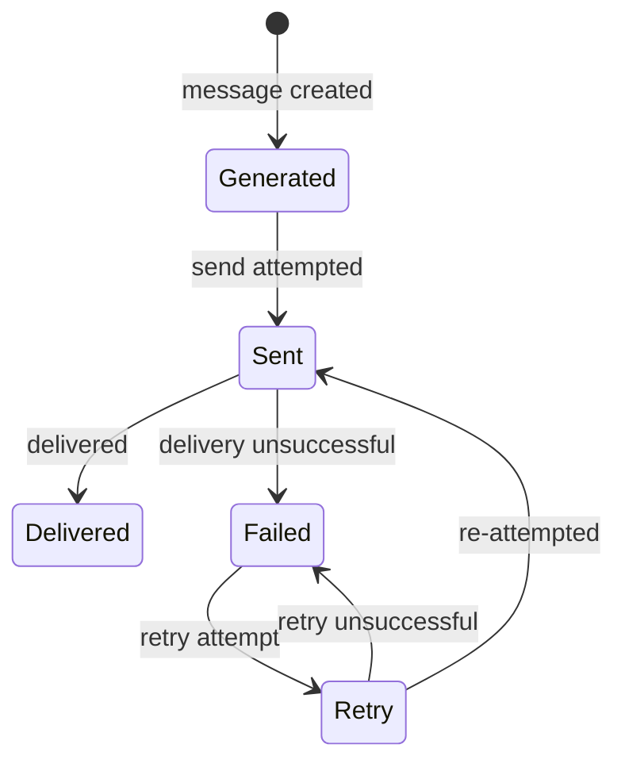

# Agri Procurement & Farmer Management System
## WhatsApp Integration Specification

---

## 1. Document Information

| Item | Value |
|---|---|---|---|
| Product name | Agri Procurement & Farmer Management System |
| Document | WhatsApp Integration Specification |
| Version | v1.0 |
| Status | Draft — aligned to PRD v1.0, BRD v1.0, Workflows v1.0, FRS v1.0 |
| Date | 2026-09-16 |
| Purpose | Complete specification of WhatsApp capabilities: Phase 1 outbound notifications (purchase, payment, statement) and Phase 2 WhatsApp Farmer Chatbot, including identity, message types, delivery status, retry, security and audit |
| Source | 1. `AgriProcurement & Farmer Management.pdf` (primary source of truth) — §3, §8, §12, §13, §17, §18, §21 2. `docs/01_PRODUCT_REQUIREMENTS_DOCUMENT.md` (§16) 3. `docs/02_BUSINESS_REQUIREMENTS_DOCUMENT.md` (§15) 4. `docs/06_FUNCTIONAL_REQUIREMENTS.md` (FR-WH-XXX) |

### Conventions

| Tag | Meaning |
|---|---|
| `[SOURCE §n]` | Statement from the original PDF section `n` |
| `[NEW]` | Newly approved Farmer Portal requirement |
| Phase 2 | WhatsApp Chatbot (`[SOURCE §21]`) |
| Undefined / Not specified in the source requirements | Behaviour not defined in the source; tracked as open questions (§70) |

### Provider-neutrality rule

This document assumes **no specific WhatsApp provider or API** (e.g., no Meta/Cloud API vendor is assumed). The source mandates only: messages to the farmer's registered mobile number (linked to Farmer ID, `[SOURCE §3]`), three outbound notification types (`[SOURCE §8, §12, §13]`), delivery statuses for statements incl. retry (`[SOURCE §13]`), and (Phase 2) chatbot queries (`[SOURCE §21]`). Provider/API details are marked undefined and listed in §70.

---

## 2. Capability Overview

---

## 3. Phase 1 — Outbound Notifications

### 3.1 Purchase Notification

- **Trigger:** after successful invoice creation (`[SOURCE §8]`).
- **Content (indicative):** purchase confirmation — invoice number, date, product, quantity, rate, total (`[SOURCE §8]`).
- **Purpose:** confirm the recorded purchase.

### 3.2 Payment Notification

- **Trigger:** when the bank/API confirms a payment (`[SOURCE §11, §12]`).
- **Content (indicative):** invoice reference, amount credited, UTR, date (`[SOURCE §12]`).
- **Example in source:** "As per Invoice F-0001-17, an amount of ₹10,000 has been credited to your bank account. UTR: XXXXXXXX. Date: 27-08-2026." (`[SOURCE §12]`).

### 3.3 Monthly Statement Notification

- **Trigger:** automatic monthly statement generation on the 1st of the month (`[SOURCE §13]`).
- **Content:** statement PDF for the previous month (`[SOURCE §13]`).
- **Purpose:** deliver the farmer's statement (see `docs/10`).

---

## 4. Phase 2 — WhatsApp Farmer Chatbot

- Farmers can interact through WhatsApp; the **registered mobile number identifies the Farmer ID** (`[SOURCE §21]`).
- Query types (`[SOURCE §21]`): My Outstanding, My Ledger, My Purchases, My Payments, Last Payment, Last Purchase, Invoice Details, Statement, Payment Status.
- Phase 2 scope; detailed conversation design is out of Phase 1 scope.

---

## 5. Farmer Identification Using Registered Mobile Number

- The **registered mobile number** is linked to the **Farmer ID** (`[SOURCE §3]`).
- It is the identity anchor for WhatsApp (`[SOURCE §3, §21]`).
- Outbound messages are addressed to the farmer's registered mobile (Phone number → Farmer ID resolution).
- **Resolution rules, mobile-format handling and unregistered-number handling: Undefined (open questions Q-WH-06, Q-WH-07).**
- Same mobile against two Farmer IDs: undefined (OQ-13 / Q-WH-08).

---

## 6. Farmer ID Mapping

| Concept | Relationship | Source |
|---|---|---|
| Farmer ID | Permanent, unique, primary business identity (e.g., F-0001) | `[SOURCE §3]` |
| Registered mobile | Linked to Farmer ID; WhatsApp identity anchor | `[SOURCE §3, §21]` |
| Portal login seed | Mobile is the proposed identity seed for Farmer Portal (`[NEW]`) | `docs/07` §4 |

- A valid mobile ↔ Farmer ID mapping is the precondition for every WhatsApp interaction.
- The mapping must be trusted/updated through the Farmer Management process (`[SOURCE §3]`).

---

## 7. Message Types

| Type | Phase | Purpose | Source |
|---|---|---|---|
| Purchase notification (utility) | 1 | Confirm purchase/invoice | `[SOURCE §8]` |
| Payment notification (utility) | 1 | Confirm payment + UTR | `[SOURCE §12]` |
| Statement notification (utility/attachment) | 1 | Deliver statement PDF | `[SOURCE §13]` |
| Chatbot query responses | 2 | Answer farmer queries | `[SOURCE §21]` |

---

## 8. Utility Notifications

- The three Phase 1 notifications are **utility notifications** (transactional messages to a registered user) per their source descriptions (`[SOURCE §8, §12, §13]`).
- The source does not use the trademarked term "utility vs template"; this document classifies them as utility/transactional by nature.
- **Provider policy category (utility vs template eligibility), approval and cost handling: Undefined (Q-WH-01).**

---

## 9. Invoice Notification

- Sent after successful invoice creation (purchase notification, §3.1) (`[SOURCE §8]`).
- Reference content: invoice number, date, product, quantity, rate, total (`[SOURCE §8]`).
- Requires an existing invoice (`[SOURCE §5–§7]`).

## 10. Payment Notification

- Sent when the bank/API confirms a payment (§3.2) (`[SOURCE §12]`).
- Reference content: invoice reference, credited amount, UTR, date (`[SOURCE §12]`).

## 11. Statement Notification

- Delivered monthly with the statement PDF (§3.3) (`[SOURCE §13]`).
- Statuses recorded: generated / sent / delivered / failed / retry (`[SOURCE §13]`).

---

## 12. Delivery Status

- Source-mandated statuses: **generated, sent, delivered, failed, retry** (`[SOURCE §13]`).
- Applies explicitly to the statement notification (`[SOURCE §13]`).
- **Whether delivery status tracking applies to purchase/payment notifications: Not specified in the source requirements (Q-WH-03).**

---

## 13. Failed Messages

- A message that cannot be delivered is marked **failed** (`[SOURCE §13]`).
- Failure is explicit for statements; failure handling for purchase/payment messages is undefined (Q-WH-03).

## 14. Retry

- The status set includes **retry** (`[SOURCE §13]`).
- **Retry policy (frequency, attempts, backoff, manual override): Undefined (Q-WH-04).**
- Applies to statement delivery (`[SOURCE §13]`).

---

## 15. Chatbot Commands (Phase 2)

Commands from the requirements (`[SOURCE §21]`):

| Command/query | Expected data (from source intent) |
|---|---|
| My Outstanding | Current outstanding |
| My Ledger | Farmer's ledger (e.g., "Ledger August → August ledger") |
| My Purchases | Farmer's purchases |
| My Payments | Farmer's payments |
| Last Payment | Most recent payment |
| Last Purchase | Most recent purchase |
| Invoice Details | Details for a given invoice (e.g., "F-0001-17") |
| Statement | Statement (period specified) |
| Payment Status | Status of a payment |

Source examples (`[SOURCE §21]`): *Outstanding → current outstanding. Ledger August → August ledger. F-0001-17 → invoice details.*

---

## 16. Chatbot Responses

- Responses are scoped to the requesting farmer's own data (identified via mobile → Farmer ID, `[SOURCE §21]`).
- Response output format per query: undefined in detail (Q-WH-05).
- Same own-data isolation applies as the portal rule (farmer sees only their own data) — enforced via Farmer ID scoping.
- Unknown/unrecognised queries: undefined (Q-WH-05).

---

## 17. Security

- WhatsApp interactions are externally driven; system security baseline applies (`[SOURCE §18]`): secure API authentication, encryption in transit, rate limiting, protection against common web/API attacks.
- Provider credentials must be stored securely (sensitive configuration, `[SOURCE §18]`).
- Outbound message content must not leak data of other farmers.

## 18. Authentication / Identity Verification

- **Outbound (Phase 1):** recipient identity is determined by the linked mobile ↔ Farmer ID mapping (`[SOURCE §3]`); no interactive authentication for receiving utility messages.
- **Inbound (Phase 2, chatbot):** the farmer is identified by the registered mobile number (`[SOURCE §21]`).
- **Identity verification depth (e.g., PIN/OTP for sensitive queries): Not specified in the source requirements (Q-WH-06).**
- Mobile-number spoofing/forwarded-number risks and mitigations: undefined (Q-WH-06).

## 19. Audit Logging

- WhatsApp sends, deliveries and status changes are business actions subject to the audit trail (`[SOURCE §17]`).
- Statement delivery statuses are recorded (`[SOURCE §13]`).
- Chatbot queries/responses (Phase 2) are recommended for logging; explicit requirement undefined (Q-WH-07).
- No silent overwrite: delivery status history preserved (`[SOURCE §17]`).

---

## 20. Phase Separation Summary

| Capability | Phase | Source |
|---|---|---|
| Purchase notification | Phase 1 | `[SOURCE §8]` |
| Payment notification | Phase 1 | `[SOURCE §12]` |
| Monthly statement notification | Phase 1 | `[SOURCE §13]` |
| WhatsApp Farmer Chatbot | Phase 2 | `[SOURCE §21]` |

---

## 21. Open Questions — WhatsApp

| ID | Question | Origin |
|---|---|---|
| Q-WH-01 | Which WhatsApp provider/API? What is the message category policy (utility/template) and associated approval/cost handling? | Undefined (OQ-04) |
| Q-WH-02 | Message template content, tokens and formatting (exact copy) | Undefined (source gives indicative example only) |
| Q-WH-03 | Delivery-status tracking and failure handling for purchase/payment notifications | Undefined (statuses mandated only for statements) |
| Q-WH-04 | Retry policy (frequency, attempts, backoff, manual override) | Undefined (OQ-14 related) |
| Q-WH-05 | Chatbot conversation design, response format, unhandled query behaviour | Undefined (Phase 2) |
| Q-WH-06 | Identity verification depth for inbound queries (e.g., OTP/PIN for sensitive data) | Undefined (`[SOURCE §21]` identifies by mobile only) |
| Q-WH-07 | Audit/retention of message and chatbot events | Undefined |
| Q-WH-08 | Same mobile registered against two Farmer IDs | Undefined (OQ-13) |

---

*End of WhatsApp Integration Specification v1.0. Next in sequence: `12_REPORTS_AND_DASHBOARD_SPECIFICATION.md` (or per index reading order).*