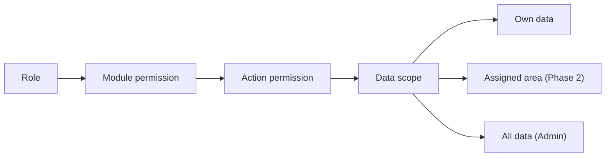
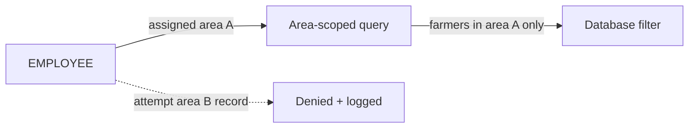

# Agri Procurement & Farmer Management System
## RBAC and Authorization Specification

---

## 1. Document Information

| Item | Value |
|---|---|
| Product name | Agri Procurement & Farmer Management System |
| Document | RBAC and Authorization Specification |
| Version | v1.0 |
| Status | Draft — aligned to PRD v1.0, BRD v1.0, Workflows v1.0, FRS v1.0 |
| Date | 2026-09-16 |
| Purpose | Authorization design for SUPER_ADMIN, EMPLOYEE and FARMER roles: role definitions, permission model, module/action/data-level permissions, own-data restriction, Phase 2 area restriction, backend & API authorization, unauthorized behavior and audit |
| Source | 1. `AgriProcurement & Farmer Management.pdf` (primary source of truth) — §2, §3, §16, §17, §18, §22 2. `docs/01_PRODUCT_REQUIREMENTS_DOCUMENT.md` (§6, §16, §20) 3. `docs/02_BUSINESS_REQUIREMENTS_DOCUMENT.md` (§6, §16, §18) 4. `docs/04_MODULE_SPECIFICATION.md` (M01–M23) 5. `docs/05_USER_ROLES_AND_USER_STORIES.md` 6. `docs/07_FARMER_PORTAL_SPECIFICATION.md` (§7) 7. `docs/06_FUNCTIONAL_REQUIREMENTS.md` (FR-AUTH, FR-SET-004) |

### Conventions

| Tag | Meaning |
|---|---|
| `[SOURCE §n]` | Statement from the original PDF section `n` |
| `[NEW]` | Newly approved Farmer Portal requirement |
| Phase 2 | Area-based access (`[SOURCE §22, §23]`) |
| Undefined | Not specified in the source requirements; tracked as open questions (§15) |

---

## 2. Role Definitions

| Role | Source | Definition |
|---|---|---|
| SUPER_ADMIN | `[SOURCE §2]` | Full access to the entire system. Manages employees and farmers; views all areas, procurement, invoices, payments, ledgers and reports; manages settings, WhatsApp and banking integrations; views audit logs; configures the permission matrix. |
| EMPLOYEE | `[SOURCE §2, §16]` | Individual login per employee. Uses the portal while collecting material from farmers. **Limited to farmer information required for procurement and procurement entry.** Every transaction records the creating employee. |
| FARMER | `[SOURCE §3]` / `[NEW]` | In the source, the farmer is a party identified by Farmer ID + registered mobile; no login existed. Under the newly approved Farmer Portal requirement, the FARMER is a login user with **own-data-only** access. |

---

## 3. Permission Model

- **Role-based access control (RBAC)** is mandated ("role-based authorization", `[SOURCE §18]`).
- The permission matrix is **configurable by Admin** (`[SOURCE §16]`).
- Model levels:
  1. **Role** → 2. **Module** → 3. **Action** → 4. **Data scope**.

- Default model below is the **source-mandated baseline**; the Admin may reconfigure via the permission matrix (`[SOURCE §16]`).
- Full role/permission catalogue beyond the documented roles: **undefined** (OQ-09).

---

## 4. Module-Level Permissions

Module references from `docs/04_MODULE_SPECIFICATION.md` (M01–M18 Phase 1; M19–M23 Phase 2).

| Module | SUPER_ADMIN | EMPLOYEE | FARMER |
|---|---|---|---|
| M01 Authentication / session | Full | Full (own) | Full (own, portal) |
| M02 User Management | Manage | None | None |
| M03 Farmer Management | Manage | Read (limited: info required for procurement, `[SOURCE §16]`) | View own profile only (`[NEW]`) |
| M04 Employee Management | Manage | None | None |
| M05 Farmer Portal | Access (admin view) | None | Full (own data) (`[NEW]`) |
| M06 Procurement | Full | **Entry** (`[SOURCE §16]`) | None |
| M07 Product Management | Manage | Select product in entry (`[SOURCE §5]`) | None |
| M08 Invoice Management | Full | Generate via workflow; view own confirmations (`[SOURCE §5–§7]`) | View own invoices (`[NEW]`) |
| M09 Payment Management | Full | None | View own payments (`[NEW]`) |
| M10 Bank Reconciliation | Full (queue/admin) | None | None (see own ledger/payments) |
| M11 Farmer Ledger | Full | Read (employee access scope undefined) | View own ledger (`[NEW]`) |
| M12 Monthly Statements | Full | None | View own statements (`[NEW]`) |
| M13 WhatsApp Integration | Configure (`[SOURCE §2]`) | None | Receive messages (`[SOURCE §8, §12, §13]`) |
| M14 Notifications | Manage/track | None (system) | View own history (`[NEW]`) |
| M15 Reports | Full (`[SOURCE §14]`) | Per permission matrix (`[SOURCE §16]`); not source-specified | Own data only (`[NEW]`) |
| M16 Dashboard | Full (`[SOURCE §15]`) | None (Admin Dashboard) | Own dashboard (`[NEW]`) |
| M17 Audit Logs | View (`[SOURCE §2]`) | None | None (portal view logging only) |
| M18 System Settings | Manage (`[SOURCE §2]`) | None | None |
| M19 WhatsApp Chatbot (P2) | Configure | None | Use (own data) (`[SOURCE §21]`) |
| M20 Area Management (P2) | Manage (`[SOURCE §23]`) | None | None |
| M21 Area-based Farmer Allocation (P2) | Manage (`[SOURCE §23]`) | Access restricted to assigned area (`[SOURCE §22]`) | None |
| M22 Area-based Employee Allocation (P2) | Manage (`[SOURCE §23]`) | None (assignment by admin) | None |
| M23 Area-wise Reporting (P2) | Full (`[SOURCE §24]`) | Per matrix | None |

---

## 5. Action-Level Permissions

Action types per entity:

| Action | SUPER_ADMIN | EMPLOYEE | FARMER |
|---|---|---|---|
| Create farmer | Yes | No | No |
| Update farmer | Yes | No (`[SOURCE §16]`) | Own-profile only, if approved (OQ-18) |
| View farmer | Yes | Limited (`[SOURCE §16]`) | Own only (`[NEW]`) |
| Delete/close farmer | Yes (status undefined) | No | No |
| Create employee | Yes | No | No |
| Update employee | Yes | No | No |
| Create purchase/invoice | Yes | Yes (`[SOURCE §16]`) | No |
| Cancel invoice | Yes (actor undefined — OQ-08) | Per matrix/undefined | No |
| Create payment | Yes (accounts role undefined) | No | No |
| Reconcile payment | Yes (queue) | No | No |
| Download statement | Yes | No | Own statements (`[NEW]`) |
| Export report | Yes | Per matrix | Own data views (`[NEW]`) |
| Configure settings/integrations | Yes | No | No |
| View audit logs | Yes | No | No |

---

## 6. Data-Level Permissions

| Data set | SUPER_ADMIN | EMPLOYEE | FARMER |
|---|---|---|---|
| All farmers | Full | Limited to information required for procurement (`[SOURCE §16]`); Phase 2: assigned area only (`[SOURCE §22]`) | None |
| Own farmer record | Full | n/a | Full (own profile, `[NEW]`) |
| Other farmers' records | Full | Phase 1: procurement-scope views only; **Phase 2: prohibited outside assigned area** | **Prohibited always** |
| Bank/KYC data | Full (sensitive access restricted, `[SOURCE §18]`) | Per permission matrix; sensitive-restricted | Own only, display rules pending OQ-18 |
| Transaction/payment data | Full | Transactions they create; reports per matrix | Own only (`[NEW]`) |
| Audit logs | Full | None | None |

---

## 7. Farmer Own-Data Restriction

**Business and authorization rule (critical).**

- A FARMER may access **only their own records**:
  - Profile
  - Purchases
  - Invoices
  - Payments
  - Ledger
  - Statements
  - Notifications
- The farmer MUST NOT access any other farmer's records in any of these categories.
- Enforcement: **server-side / database authorization level**, not only UI (derived from `[SOURCE §22]` enforcement principle; specified in `docs/07` §7).

| Requirement | Detail |
|---|---|
| F-OD-01 | Every farmer data request is scoped to the authenticated Farmer ID server-side. |
| F-OD-02 | Farmer-supplied identifiers are validated to belong to the session farmer; not trusted alone. |
| F-OD-03 | No direct record-access/enumeration pattern that bypasses farmer scope. |
| F-OD-04 | Cross-scope access attempts are denied (not silently redirected) and logged. |
| F-OD-05 | No global search/lookup in the farmer portal. |

---

## 8. Employee Permissions

- EMPLOYEE permissions are limited to farmer info required for procurement + procurement entry (`[SOURCE §16]`).
- Individual login per employee; transaction attribution to employee (`[SOURCE §2]`).
- Departmental management by Admin.

### 8.1 Phase 1
- Farmer lookup relevant to procurement, procurement entry.
- No access to: user/employee administration, payments/reconciliation, admin dashboard, audit logs, system settings, statements administration (baseline matrix; Admin may adjust via permission matrix `[SOURCE §16]`).

### 8.2 Phase 2 area restriction (mandatory rule)
- Employees assigned to an area must only access farmers belonging to **their assigned area** (`[SOURCE §22]`).
- Employees must not search, view, edit or download farmers outside their assigned area (`[SOURCE §22]`).
- **Enforcement at backend/database authorization level, not only frontend UI** (`[SOURCE §22]`).

| Requirement | Detail |
|---|---|
| E-AR-01 | Employee data queries are filtered to the employee's assigned area(s) at backend level (`[SOURCE §22]`). |
| E-AR-02 | Employee cannot access farmers outside assigned area in search, view, edit or download (`[SOURCE §22]`). |
| E-AR-03 | Area scoping is enforced at the database/query layer, not only hiding UI elements. |
| E-AR-04 | Area assignment is managed by Admin (create areas, assign farmers/employees, reassign, transfer) (`[SOURCE §23]`). |

---

## 9. Admin Permissions

- SUPER_ADMIN has full access to the entire system (`[SOURCE §2]`).
- Manages employees and farmers; views all areas, procurement, invoices, payments, ledgers, reports; manages settings, WhatsApp & banking integrations; views audit logs (`[SOURCE §2]`).
- Configures the permission matrix (`[SOURCE §16]`).
- Phase 2: full area management access maintained (`[SOURCE §23]`).

---

## 10. Future Configurable Permissions

- The permission matrix is **configurable by Admin** (`[SOURCE §16]`).
- Future flexibility: Admin can configure module/action grants per role within the matrix.
- **Catalogue of roles and configurable items: Undefined (OQ-09).**
- Tablet of typical current roles is the baseline above; actual matrix entries are Admin-defined.

---

## 11. Backend Authorization Requirements

| ID | Requirement | Source |
|---|---|---|
| BZ-01 | Authorization checks MUST be enforced in the backend for every protected operation (not only UI). | `[SOURCE §18, §22]` |
| BZ-02 | Farmer data access MUST be scoped by Farmer ID server-side. | `[NEW]` / derived `[SOURCE §22]` |
| BZ-03 | (Phase 2) Employee data access MUST be scoped by assigned area server-side. | `[SOURCE §22]` |
| BZ-04 | Role assigned at session start; permissions evaluated per request. | `[SOURCE §18]` |
| BZ-05 | Unauthorized operations MUST NOT be reachable by tampered requests. | `[SOURCE §18]` |

---

## 12. API Authorization

| ID | Requirement | Source |
|---|---|---|
| APIZ-01 | API access MUST use secure API authentication. | `[SOURCE §18]` |
| APIZ-02 | Internal portal APIs MUST apply the same role/data-scope checks as UI flows. | derived `[SOURCE §18]` |
| APIZ-03 | Banking/WhatsApp provider APIs use secure authenticated channels; credentials secured. | `[SOURCE §18]` |
| APIZ-04 | Farmer portal APIs MUST scope all queries to the session Farmer ID; no cross-farmer access via API. | `[NEW]` |
| APIZ-05 | API requests carry actor identity; denied requests are logged. | `[SOURCE §17]` |

---

## 13. Database-Level / Data-Filtering Requirements

| ID | Requirement | Source |
|---|---|---|
| DBZ-01 | Farmer data queries are filtered by Farmer ID at the data-access layer. | `[NEW]` |
| DBZ-02 | (Phase 2) Employee queries are filtered by the employee's assigned area(s) at the data-access/database layer. | `[SOURCE §22]` |
| DBZ-03 | The area restriction must be enforced at backend/database authorization level, not only frontend UI level. | `[SOURCE §22]` |
| DBZ-04 | Data-fetching APIs must not rely on client-supplied filters alone for scoping. | derived `[SOURCE §18, §22]` |
| DBZ-05 | Sensitive data (bank, KYC) restricted at retrieval layer. | `[SOURCE §18]` |

---

## 14. Unauthorized Access Behavior

| Scenario | Expected behavior |
|---|---|
| Farmer requests another farmer's record (ID enum / tampered request) | Deny (no data); log attempt (P-ISO-04, `docs/07`). |
| Employee (Phase 2) requests farmer outside assigned area | Deny; log attempt (E-AR-01/02). |
| Unauthenticated request to protected resource | Return authentication-required; no data leakage. |
| Role without module permission attempts action | Deny; log; no partial data. |
| API without valid authentication | Reject (secure API auth `[SOURCE §18]`). |
| Denial must never reveal existence of another record's data. | Deny generically (best practice consistent with `[SOURCE §18]`). |

---

## 15. Audit Requirements

- All authorization denials and privileged actions are recorded per the audit trail: user/employee ID, date/time, action, original/new value, record affected, IP/device where appropriate (`[SOURCE §17]`).
- SUPER_ADMIN can view audit logs (`[SOURCE §2]`).
- No silent overwrite of historical financial records (`[SOURCE §17]`).
- Permission-matrix configuration changes are auditable (`[SOURCE §16, §17]`).

---

## 16. Permission Matrix (Consolidated)

### 16.1 Phase 1

| Area | SUPER_ADMIN | EMPLOYEE | FARMER |
|---|---|---|---|
| User/Employee admin | Full | – | – |
| Farmer master | Full | Read (procurement-scope) | Own profile view |
| Procurement entry | Full | Yes | – |
| Invoice view/generate | Full | Generate (workflow) / own confirmations | Own invoices |
| Payment entry/reconcile | Full | – | Own payments view |
| Ledger | Full | Per matrix | Own ledger |
| Statements | Full | – | Own statements (PDF) |
| WhatsApp config | Full | – | Receive |
| Notifications | Full | – | Own history |
| Reports | Full | Per matrix | Own data |
| Dashboard | Full | – | Own dashboard |
| Audit logs | View | – | – |
| System settings | Full | – | – |

### 16.2 Phase 2 (area-scoped)

| Area | SUPER_ADMIN | EMPLOYEE (assigned area) | FARMER |
|---|---|---|---|
| Farmer access scope | All | **Assigned area only** (`[SOURCE §22]`) | Own data |
| Area management | Full | – | – |
| Farmer/employee assignment | Full | – | – |
| Area-wise reporting | Full | Assigned-area reports (per matrix) | Own data |
| Chatbot (WhatsApp) | Configure | – | Own queries (`[SOURCE §21]`) |

---

## 17. Open Questions

| ID | Question | Source |
|---|---|---|
| Q-RBAC-01 | Full role/permission catalogue beyond the three documented roles | Undefined (OQ-09) |
| Q-RBAC-02 | Employee access to ledger/reports scope | Undefined (per permission matrix) |
| Q-RBAC-03 | Who may cancel invoices | Undefined (OQ-08) |
| Q-RBAC-04 | Who creates/approves payments | Undefined (Q-PAY-010) |
| Q-RBAC-05 | Farmer profile edit rights (OQ-18) | Undefined |
| Q-RBAC-06 | Area granularity model (multiple areas per employee?, hierarchy?) | Undefined |

---

*End of RBAC and Authorization Specification v1.0. Next in sequence: `13_SECURITY_SPECIFICATION.md` (or per index reading order).*