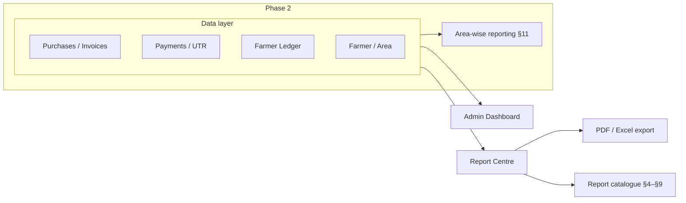
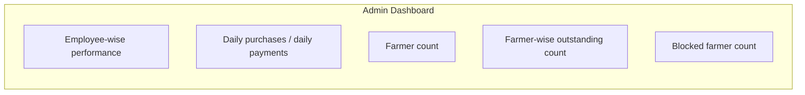

# Agri Procurement & Farmer Management System
## Reports and Dashboard Specification

---

## 1. Document Information

| Item | Value |
|---|---|
| Product name | Agri Procurement & Farmer Management System |
| Document | Reports and Dashboard Specification |
| Version | v2.0 |
| Status | Draft — **merged** of `docs/13_REPORTS_AND_DASHBOARD_SPECIFICATION.md` v1.0 (mandate) and `docs/19_REPORTING_AND_DASHBOARD_SPECIFICATION_DETAILED.md` v1.0 (detailed expansion) into this single canonical spec |
| Date | 2026-09-16 |
| Purpose | Complete specification of the reporting layer (Report Centre), the Admin Dashboard (KPIs, date filters), the detailed report catalogue grouped by Farmer / Procurement / Payment, export formats, permission alignment, performance and data rules |
| Sources | 1. `AgriProcurement & Farmer Management.pdf` (primary source of truth) — §2, §9–§15, §17, §22, §24 2. `docs/01_PRODUCT_REQUIREMENTS_DOCUMENT.md` (§14–§15) 3. `docs/02_BUSINESS_REQUIREMENTS_DOCUMENT.md` (§14) 4. `docs/06_FUNCTIONAL_REQUIREMENTS.md` (FR-RPT-XXX, FR-DSH-XXX) 5. `docs/09_PAYMENT…` (statuses `[SOURCE §11]`) 6. `docs/10_LEDGER_AND_STATEMENT_SPECIFICATION.md` 7. `docs/12_RBAC_AND_AUTHORIZATION.md` 8. `docs/15_DATABASE_DESIGN.md` 9. `docs/14_AUDIT_LOGGING…` |
| Related doc | Supersedes separate `docs/19_REPORTING_AND_DASHBOARD_SPECIFICATION_DETAILED.md` (merged here; that file removed) |

### Conventions

| Tag | Meaning |
|---|---|
| `[SOURCE §n]` | Statement from the original PDF section `n` |
| `[NEW]` | Newly approved Farmer Portal requirement |
| `[PROPOSED]` | Design addition not in the source; requires approval |
| DERIVED | Metric computed from recorded transaction data (no new financial rule); the aggregation is counting/summing recorded values |
| Undefined / OQ | Not specified in the source requirements; tracked as open questions (§21) |

### Scope rules

1. **No invented metrics.** Every KPI and report column traces to: a source requirement (`[SOURCE]`), a direct aggregate of recorded transaction data (DERIVED), or is explicitly `[PROPOSED]`.
2. This document does **not** change the mandated register set (R-01…R-09); detailed group views add operational detail and status sub-views.
3. Aggregations group recorded transactions only. Where a metric's formula could imply a financial rule (e.g., "outstanding"), the rule stays as defined in `docs/10` (undefined/derived) — never invented here.

---

## 2. Reporting Overview

- Reports are accessible to **Super Admin**; employee access governed by the permission matrix (`[SOURCE §16]`).
- Farmer access restricted to **own data** views (`[NEW]`; `docs/12` §7).
- Report queries always apply role data-scope **server-side** — never filtered-after-fetch.

---

## 3. Report Centre — Mandated Reports (`[SOURCE §14]`)

All report names, scopes and filters in this section are taken directly from the source (§14). Ingressed numbers are placeholders; no financial figures are invented.

| # | Report | Source description |
|---|---|---|
| R-01 | Purchase Register | Register of purchases |
| R-02 | Invoice Register | Register of invoices |
| R-03 | Payment Register | Register of payments |
| R-04 | Farmer-wise Report | Farmer-wise ledger/statement of activity |
| R-05 | UTR Register | Register of UTR numbers from payments |
| R-06 | Monthly Summary (Purchase/Payment) | Summary of purchases vs payments per month |
| R-07 | Product-wise Procurement | Procurement grouped by product |
| R-08 | Employee-wise Procurement | Procurement grouped by employee |
| R-09 | Farm Area-wise Procurement (Phase 2) | Procurement grouped by farm area |

### 3.1 Registry Map — mandate ↔ detailed group views (§6–§8)

| Group | Report (§6–8) | Mandate link |
|---|---|---|
| Farmer | F-01 Farmer-wise Purchase | R-01/R-04 farmer-scoped (`[SOURCE §14]`) |
| Farmer | F-02 Farmer-wise Payment | R-03 farmer-scoped (`[SOURCE §14]`) |
| Farmer | F-03 Farmer Outstanding | `[SOURCE §15]` farmer-wise outstanding count; value report DERIVED from ledger |
| Farmer | F-04 Farmer Ledger | R-04 (`[SOURCE §9, §14]`) |
| Farmer | F-05 Farmer Monthly Statement | `[SOURCE §13]` statement + R-06 monthly cycle |
| Procurement | P-01 Date-wise Procurement | R-01 date-filtered (`[SOURCE §14]`) / `[SOURCE §15]` daily activity |
| Procurement | P-02 Product-wise Procurement | R-07 (`[SOURCE §14]`) |
| Procurement | P-03 Employee-wise Procurement | R-08 (`[SOURCE §14]`) |
| Procurement | P-04 Farmer-wise Procurement | R-01/R-04 grouped by farmer (`[SOURCE §14]`) |
| Procurement | P-05 Quantity-wise Procurement | `[PROPOSED]` structural view from recorded qty data |
| Procurement | P-06 Rate-wise Procurement | `[PROPOSED]` structural view from recorded rate data |
| Payment | PM-01 Payment Register | R-03 (`[SOURCE §14]`) |
| Payment | PM-02 UTR Register | R-05 (`[SOURCE §14]`) |
| Payment | PM-03 Paid Payments | `[SOURCE §11]` status-derived sub-view of R-03 |
| Payment | PM-04 Partially Paid Payments | `[PROPOSED]` (depends on allocation model; Q-PAY-006) |
| Payment | PM-05 Pending Payments | `[SOURCE §11]` status-derived sub-view of R-03 |
| Payment | PM-06 Unreconciled Payments | `[SOURCE §11]` Unmatched/Failed queue, R-03 sub-view |

---

## 4. Mandated Report Definitions (R-01…R-09)

### 4.1 Purchase Register (R-01)
- Register of all purchases (`[SOURCE §14]`).
- Granularity: purchase/invoice level.
- Suggested minimum columns (from system data): date, farmer, invoice, product, quantity, rate, amount, employee. *(Column list derived; exact layout undefined — Q-RPT-01.)*
- Detailed variants: P-01 (date-wise), P-04 (farmer-wise) — §7.

### 4.2 Invoice Register (R-02)
- Register of all invoices (`[SOURCE §14]`).
- Source invoice numbering applies (`[SOURCE §6]`).
- Dashboard counterpart: number of invoices (K-10, §10.1).

### 4.3 Payment Register (R-03)
- Register of all payments (`[SOURCE §14]`).
- Payment data, UTR and statuses per `docs/09`.
- Detailed variants: PM-01…PM-06 — §8.

### 4.4 Farmer-wise Report (R-04)
- Farmer-wise report/ledger (`[SOURCE §14]`).
- Content is the farmer's ledger view (`[SOURCE §9]`).
- Detailed variants: F-01…F-05 — §6.

### 4.5 UTR Register (R-05)
- Register of UTR numbers (`[SOURCE §14]`).
- Source of UTR data: payment module (`[SOURCE §10]`), ledger column (`[SOURCE §9]`).
- Detailed variant: PM-02 — §8.

### 4.6 Monthly Summary — Purchase/Payment (R-06)
- Monthly summary of purchases and payments (`[SOURCE §14]`).
- Dated alignment with the monthly statement cycle (`[SOURCE §13]`).
- Dashboard counterpart: monthly procurement (K-06), payments made (K-08).

### 4.7 Product-wise Procurement (R-07)
- Procurement grouped by product (`[SOURCE §14]`).
- Quantity + amount aggregates per product.
- Detailed variant: P-02 — §7.

### 4.8 Employee-wise Procurement (R-08)
- Procurement grouped by employee (`[SOURCE §14]`).
- Supports §10.2 dashboard "employee-wise performance".
- Detailed variant: P-03 — §7.

### 4.9 Farm Area-wise Procurement (R-09)
- Procurement grouped by farm/area (`[SOURCE §24]`, Phase 2).
- Solidly linked to the area allocation module (`[SOURCE §22–§24]`).
- Phase 2 detail: §11.

---

## 5. Report Filters (`[SOURCE §14]`)

Source-mandated filters:

| Filter | Notes |
|---|---|
| From Date | Start of date range |
| To Date | End of date range |
| Farmer | Filter by farmer |
| Product | Filter by product |
| Employee | Filter by employee |

- Any combination of the above may be applied (`[SOURCE §14]`). Group views (§6–§8) use these plus their group-specific dimension.
- **Drill-down, saved filters, scheduling, comparative/period-over-period: Undefined (Q-RPT-02).**

---

## 6. Group: Farmer Reports

> All farmer-group reports default-scope to one farmer. Admin can choose any farmer; employees (Phase 2) only farmers in their area; farmers themselves see only own data via portal views (no report centre, `[NEW]`).

### F-01 Farmer-wise Purchase
| Attribute | Detail |
|---|---|
| Purpose | All purchases of a farmer in a date range (`[SOURCE §14]` farmer-wise). |
| Filters | Farmer, From Date, To Date, Product (optional). |
| Columns | Date, Invoice No, Product, Quantity, Unit, Rate, Gross, Deduction, Net, Employee. |
| User roles | SUPER_ADMIN; EMPLOYEE (Phase 2 area-scoped); farmer own view (`[NEW]`). |
| Data source | PROCUREMENT ↔ INVOICE (join on invoice). |
| Export | PDF, Excel (`[SOURCE §14]`); CSV `[PROPOSED]`. |
| Permissions | Super Admin full; employee area filter (E-AR) backend-enforced (`[SOURCE §22]`); farmer own-only (P-ISO). |
| Performance | Index (farmer_id, invoice_date); range-capped; server pagination; ambient aggregates precomputed for dashboard. |

### F-02 Farmer-wise Payment
| Attribute | Detail |
|---|---|
| Purpose | Payment history of a farmer with UTR and status (`[SOURCE §14]` payment register farmer-scoped). |
| Filters | Farmer, From Date, To Date, Status (optional). |
| Columns | Payment Date, Payment ID, Amount, Mode, Bank Ref, UTR, Status, Allocated Amount, Invoice(s). |
| User roles | SUPER_ADMIN; EMPLOYEE accounts per matrix; farmer own view (`[NEW]`). |
| Data source | PAYMENT, PAYMENT_ALLOCATION, INVOICE. |
| Export | PDF, Excel; CSV `[PROPOSED]`. |
| Permissions | Super Admin; accounts per matrix (OQ-09); farmer own UTR/payment only. |
| Performance | Index (farmer_id, payment_date); allocation join limits; lazy-load allocations. |

### F-03 Farmer Outstanding
| Attribute | Detail |
|---|---|
| Purpose | Current outstanding position per farmer (`[SOURCE §15]` farmer outstanding count; value DERIVED from ledger). |
| Filters | Farmer (single or group), As-of Date. |
| Columns | Farmer ID, Name, As-of Date, Total Purchases, Total Payments, Outstanding (per `docs/10` rule — formula Undefined), Status. |
| User roles | SUPER_ADMIN; EMPLOYEE (Phase 2 area-scoped); farmer own position (`[NEW]`). |
| Data source | LEDGER_ENTRY aggregation (per `docs/10` §4 — outstanding formula Undefined; shows recorded dims only). |
| Export | PDF, Excel; CSV `[PROPOSED]`. |
| Permissions | Super Admin; area employee; farmer own. Employee/export scope enforced backend. |
| Performance | Pre-computed periodic balances; as-of queries against ledger snapshot; index (farmer_id, entry_date). |

### F-04 Farmer Ledger
| Attribute | Detail |
|---|---|
| Purpose | Full farmer ledger — purchases and payments, running position (`[SOURCE §9, §14]` R-04; FR-LED-001/002). |
| Filters | Farmer, From Date, To Date (period range). |
| Columns | Date, Invoice No, Product, Quantity, Rate, Amount, Payment, UTR, (derived position per `docs/10`). |
| User roles | SUPER_ADMIN; EMPLOYEE (Phase 2 area); farmer own `My Ledger` (`[NEW]`, F7 in `docs/17`). |
| Data source | LEDGER_ENTRY; PROCUREMENT/PAYMENT references. |
| Export | PDF, Excel; CSV `[PROPOSED]`; farmer own export pending OQ-07. |
| Permissions | Super Admin; area employee; farmer own only (P-ISO-01). |
| Performance | Indexed (farmer_id, date); period-capped; deny full-history unbounded downloads (size guard). |

### F-05 Farmer Monthly Statement
| Attribute | Detail |
|---|---|
| Purpose | Monthly statement for a farmer (`[SOURCE §13]`; statement on 1st of month) as a report/download. |
| Filters | Farmer, Statement Period (Month/Year). |
| Columns | Opening, Purchases (period), Payments (period), Closing/Outstanding, (per `docs/10` — formulas Undefined), statement header data. |
| User roles | SUPER_ADMIN; EMPLOYEE (area-scoped, Phase 2); farmer own (`[NEW]`, F8). |
| Data source | MONTHLY_STATEMENT + LEDGER aggregates. |
| Export | PDF (statement hard-copy intent `[SOURCE §13]`), Excel; CSV `[PROPOSED]`. |
| Permissions | Super Admin; area employee; farmer own only. |
| Performance | Statement snapshot table pre-generated (`[SOURCE §13]` monthly job); report reads snapshot, not live ledger. |

---

## 7. Group: Procurement Reports

> Procurement group operates over PROCUREMENT/INVOICE records; all support the §14 filters (From, To, Farmer, Product, Employee `[SOURCE §14]`) plus group-specific dimension.

### P-01 Date-wise Procurement
| Attribute | Detail |
|---|---|
| Purpose | Procurement volumes/value by date, for a range (`[SOURCE §14]` R-01 by date; `[SOURCE §15]` daily activity). |
| Filters | From Date, To Date, Farmer, Product, Employee. |
| Columns | Date, # Purchases, Total Quantity, Total Net Value, (by-product split optional). |
| User roles | SUPER_ADMIN; EMPLOYEE (Phase 2 area). |
| Data source | PROCUREMENT (group by date). |
| Export | PDF, Excel; CSV `[PROPOSED]`. |
| Permissions | Super Admin; employee per matrix + area scope. |
| Performance | Date-range index; pre-aggregated daily rollup for dashboard K-04/K-05. |

### P-02 Product-wise Procurement
| Attribute | Detail |
|---|---|
| Purpose | Procurement grouped by product (`[SOURCE §14]` R-07). |
| Filters | From Date, To Date, Product. |
| Columns | Product, Unit, Total Quantity, Total Net Value, # Purchases. |
| User roles | SUPER_ADMIN; EMPLOYEE (Phase 2 area). |
| Data source | PROCUREMENT group by PRODUCT. |
| Export | PDF, Excel; CSV `[PROPOSED]`. |
| Permissions | Super Admin; employee per matrix + area scope. |
| Performance | Index (product_id, date); offtake aggregation cached. |

### P-03 Employee-wise Procurement
| Attribute | Detail |
|---|---|
| Purpose | Procurement by performing employee (`[SOURCE §14]` R-08); feeds §10.2 employee performance. |
| Filters | From Date, To Date, Employee, Farmer, Product. |
| Columns | Employee ID, Name, # Purchases, Total Quantity, Total Value. |
| User roles | SUPER_ADMIN; EMPLOYEE (Phase 2 area-scoped). |
| Data source | PROCUREMENT group by EMPLOYEE. |
| Export | PDF, Excel; CSV `[PROPOSED]`. |
| Permissions | Super Admin; employee scope: own or area per matrix (OQ-09). |
| Performance | Index (employee_id, date); weekly rollup for performance widget (`[SOURCE §15]`). |

### P-04 Farmer-wise Procurement
| Attribute | Detail |
|---|---|
| Purpose | Procurement grouped by farmer (`[SOURCE §14]` farmer-wise report; R-01/R-04). |
| Filters | From Date, To Date, Farmer, Product, Employee. |
| Columns | Farmer ID, Name, # Purchases, Total Quantity, Total Value. |
| User roles | SUPER_ADMIN; EMPLOYEE (Phase 2 area). |
| Data source | PROCUREMENT group by FARMER. |
| Export | PDF, Excel; CSV `[PROPOSED]`. |
| Permissions | Super Admin; area employee; not farmer (own views only, `[NEW]`). |
| Performance | Leaderboard-style aggregation; capped result set with pagination. |

### P-05 Quantity-wise Procurement `[PROPOSED]`
| Attribute | Detail |
|---|---|
| Purpose | Distribution of purchases by quantity bands / by unit volume (`[PROPOSED]` view; part of §7 regeneration needs — not in §14 list). |
| Filters | From Date, To Date, Product, Farmer, Employee. |
| Columns | Quantity Band (or unit), # Purchases, Total Quantity, Total Value. |
| User roles | SUPER_ADMIN; EMPLOYEE (per matrix). |
| Data source | PROCUREMENT (structural grouping of recorded quantities). |
| Export | PDF, Excel, CSV `[PROPOSED]`. |
| Permissions | Super Admin; employee per matrix. |
| Performance | Server-side banding; no client-side load; index on product/date. |

### P-06 Rate-wise Procurement `[PROPOSED]`
| Attribute | Detail |
|---|---|
| Purpose | Distribution of purchases by rate band / unit rate trend (`[PROPOSED]`; supports price analysis — not in §14 list). |
| Filters | From Date, To Date, Product, Farmer, Employee. |
| Columns | Rate Band, # Purchases, Total Quantity, Total Value, Avg/Min/Max Rate. |
| User roles | SUPER_ADMIN; EMPLOYEE (per matrix). |
| Data source | PROCUREMENT (structural grouping of recorded rates). |
| Export | PDF, Excel, CSV `[PROPOSED]`. |
| Permissions | Super Admin; employee per matrix. |
| Performance | Pre-aggregation per product/period; bounded output. |

---

## 8. Group: Payment Reports

> Payment status vocabulary per `[SOURCE §11]` (Matched/Unmatched/Failed/Pending/Duplicate) and allocation model per `docs/09` (Q-PAY-006). Sub-views PM-03…PM-06 are the Payment Register (R-03) filtered by status; none introduce new statuses.

### PM-01 Payment Register
| Attribute | Detail |
|---|---|
| Purpose | Full register of recorded payments (`[SOURCE §14]` R-03). |
| Filters | From Date, To Date, Farmer, Status, Mode. |
| Columns | Payment ID, Date, Farmer, Amount, Mode, Bank Ref, UTR, Status, Allocation Status (per allocation model). |
| User roles | SUPER_ADMIN; accounts staff per matrix. |
| Data source | PAYMENT (+ PAYMENT_ALLOCATION). |
| Export | PDF, Excel; CSV `[PROPOSED]`. |
| Permissions | Super Admin; accounts role per matrix (Q-PAY-010/OQ-09). |
| Performance | Status index; date partition; paginated. |

### PM-02 UTR Register
| Attribute | Detail |
|---|---|
| Purpose | Register of UTR numbers from payments (`[SOURCE §14]` R-05; UTR source: payment module `[SOURCE §10]`, ledger column `[SOURCE §9]`). |
| Filters | From Date, To Date, Farmer, Status. |
| Columns | UTR, Payment ID, Date, Farmer, Amount, Bank, Status, Matched Invoice(s). |
| User roles | SUPER_ADMIN; accounts staff per matrix. |
| Data source | PAYMENT (UTR field); MATCHING status. |
| Export | PDF, Excel; CSV `[PROPOSED]` (UTR lists are natural CSV). |
| Permissions | Super Admin; accounts role; UTR is sensitive — no farmer facing view beyond own payment (`[NEW]`). |
| Performance | UTR indexed; export streams for UTR dedup checks. |

### PM-03 Paid Payments (status view)
| Attribute | Detail |
|---|---|
| Purpose | Payments in Matched/Paid state (`[SOURCE §11]` Matched). |
| Filters | From Date, To Date, Farmer. |
| Columns | As PM-01 restricted to paid status. |
| User roles | SUPER_ADMIN; accounts staff. |
| Data source | PAYMENT (status) + ALLOCATION. |
| Export | PDF, Excel, CSV `[PROPOSED]`. |
| Permissions | Admin/accounts; farmer own (`[NEW]`). |
| Performance | Status-clustered index. |

### PM-04 Partially Paid Payments `[PROPOSED]`
| Attribute | Detail |
|---|---|
| Purpose | Payments/allocations where a payment only partially settles an invoice (allocated < invoice amount) (`[PROPOSED]`; depends on allocation model Q-PAY-006 — not stated in source). |
| Filters | From Date, To Date, Farmer. |
| Columns | Payment ID, Invoice No, Amount, Allocated, Remaining. |
| User roles | SUPER_ADMIN; accounts staff. |
| Data source | PAYMENT_ALLOCATION vs INVOICE amounts. |
| Export | PDF, Excel, CSV `[PROPOSED]`. |
| Permissions | Admin/accounts only (needs allocation model approval). |
| Performance | Derived view; periodic recompute suggested. |

### PM-05 Pending Payments (status view)
| Attribute | Detail |
|---|---|
| Purpose | Payments in Pending status (awaiting confirmation) (`[SOURCE §11]` Pending; dashboard K-07). |
| Filters | From Date, To Date, Farmer. |
| Columns | As PM-01 restricted to Pending. |
| User roles | SUPER_ADMIN; accounts staff. |
| Data source | PAYMENT (status). |
| Export | PDF, Excel, CSV `[PROPOSED]`. |
| Permissions | Admin/accounts. |
| Performance | Status index; alerting feed for K-07. |

### PM-06 Unreconciled Payments (`[SOURCE §11]` Unmatched/Failed/Duplicate)
| Attribute | Detail |
|---|---|
| Purpose | Payments not successfully matched to invoices (`[SOURCE §11]` Unmatched/Failed/Duplicate; feeds Reconciliation Queue and K-11). |
| Filters | From Date, To Date, Farmer, Reason. |
| Columns | Payment ID, Date, Farmer, Amount, UTR, Status (Unmatched/Failed/Duplicate), Last retry, Notes. |
| User roles | SUPER_ADMIN; accounts staff (reconciliation function). |
| Data source | PAYMENT + RECONCILIATION queue records. |
| Export | PDF, Excel; CSV `[PROPOSED]` (banks prefer CSV for re-match). |
| Permissions | Admin/accounts with reconciliation permission (OQ-09). |
| Performance | Queue-driven index; real-time component for dashboard K-11. |

---

## 9. Export Formats

| Format | Support | Behaviour |
|---|---|---|
| PDF | `[SOURCE §14]` (mandated) | Formal hard-copy layout; statement/invoice use; paginated; watermark/id per download. |
| Excel | `[SOURCE §14]` (mandated) | Tabular export with headers; multiple sheets for grouped reports (proposed within mandate — Q-RPT-03). |
| CSV | `[PROPOSED]` | Not stated in source — added for bank/UTR/work processing convenience; needs approval (Q-RPT-07). |

Common export rules (DERIVED/`[PROPOSED]` unless stated):
- Export applies the exact same role data-scope as the on-screen query (FRPT-01…04, §16).
- Exports are generated server-side and streamed; large runs async with download notice (`[PROPOSED]`).
- Export events audited (`[SOURCE §17]`): actor, report, filters, timestamp, filename hash.
- Formats: currency/number rounding and date formats Undefined (Q-RPT-03).

---

## 10. Admin Dashboard

- Displays **summary and visual charts** (`[SOURCE §15]`).
- **Audience:** ADMIN (the Dashboard is an admin surface per `[SOURCE §15]`). Employees: none. Farmers: none (own views instead, `[NEW]`).

### 10.1 KPI Catalogue

| # | KPI | Definition (behaviour) | Support | Data source (`docs/15`) | Refresh |
|---|---|---|---|---|---|
| K-01 | Total farmers | Count of farmer records | `[SOURCE §15]` | FARMER | Periodic (Q-RPT-05) |
| K-02 | Active farmers | Count of farmers with status = active | DERIVED (farmer status) | FARMER.status | Periodic |
| K-03 | Total employees | Count of employee records | DERIVED (master data) | EMPLOYEE | Periodic |
| K-04 | Today's procurement | Count of purchases for selected date (default today) | DERIVED (`[SOURCE §15]` daily purchases) | PROCUREMENT | Near-real-time |
| K-05 | Today's procurement value | Sum of procurement net values for the day | DERIVED (recorded net amounts) | PROCUREMENT / INVOICE | Near-real-time |
| K-06 | Monthly procurement | Sum of procurement value for the selected month | DERIVED (`[SOURCE §14]` monthly summary) | PROCUREMENT | Near-real-time |
| K-07 | Pending farmer payments | Count/amount of payments in Pending status | DERIVED (`[SOURCE §11]` Pending status) | PAYMENT.status | Near-real-time |
| K-08 | Payments made | Count/amount of payments recorded (daily/monthly) | `[SOURCE §15]` daily + monthly payments | PAYMENT | Near-real-time |
| K-09 | Total outstanding | Farmer outstanding value; KPI card shows sum + farmer-wise breakdown | `[SOURCE §15]` farmer-wise outstanding; value DERIVED from ledger | LEDGER_ENTRY / Statement | Periodic/on-nights |
| K-10 | Number of invoices | Count of invoices (incl. status split) | DERIVED (`[SOURCE §14]` invoice register) | INVOICE | Periodic |
| K-11 | Unreconciled bank transactions | Count of Unmatched/Failed/Duplicate in reconciliation queue | DERIVED (`[SOURCE §11]`) | PAYMENT / Reconciliation queue | Near-real-time |
| K-12 | Blocked farmers (source region) | Count of blocked farmers | `[SOURCE §15]` | FARMER.status | Periodic |

> K-01…K-12 extend the source §15 dashboard regions (§10.2). Metric cards are defined as **count** unless value is stated; value sums are always over recorded/approved amounts. No formula beyond agg (K-09 relies on ledger rule per `docs/10`, which stays undefined/derived — not re-invented).

### 10.2 Dashboard Visuals (source + derived)

| Widget | Content | Support |
|---|---|---|
| Employee-wise performance | Weekly purchases per employee | `[SOURCE §15]` |
| Daily activity | Daily purchases, daily payments | `[SOURCE §15]` |
| Farmer count | Total farmers | `[SOURCE §15]` |
| Farmer-wise outstanding | Outstanding distribution | `[SOURCE §15]` |
| Blocked farmer count | Count and drill list | `[SOURCE §15]` |
| Trend/line for K-04…K-08 (extra chart) | `[PROPOSED]` | |

### 10.3 Date Filters (Admin Dashboard)

- From Date / To Date selects the range for all date-driven KPIs (K-04…K-08, K-11) while master-count KPIs (K-01…K-03, K-09, K-12) remain period-independent (or respect the filter for their dated components where defined).
- Default = today; range capping and drill-through to underlying registers: Undefined (Q-RPT-05).

---

## 11. Phase 2 — Area-wise Reporting (`[SOURCE §24]`)

- Phase 2 introduces **area-wise reporting** (`[SOURCE §24]`).
- Area metrics: area-wise purchases, area-wise payments, area-wise farmer count, farmer-wise area outstanding.
- Backed by area allocation governance (`[SOURCE §22–§23]`; see `docs/12` §8, §11, §13).
- Employee area-scoped access applies to reports (E-AR-01…04) — same backend filters apply to exports.
- Mandate: Farm Area-wise Procurement (R-09, §4.9).

---

## 12. Farmer Portal Own-Data Views (`[NEW]`)

- In the Farmer Portal, equivalents are **own-data dashboards rather than reports**: My Purchases, My Payments, My Ledger, My Statements, My Dashboard (`[NEW]`).
- Scope rule: **a Farmer can access only their own records** (F-OD-01…05, `docs/12` §7).
- No admin-style report centre, filters or exports for farmers (`[NEW]`).

---

## 13. Dashboard vs Report — Access Alignment

| Surface | SUPER_ADMIN | EMPLOYEE | FARMER |
|---|---|---|---|
| Report Centre (R-01…R-08) + group views | Full | Per matrix (`[SOURCE §16]`); Phase 2 area-scoped | Not available (own views only) (`[NEW]`) |
| Farm Area-wise Procurement (R-09) | Full (P2) | Assigned area only (`[SOURCE §24]`) | Not available |
| Admin Dashboard | Full | None | Not available |
| Farmer Portal dashboard | Admin view | None | Own data (`[NEW]`) |

---

## 14. Data & Aggregation Rules

- Every report derives from recorded transactions (purchases/invoices, payments, ledger) with the audit trail as the record of record (`[SOURCE §14, §17]`).
- Aggregation is grouping/counting over the recorded data; **no new financial rules are introduced** beyond the underlying transactions.
- Payment/farmer counts rely on status definitions (paid/unpaid, outstanding, blocked) per the payment domain (`docs/09`) and farmer master status (`docs/01`).

---

## 15. Filtering + Authorization Requirements

| Requirement | Detail | Source |
|---|---|---|
| FRPT-01 | Report queries apply role data-scope server-side | `[SOURCE §16, §22]` |
| FRPT-02 | (Phase 2) Employee report queries restricted to assigned area at backend/database level | `[SOURCE §22, §24]` |
| FRPT-03 | Farmer report/view queries scoped to session Farmer ID; no cross-farmer data | `[NEW]` |
| FRPT-04 | Client filters must not expand the data scope beyond authorization scope | derived `[SOURCE §18, §22]` |
| FRPT-05 | Report generation/download by unauthorized roles denied and logged | `[SOURCE §17]` |

---

## 16. Performance Considerations

- Index strategy: (farmer_id, date), (product_id, date), (employee_id, date), (status, date) covering the filter combinations; avoid full scans for dashboard reads.
- Pre-computation: daily/monthly rollups feed KPIs (K-04…K-08) and P-01/P-02/P-03; statement snapshot serves F-05 (`[SOURCE §13]` jobs).
- Date-range caps and result limits on export to prevent unbounded payloads; async generation for large ranges (`[PROPOSED]`).
- As-of balances (F-03) read ledger snapshots; periodic recompute scheduled.
- All aggregation server-side; no client derivation of financial figures.
- Dashboard refresh interval is Q-RPT-05 (Undefined).

---

## 17. Undefined Report Items (for Decision)

| Item | Status |
|---|---|
| Exact print layout/columns of each report | Undefined (Q-RPT-01) |
| Drill-down, saved schedules, digitised signatures | Undefined (Q-RPT-02) |
| Currency/date formats, number rounding in exports | Undefined (Q-RPT-03) |
| Report blast/email distribution lists | Undefined (Q-RPT-04) |
| Employee access to each report in the permission matrix | Per matrix (`[SOURCE §16]`); entries undefined (OQ-09) |

---

## 18. Audit

- Report views/exports and dashboard access are events subject to the audit trail (`[SOURCE §17]`).
- Privileged exports (e.g., full farmer list) logged with actor, filters, timestamp (`[SOURCE §17]`).

---

## 19. Report Status Summary (Source Reaffirmation)

| Fact | Source |
|---|---|
| Reports §14 exist with filters and PDF/Excel export | `[SOURCE §14]` |
| Dashboard §15 exists with the metrics listed | `[SOURCE §15]` |
| Phase 2 area-wise reporting | `[SOURCE §24]` |
| Payment statuses Matched/Unmatched/Failed/Pending/Duplicate | `[SOURCE §11]` |
| UTR in payment & ledger | `[SOURCE §9, §10]` |
| Monthly statement cycle | `[SOURCE §13]` |
| Farmer admin-level access to all areas/reports | `[SOURCE §2]` |

---

## 20. Open Questions

| ID | Question | Origin |
|---|---|---|
| Q-RPT-01 | Exact report layouts/columns for R-01…R-09 | `docs/13` |
| Q-RPT-02 | Schedules, drill-down, saved filters, comparative periods | `docs/13` |
| Q-RPT-03 | Export format details (currency, date, rounding, Excel sheets) | `docs/13` |
| Q-RPT-04 | Email/WhatsApp distribution of reports | `docs/13` |
| Q-RPT-05 | Dashboard refresh frequency and drill-through behavior | `docs/13` |
| Q-RPT-06 | Confirm value vs count semantic per KPI card (K-04…K-08) | Detailed expansion |
| Q-RPT-07 | Approve CSV as export format (not in source) | `[PROPOSED]` |
| Q-RPT-08 | Approve Quantity-wise/Rate-wise views (P-05/P-06) as products | `[PROPOSED]` |
| Q-RPT-09 | "Partially Paid" definition requires allocation rule (Q-PAY-006) | `[PROPOSED]` |
| Q-RPT-10 | As-of outstanding report windowing & snapshot policy | DERIVED |

---

*End of Reports and Dashboard Specification v2.0 (merged). Next in sequence: `20_NON_FUNCTIONAL_REQUIREMENTS_AND_SCALABILITY.md`.*