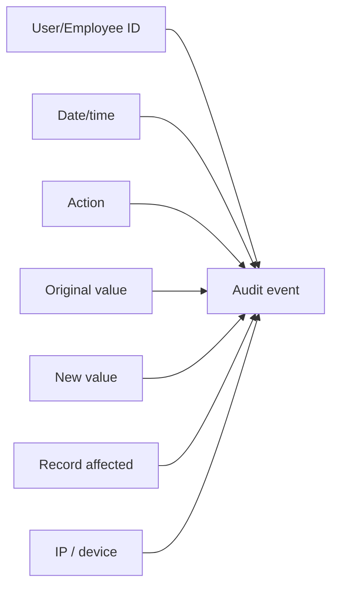
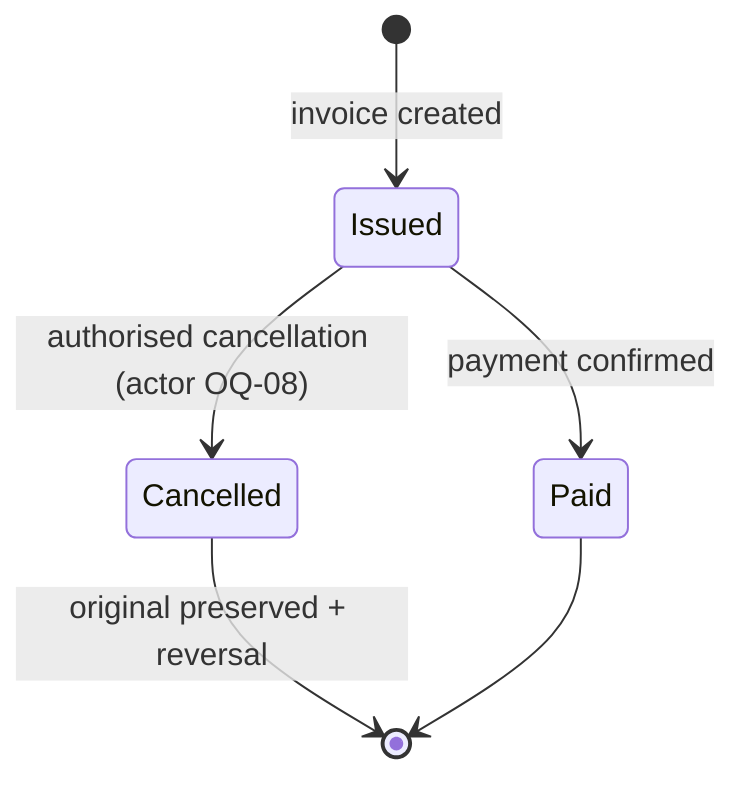
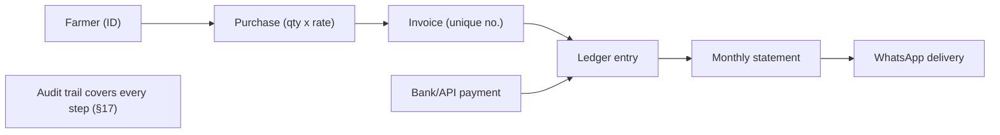

# Agri Procurement & Farmer Management System
## Audit Logging and Data Integrity Specification

---

## 1. Document Information

| Item | Value |
|---|---|
| Product name | Agri Procurement & Farmer Management System |
| Document | Audit Logging and Data Integrity Specification |
| Version | v1.0 |
| Status | Draft — aligned to PRD v1.0, BRD v1.0, Workflows v1.0, FRS v1.0 |
| Date | 2026-09-16 |
| Purpose | Complete audit and financial data integrity strategy: audit event model, event catalogues, immutability, corrections, cancellations, who-changed-what-and-when, data integrity and traceability |
| Source | 1. `AgriProcurement & Farmer Management.pdf` (primary source of truth) — §5, §6, §9, §10, §11, §16, §17, §18 2. `docs/01_PRODUCT_REQUIREMENTS_DOCUMENT.md` (§11, §16) 3. `docs/08_PROCUREMENT_AND_INVOICE_SPECIFICATION.md` 4. `docs/09_PAYMENT_AND_RECONCILIATION_SPECIFICATION.md` 5. `docs/12_RBAC_AND_AUTHORIZATION.md` |

### Conventions

| Tag | Meaning |
|---|---|
| `[SOURCE §n]` | Statement from the original PDF section `n` |
| `[NEW]` | Newly approved Farmer Portal requirement |
| `[PROPOSED]` | Technical design suggestion (not a source requirement) |
| Undefined | Not specified in the source requirements; tracked as open questions (§16) |

> Audit fields and the no-silent-overwrite rule are source-mandated (`[SOURCE §17]`). Database/implementation specifics (column storage, hashing, retention) are marked `[PROPOSED]` and are not requirements.

---

## 2. Source Extract — Audit Trail (§17)

- **Every change made to data** is logged (`[SOURCE §17]`).
- Log content per change (`[SOURCE §17]`):
  - User/Employee ID
  - Date/time
  - Action
  - Original value
  - New value
  - Record affected
  - IP/device information where appropriate
- **No historical financial record** is modified, deleted or overwritten silently (`[SOURCE §17]`).
- **Corrections** are made either by a **new entry** or a **reversal** — never by silently editing the original (`[SOURCE §17]`).

## 3. Integrity Sources Across the System

| Rule | Origin |
|---|---|
| Unique invoice numbers (Farmer ID + per-farmer sequence; no duplicates, resets monthly) | `[SOURCE §6]` |
| Amount = quantity × rate | `[SOURCE §5]` |
| Ledger auto-updates on confirmed payment | `[SOURCE §11]` |
| Reversal/mismatch workflow on reconciliation | `[SOURCE §10]` |
| RBAC + secure API authentication | `[SOURCE §18]` |
| Permission matrix configurable by Admin, changes should be defensible | `[SOURCE §16]` |
| Farmer accesses only own records (`[NEW]`) | `docs/12` §7 |

---

## 4. Audit Event Model

Source-mandated fields (`[SOURCE §17]`):

| Field | Description |
|---|---|
| User/Employee ID | Actor (login user or system/service account) |
| Date/time | When the action occurred |
| Action | What was done (create/update/cancel/reverse/…) |
| Original value | Value before the change |
| New value | Value after the change |
| Record affected | Entity + record identifier (e.g., Invoice F-0001-17) |
| IP/device (where appropriate) | Source of the request (web/portal/device) |

---

## 5. Event Catalogues

### 5.1 Login Events

| Event | Content (per `[SOURCE §17]`) |
|---|---|
| Login success | User/employee ID, date/time, action=login, IP/device |
| Login failure | User/employee ID or attempted ID, date/time, IP/device |
| Logout / session expiry | User/employee ID, date/time |
| Farmer Portal login (`[NEW]`) | Farmer ID (via mobile/OTP), date/time, IP/device |
| Failed identity/reset attempts | Same fields incl. IP/device |

### 5.2 Procurement Changes

| Event |
|---|
| Purchase created (product, quantity, rate, amount, farmer, employee) |
| Purchase updated (before/after values) |
| Purchase confirmation / notification sent |

### 5.3 Invoice Changes

| Event |
|---|
| Invoice created (invoice number, amount) |
| Invoice regenerated (OQ-07) |
| Invoice cancelled (№ 5.4) |
| Invoice details updated, if any |

### 5.4 Invoice Cancellation

- Cancellation of an historical invoice: **the original record is preserved and marked**, it is never silently deleted (`[SOURCE §17]`).
- **Authorized actor for cancellation: Undefined (OQ-08).**
- Reversal compensation (offsetting entry) follows the correction rules (§9).

### 5.5 Payment Changes

| Event |
|---|
| Payment recorded |
| Payment confirmed by bank/API (UTR) → ledger auto-update |
| Payment reversal / correction |
| Payment notified |

### 5.6 Reconciliation Changes

| Event |
|---|
| Payment matched / unmatched |
| Payment marked failed / pending / duplicate |
| Reversal action logged against the original record |

### 5.7 Farmer Data Changes

| Event |
|---|
| Farmer created (Farmer ID) |
| Farmer master updated (name, mobile, farm area) |
| Farmer blocked / unblocked |
| Farmer portal own-profile change (`[NEW]`, OQ-18) |

### 5.8 Permission Changes

- Permission / role changes for employees (`[SOURCE §16]`).
- Matrix configuration applied; before/after values logged.
- Area assignment changes (Phase 2, `[SOURCE §23]`).

### 5.9 Admin Actions

| Event |
|---|
| System settings changed |
| WhatsApp / banking configuration changed |
| Reports/dashboard accessed or exported (privileged) |
| Email/integration credentials updated (existing key never logged) |
| User management (employee create/update/deactivate) |

---

## 6. Immutable Historical Financial Records

**Core rule (`[SOURCE §17]`):**
- No historical financial record is modified, deleted or overwritten silently.
- Applies to: purchases, invoices, payments, ledgers, statements and reconciliation records.
- System services (auto ledger update `[SOURCE §11]`, batch reconciliation) treat history as append-only.

---

## 7. Corrections

- Corrections are made by **new entry** or **reversal**, never by editing the original (`[SOURCE §17]`).
- The original values remain visible; the correction entry references the original record.
- The audit trail records both the original record and the correction as separate events (`[SOURCE §17]`).

| Rule | Requirement |
|---|---|
| COR-01 | Correct data via new entry/reversal; never edit original (`[SOURCE §17]`) |
| COR-02 | Each correction creates its own audit event with before/after values |
| COR-03 | Corrected records remain traceable to the original |

---

## 8. Cancellations

- Invoice cancellation preserves and marks the original (`[SOURCE §17]`); the invoice sequence remains consumed (per `[SOURCE §6]` numbering, no re-use).
- **Cancellation authority and compensation flow: Undefined (OQ-08).**

---

## 9. Audit Trail — Who Changed What and When

- Every change carries **user/employee ID + date/time** (`[SOURCE §17]`).
- Result: full provenance over time per record — who, what, when, before, after.
- Portal (`[NEW]`), mobile and tablet sessions record the same actor fields.
- Audit events are created **automatically by the system on data changes**; not reliant on manual entry (`[SOURCE §17]`).

---

## 10. Data Integrity

| Requirement | Source |
|---|---|
| Invoice numbers: unique per farmer sequence; no duplicates; reset monthly | `[SOURCE §6]` |
| Invoice generation protected against concurrent duplicate creation (transaction protection; locking/retry) | OQ-06 (source notes race-condition risk) |
| Amount = quantity × rate, always derived | `[SOURCE §5]` |
| Ledger consistency: every confirmed payment updates the ledger | `[SOURCE §11]` |
| No silent overwrite of history | `[SOURCE §17]` |
| Payment/report numerics derive from recorded transactions | §14 |
| Sensitive data protected; secure storage of credentials | `[SOURCE §18]` |

---

## 11. Traceability

- The full chain — Farmer → Purchase → Invoice → Ledger → Payment/UTR → Statement — is reconstructible and each hop leaves audit events.
- **Traceability gaps/undefined steps:** see open questions (Q-AUD-07, Q-AUD-08).

---

## 12. Proposed Technical Design (NOT a requirement)

> `[PROPOSED]` — suggestions only. Not derived from the source; requires product/architecture approval.

- **Append-only audit log** separate from operational tables; original snapshot captured at event time.
- **Structural integrity**: hash-chaining/linking audit entries and periodic hash snapshots (tamper evidence).
- **Retention & lifecycle**: compliance-grade retention; no silent deletion (physical or logical purge policies must be explicit).
- **Storage choice** (RDBMS tables, WORM object storage, message log): open for architecture decision.
- **Employee read access**: audit logs visible to Super Admin only in the permission matrix.

---

## 13. Open Questions — Audit & Integrity

| ID | Question | Origin |
|---|---|---|
| Q-AUD-01 | Audit retention period and archival policy | Undefined (OQ-11) |
| Q-AUD-02 | Request/response body logging vs field-level only | Undefined |
| Q-AUD-03 | Who can reopen/correct a closed reconciliation case | Undefined (Q-PAY-…, §16 docs/09) |
| Q-AUD-04 | System-actor identity for scheduled jobs (statement/WhatsApp) | Undefined (OQ-14) |
| Q-AUD-05 | Whether report views/exports are audited at what granularity | Undefined |
| Q-AUD-06 | Audit log backup/disaster-recovery obligations | Undefined |
| Q-AUD-07 | Traceability of WhatsApp delivery status into ledger | Undefined |
| Q-AUD-08 | Traceability of cancelled invoice compensations | Undefined (OQ-08) |

---

*End of Audit Logging and Data Integrity Specification v1.0. Next in sequence: `15_SECURITY_SPECIFICATION.md`.*