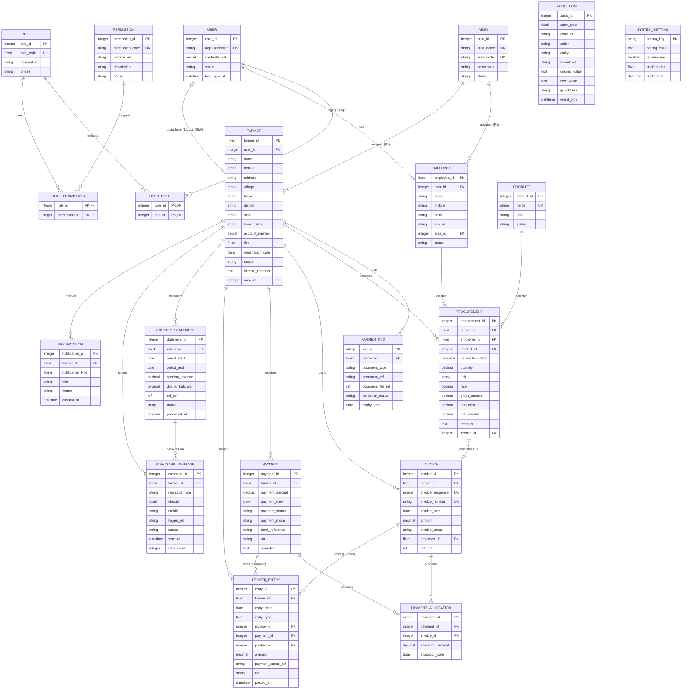

# Agri Procurement & Farmer Management System
## Database Design — Logical Data Model

---

## 1. Document Information

| Item | Value |
|---|---|
| Product name | Agri Procurement & Farmer Management System |
| Document | Database Design — Logical Data Model |
| Version | v1.0 |
| Status | Draft — aligned to PRD v1.0, Module Spec v1.0, Procurement/Invoice v1.0, Payment/Reconciliation v1.0, Ledger/Statement v1.0, WhatsApp v1.0, RBAC v1.0, Audit v1.0 |
| Date | 2026-09-16 |
| Author role | Senior Database Architect |
| Purpose | Complete logical data model: entities, fields, logical data types, keys, constraints, relationships, ER diagram, data integrity, indexing and transaction-consistency considerations |
| Source | 1. `AgriProcurement & Farmer Management.pdf` (primary) — §3–§13, §16–§20, §22–§23 2. `docs/01_PRODUCT_REQUIREMENTS_DOCUMENT.md` 3. `docs/04_MODULE_SPECIFICATION.md` 4. `docs/08_PROCUREMENT_AND_INVOICE_SPECIFICATION.md` 5. `docs/09_PAYMENT_AND_RECONCILIATION_SPECIFICATION.md` 6. `docs/10_LEDGER_AND_STATEMENT_SPECIFICATION.md` 7. `docs/11_WHATSAPP_INTEGRATION_SPECIFICATION.md` 8. `docs/12_RBAC_AND_AUTHORIZATION.md` 9. `docs/14_AUDIT_LOGGING_AND_DATA_INTEGRITY.md` |

### Conventions

| Tag | Meaning |
|---|---|
| `[SOURCE §n]` | Requirement in original PDF section `n` |
| `[NEW]` | Newly approved Farmer Portal requirement |
| `[PROPOSED]` | Technical design suggestion; not a source requirement |
| Phase 2 / Future | Area/chatbot (Phase 2) or future-ready fields (`[SOURCE §20]`) — inactive placeholders in Phase 1 |

### Design rules applied

1. **No database technology is selected.** This document is purely logical (entities, attributes, types, keys, constraints). Storage-engine choice (relational/SQL vs other) is a separate architecture decision and is **not assumed here**. SQL-compatible notation is used only as a neutral vocabulary.
2. **No financial rules are invented.** Amounts, statuses and numbering rules are taken verbatim from the source/specs; anything derived (e.g., outstanding) is marked derived and any precision/rounding decision is an open question.
3. **Primary identity is business identity.** Farmer ID and Employee ID are the permanent business identities (`[SOURCE §3, §4]`). Internal/system identifiers, if any, are subordinate.
4. **Farmer ownership is enforced at the data layer.** Every farmer-scoped record carries Farmer ID; cross-farmer access is prevented at storage/query level, not UI (derived `[SOURCE §22]`; upheld by F-OD-01…05, DBZ-01).
5. **Area authorization is a data attribute.** Area links on Farmer/Employee enable backend/database-level enforcement in Phase 2 (`[SOURCE §22]`, DBZ-02/03).

---

## 2. Entity Catalogue

| # | Entity | Phase | Kind |
|---|---|---|---|
| E01 | USER | 1 | Identity / principal |
| E02 | ROLE | 1 | Reference |
| E03 | PERMISSION | 1 | Reference (matrix row) |
| E04 | EMPLOYEE | 1 | Master |
| E05 | FARMER | 1 | Master |
| E06 | FARMER_KYC | 1 | Master detail |
| E07 | PRODUCT | 1 | Reference |
| E08 | PROCUREMENT | 1 | Transaction |
| E09 | INVOICE | 1 | Transaction |
| E10 | PAYMENT | 1 | Transaction |
| E11 | PAYMENT_ALLOCATION | 1 | Transaction detail |
| E12 | LEDGER_ENTRY | 1 | Ledger |
| E13 | MONTHLY_STATEMENT | 1 | Document / delivery |
| E14 | WHATSAPP_MESSAGE | 1 | Log |
| E15 | NOTIFICATION | 1 | Log |
| E16 | AUDIT_LOG | 1 | Audit |
| E17 | SYSTEM_SETTING | 1 | Configuration |
| E18 | AREA | Phase 2 | Master (future-ready) |
| E19 | Area/future-ready attributes & entities | Phase 2 / Future | See §18 |

Supporting relationships (logical junctions): USER_ROLE, ROLE_PERMISSION (configurable permission matrix `[SOURCE §16]`).

---

## 3. Naming & Type Vocabulary (Logical)

| Logical type | Meaning |
|---|---|
| `string(n)` | Variable-length character data up to n characters |
| `fixed(n)` | Fixed-length character data (codes/keys) |
| `integer` | Whole number |
| `decimal(p,s)` | Exact numeric, precision p, scale s (money/quantity) |
| `date` | Calendar date |
| `datetime` | Date + time (with timezone rules set per OQ) |
| `boolean` | True/false |
| `text` | Longer free text |
| `ref` | Pointer to stored artifact (PDF/document), not in-DB blob |
| `secret` | Encrypted storage only (`[SOURCE §18]`) |

Money: `decimal(14,2)`; quantities `decimal(12,3)`; rates `decimal(12,4)`. **Precision/rounding policy is an open question (Q-DB-02)** — these sizes are design defaults, not business rules.

---

## 4. Entity Definitions

> Audit requirement is identical for every mutable entity: **record user/employee ID, date/time, action, original value, new value, record affected, IP/device where appropriate** (`[SOURCE §17]`); historical financial records are never silently overwritten (`[SOURCE §17]`). This is summarized as "**Audit:** §17" per entity and expanded in E16.

---

### E01. USER

- **Purpose:** Authentication principal. Employees authenticate individually (`[SOURCE §2]`); farmers authenticate via portal (`[NEW]`). Separating USER from EMPLOYEE/FARMER lets the same principal model serve Admin, Employee and Farmer without forcing financial records onto login records.

| Field | Logical type | Req | Business rule / note |
|---|---|---|---|
| user_id | integer | Yes | PK (system-surrogate) |
| login_identifier | string(50) | Yes | UK; employee login id / farmer mobile-based seed (`[NEW]`; OQ-02) |
| credential_ref | secret | Yes | Stored/verified securely (`[SOURCE §18]`); method for farmers OQ-02 |
| status | string(20) | Yes | active / disabled / pending-activation (activation flow OQ-15) |
| last_login_at | datetime | No | Session reporting |
| created_at / updated_at | datetime | Yes | |

- **Relationships:** 1:1 optional with EMPLOYEE (E04) and FARMER (E05); n:m with ROLE via USER_ROLE.
- **Unique constraints:** login_identifier unique.
- **Business constraints:** every employee has an individual login (`[SOURCE §2]`); farmer credential/OTP path per OQ-02.
- **Index requirements:** login_identifier (UK); status.
- **Audit:** §17 (account lifecycle events).

---

### E02. ROLE

- **Purpose:** Role-based authorization (`[SOURCE §18]`); permission matrix configurable by Admin (`[SOURCE §16]`).

| Field | Logical type | Req | Business rule / note |
|---|---|---|---|
| role_id | integer | Yes | PK |
| role_code | fixed(20) | Yes | UK; SUPER_ADMIN, EMPLOYEE, FARMER (catalogue beyond these OQ-09) |
| description | string(255) | No | |
| phase | string(20) | Yes | Phase 1 / Phase 2 |

- **Relationships:** n:m to PERMISSION via ROLE_PERMISSION; n:m to USER via USER_ROLE.
- **Unique constraints:** role_code unique.
- **Index requirements:** role_code (UK).
- **Audit:** §17 (role/matrix changes).

---

### E03. PERMISSION

- **Purpose:** Granular capability rows operated on by the configurable permission matrix (`[SOURCE §16]`). Aligned to module/action/scope levels in `docs/12` §3–§6.

| Field | Logical type | Req | Business rule / note |
|---|---|---|---|
| permission_id | integer | Yes | PK |
| permission_code | string(80) | Yes | UK; e.g., MODULE.MODULE_<module>; ACTION.<action>; SCOPE.<own/area/all> |
| module_ref | string(20) | Yes | M01…M23 (`docs/04`) |
| description | string(255) | No | |
| phase | string(20) | Yes | |

- **Relationships:** n:m to ROLE via ROLE_PERMISSION.
- **Unique constraints:** permission_code unique.
- **Index requirements:** permission_code (UK); module_ref.
- **Audit:** §17 (matrix configuration changes `[SOURCE §16, §17]`).

**Junction ROLE_PERMISSION (permission matrix):** role_id + permission_id composite PK; Audit §17. **Junction USER_ROLE:** user_id + role_id composite PK (supports matrix flexibility; single-role baseline per `[SOURCE §4]`).

---

### E04. EMPLOYEE

- **Purpose:** Employee Master — identity node for logins and transaction attribution (`[SOURCE §4]`).

| Field | Logical type | Req | Business rule / note |
|---|---|---|---|
| employee_id | fixed(10) | Yes | PK — business identity, e.g., EMP-001 (`[SOURCE §4]`) |
| user_id | integer | No | FK → USER (1:1 optional; individual login `[SOURCE §2]`) |
| name | string(120) | Yes | |
| mobile | string(20) | Yes | |
| email | string(120) | No | |
| role_ref | string(20) | Yes | Baseline role; matrix governs permissions (`[SOURCE §16]`) |
| area_id | integer | No | FK → AREA (E18); **reserved Phase 1, active Phase 2** (`[SOURCE §4, §22]`) |
| status | string(20) | Yes | active / inactive |
| created_by / updated_by | fixed(10) | Yes | Admin actor |

- **Relationships:** 1:1 optional USER; 0..n PROCUREMENT (created); n:1 AREA (Phase 2).
- **Unique constraints:** mobile and email duplicates — see business rule; no source mandate (OQ-13 analog). user_id unique.
- **Business constraints:** every transaction records the creating employee (`[SOURCE §2]`); area field reserved since Phase 1 (`[SOURCE §4]`); Phase 2 employees only access farmers in assigned area (`[SOURCE §22]`).
- **Index requirements:** employee_id (PK); user_id (FK); status; **area_id (Phase 2 — enables area-scoped query filtering, E-AR-03)**.
- **Audit:** §17.

---

### E05. FARMER

- **Purpose:** Farmer Master — permanent primary business identity of each farmer (`[SOURCE §3]`).

| Field | Logical type | Req | Business rule / note |
|---|---|---|---|
| farmer_id | fixed(10) | Yes | PK — permanent business identity, e.g., F-0001 (`[SOURCE §3]`) |
| user_id | integer | No | FK → USER (1:1 optional, portal login `[NEW]`) |
| name | string(120) | Yes | |
| mobile | string(20) | Yes | **Registered mobile, WhatsApp identity anchor** (`[SOURCE §3]`); format/deduplication OQ-13 |
| address | string(255) | Yes | |
| village | string(80) | Yes | |
| taluka | string(80) | Yes | |
| district | string(80) | Yes | |
| state | string(80) | Yes | |
| bank_name | string(120) | Yes | Sensitive/restricted access (`[SOURCE §18]`) |
| account_number | secret | Yes | Sensitive/restricted; encrypted (`[SOURCE §18]`) |
| ifsc | fixed(11) | Yes | |
| registration_date | date | Yes | |
| status | string(20) | Yes | values/transitions OQ; supports "blocked farmer count" (`[SOURCE §15]`) |
| products_normally_supplied | text | No | |
| internal_remarks | text | No | |
| area_id | integer | No | FK → AREA (Phase 2 assignment `[SOURCE §23]`); inactive Phase 1 |
| gps_home_coords | string(50) | No | Future-ready `[SOURCE §20]` (inactive) |
| created_by / updated_by | fixed(10) | Yes | |

- **Relationships:** 1:1 optional USER; 1:n FARMER_KYC; 1:n PROCUREMENT / INVOICE / PAYMENT / LEDGER_ENTRY / MONTHLY_STATEMENT / WHATSAPP_MESSAGE / NOTIFICATION; n:1 AREA (Phase 2).
- **Unique constraints:** **farmer_id unique and permanent (`[SOURCE §3]`)**. Mobile: no single-mobile-to-many-farmers policy defined (OQ-13) — no UK yet; decision required.
- **Business constraints:** Farmer ID is never reused/reassigned; registered mobile is linked for WhatsApp identification (`[SOURCE §3]`); farmer data access limited for employees (`[SOURCE §16]`); bank/KYC restricted (`[SOURCE §18]`); **farmer sees only own records (`[NEW]`; F-OD)**.
- **Index requirements:** farmer_id (PK); mobile (for lookup/WhatsApp resolution — classical lookups); name; area_id (Phase 2); status.
- **Audit:** §17 (incl. status/block changes).

---

### E06. FARMER_KYC

- **Purpose:** KYC documents/information where required (`[SOURCE §3]`). KYC specifics (document list, validation, lifecycle) are undefined (OQ-10).

| Field | Logical type | Req | Business rule / note |
|---|---|---|---|
| kyc_id | integer | Yes | PK |
| farmer_id | fixed(10) | Yes | FK → FARMER |
| document_type | string(60) | Yes | values OQ-10 |
| document_ref | string(120) | No | |
| document_file_ref | ref | No | stored artifact reference (external) |
| validation_status | string(20) | No | value list OQ-10 |
| expiry_date | date | No | |
| captured_date | date | Yes | |

- **Relationships:** n:1 FARMER.
- **Unique constraints:** farmer_id + document_type logically repeatable unless business forbids (undefined OQ-10).
- **Index requirements:** farmer_id; validation_status.
- **Audit:** §17; document refs never silently replaced.

---

### E07. PRODUCT

- **Purpose:** Selectable product/unit reference for procurement (`[SOURCE §5, §7]`). Catalogue governance undefined (OQ-05).

| Field | Logical type | Req | Business rule / note |
|---|---|---|---|
| product_id | integer | Yes | PK |
| name | string(80) | Yes | UK (normalized) |
| unit | string(20) | Yes | e.g., kg (`[SOURCE §7]`) |
| status | string(20) | Yes | active / inactive |
| quality_grade_ref | string(40) | No | Future-ready `[SOURCE §20]` (inactive) |
| created_by / updated_by | fixed(10) | Yes | |

- **Relationships:** 1:n PROCUREMENT.
- **Unique constraints:** name (or logical equivalent) unique.
- **Business constraints:** rate governance/approval not defined (OQ-05); amount always quantity × rate (`[SOURCE §5]`).
- **Index requirements:** name (UK); status.
- **Audit:** §17.

---

### E08. PROCUREMENT

- **Purpose:** Record a purchase from a farmer — the first transaction in the chain Farming section (`[SOURCE §5]`).

| Field | Logical type | Req | Business rule / note |
|---|---|---|---|
| procurement_id | integer | Yes | PK (system-surrogate) |
| farmer_id | fixed(10) | Yes | FK → FARMER; business identity in transaction (`[SOURCE §5]`) |
| employee_id | fixed(10) | Yes | FK → EMPLOYEE (creator, backend trail `[SOURCE §2]`) |
| product_id | integer | Yes | FK → PRODUCT |
| transaction_date | datetime | Yes | |
| quantity | decimal(12,3) | Yes | weight/quantity with unit (`[SOURCE §5]`) |
| unit | string(20) | Yes | |
| rate | decimal(12,4) | Yes | per unit (`[SOURCE §7]`) |
| gross_amount | decimal(14,2) | Yes | = quantity × rate, computed (`[SOURCE §5]`) |
| deduction | decimal(14,2) | No | "if applicable" (`[SOURCE §5]`); rules OQ-06 |
| deduction_reason | string(255) | No | |
| net_amount | decimal(14,2) | Yes | gross − deduction (`[SOURCE §5]`) |
| remarks | text | No | source-mandated field (`[SOURCE §5]`) |
| invoice_id | integer | No | FK → INVOICE (set at generation; 1:1) |
| gps_coords | string(50) | No | Future-ready `[SOURCE §20]` (inactive) |
| lot_no / batch_no | string(60) | No | Future-ready `[SOURCE §20]` (inactive) |
| collection_centre_id | integer | No | Future-ready `[SOURCE §20]` (inactive) |

- **Relationships:** n:1 FARMER, n:1 EMPLOYEE (creator), n:1 PRODUCT, 1:1 INVOICE (via invoice_id).
- **Unique constraints:** one procurement ↔ one invoice (unique invoice_id among issued records).
- **Business constraints:** amount = quantity × rate, computed automatically (`[SOURCE §5]`); employee-created (`[SOURCE §2]`); Phase 2 area scope via farmer's area (`[SOURCE §22]`).
- **Index requirements:** farmer_id (+ transaction_date); employee_id (+ transaction_date); product_id; transaction_date (daily/monthly reporting `[SOURCE §14, §15]`); invoice_id (1:1).
- **Audit:** §17.

---

### E09. INVOICE

- **Purpose:** The uniquely numbered financial instrument auto-generated from Farmer ID + sequence (`[SOURCE §6]`).

| Field | Logical type | Req | Business rule / note |
|---|---|---|---|
| invoice_id | integer | Yes | PK (system-surrogate) |
| farmer_id | fixed(10) | Yes | FK → FARMER |
| invoice_sequence | integer | Yes | **stored as separate field** (`[SOURCE §6]`) |
| invoice_number | string(30) | Yes | derived: farmer_id + '-' + sequence (e.g., F-0001-17) (`[SOURCE §6]`) |
| invoice_date | date | Yes | |
| amount | decimal(14,2) | Yes | = procurement net amount |
| invoice_status | string(20) | Yes | issued / cancelled (`[SOURCE §6]`); transitions OQ-08 |
| employee_id | fixed(10) | Yes | created by (`[SOURCE §2, §7]`) |
| cancelled_at / cancelled_reason / cancelled_by | — | No | cancellation depth OQ-08 |
| pdf_ref | ref | No | output/reprint OQ-07 |

- **Relationships:** n:1 FARMER; 1:1 PROCUREMENT; 1:n PAYMENT_ALLOCATION; 1:n LEDGER_ENTRY (purchase posting); possibly notifications.
- **Unique constraints:** **invoice_number UK (`[SOURCE §6]`)**; **composite UK (farmer_id, invoice_sequence) (`[SOURCE §6]`)** — sequence independent per farmer.
- **Business constraints:** employee never types invoice numbers (`[SOURCE §6]`); cancelled invoices remain; numbers never reused (`[SOURCE §6]`); all modifications audited (`[SOURCE §6, §17]`); invoice is farmer-owned (portal own-data `[NEW]`).
- **Index requirements:** invoice_number (UK); (farmer_id, invoice_sequence) UK; farmer_id + invoice_date; status; employee_id.
- **Audit:** §17 (creation, modification, cancellation — mandatory `[SOURCE §6]`).

---

### E10. PAYMENT

- **Purpose:** Payment record with source-mandated fields (`[SOURCE §10]`); receives UTR/status from bank/API (`[SOURCE §11]`).

| Field | Logical type | Req | Business rule / note |
|---|---|---|---|
| payment_id | integer | Yes | PK (system-surrogate) |
| farmer_id | fixed(10) | Yes | FK → FARMER |
| payment_amount | decimal(14,2) | Yes | |
| payment_date | date | Yes | |
| payment_status | string(20) | Yes | matched / unmatched / failed / pending / duplicate (`[SOURCE §11]`) |
| payment_mode | string(40) | Yes | values OQ/Q-PAY-07 |
| bank_reference | string(120) | No | (`[SOURCE §10]`) |
| utr | string(80) | No | auto-received wherever supported (`[SOURCE §11]`) |
| remarks | text | No | |
| created_by | fixed(10) | No | creator role undefined (Q-PAY-010) |
| reconciliation_notes | text | No | accounts-staff handling (`[SOURCE §11]`) |

- **Relationships:** n:1 FARMER; 1:n PAYMENT_ALLOCATION; 1:n LEDGER_ENTRY (confirmed/matched postings); n:1 invoice via allocation only.
- **Unique constraints:** none source-mandated; UTR register `[SOURCE §14]` suggests indexed (non-unique) UTR.
- **Business constraints:** full/partial/multiple payments per invoice; multiple invoices per payment (`[SOURCE §10]`); statuses mandated (`[SOURCE §11]`); sum of allocations = payment amount (guard = `[PROPOSED]`, Q-PAY-006).
- **Index requirements:** farmer_id (+ payment_date); status (queue/reporting); utr (register lookup & duplicate detection `[SOURCE §11]`); created_at.
- **Audit:** §17 (creation, status changes, reconciliation).

---

### E11. PAYMENT_ALLOCATION

- **Purpose:** Link a payment to the invoice(s) it settles and track per-invoice settlement (`[SOURCE §10]`).

| Field | Logical type | Req | Business rule / note |
|---|---|---|---|
| allocation_id | integer | Yes | PK |
| payment_id | integer | Yes | FK → PAYMENT |
| invoice_id | integer | Yes | FK → INVOICE |
| allocation_amount | decimal(14,2) | Yes | portion of the payment to this invoice |
| allocation_date | date | Yes | |

- **Relationships:** n:1 PAYMENT; n:1 INVOICE.
- **Unique constraints:** **(payment_id, invoice_id) UK** (one allocation row per pair).
- **Business constraints:** allocation only to the same farmer's invoices (farmer identity model `[SOURCE §3]`); sum of allocations = payment amount (`[PROPOSED]` guard, Q-PAY-006); allocation split rule (FIFO etc.) undefined (Q-PAY-006); over-allocation guard (`[PROPOSED]`).
- **Index requirements:** payment_id; invoice_id (+ allocation_amount for due computation); farmer_id via payment.
- **Audit:** §17.

---

### E12. LEDGER_ENTRY

- **Purpose:** Farmer-wise ledger (`[SOURCE §9]`) — a posting of invoices and confirmed payments per farmer, fed automatically on confirmation (`[SOURCE §11]`).

| Field | Logical type | Req | Business rule / note |
|---|---|---|---|
| entry_id | integer | Yes | PK |
| farmer_id | fixed(10) | Yes | FK → FARMER |
| entry_date | date | Yes | ledger date (`[SOURCE §9]`) |
| entry_type | fixed(10) | Yes | PURCHASE / PAYMENT (`[SOURCE §9]`) |
| invoice_id | integer | No | FK → INVOICE (PURCHASE rows) |
| payment_id | integer | No | FK → PAYMENT (PAYMENT rows) |
| product_id | integer | No | for purchase rows (`[SOURCE §9]`) |
| quantity | decimal(12,3) | No | for purchase rows |
| rate | decimal(12,4) | No | for purchase rows |
| amount | decimal(14,2) | Yes | invoice amount or payment amount (`[SOURCE §9]`) |
| payment_status_ref | string(20) | No | Paid / Pending as per `[SOURCE §9]` ledger column |
| utr | string(80) | No | (`[SOURCE §9]`) |
| posted_at | datetime | Yes | auto-posting timestamp |

- **Relationships:** n:1 FARMER; n:1 INVOICE (nullable); n:1 PAYMENT (nullable).
- **Unique constraints:** guards against duplicate postings (e.g., one purchase entry per invoice; one entry per confirmed payment, or per distinct payment posting) — exact single-uniqueness rule decision in Q-DB-04.
- **Business constraints:** complete farmer-wise ledger (`[SOURCE §9]`); updated automatically on confirmed payment (`[SOURCE §11]`); **outstanding is derived** from ledger (formula detail undefined — Q-LS-01/Q-DB-01); no silent overwrite (`[SOURCE §17]`); cancelled-invoice treatment undefined (OQ-08).
- **Index requirements:** farmer_id + entry_date (ledger & statement sourcing); (farmer_id, entry_type); invoice_id(source guard); payment_id(source guard); utr.
- **Audit:** §17; ledger is append-oriented.

---

### E13. MONTHLY_STATEMENT

- **Purpose:** Previous-month statement artifact with delivery lifecycle (`[SOURCE §13]`).

| Field | Logical type | Req | Business rule / note |
|---|---|---|---|
| statement_id | integer | Yes | PK |
| farmer_id | fixed(10) | Yes | FK → FARMER |
| period_start | date | Yes | previous month window (`[SOURCE §13]`) |
| period_end | date | Yes | |
| opening_balance | decimal(14,2) | No | "if applicable" (`[SOURCE §13]`) |
| closing_balance | decimal(14,2) | Yes | closing/outstanding (`[SOURCE §13]`) |
| pdf_ref | ref | Yes | generated PDF (`[SOURCE §13]`) |
| status | string(20) | Yes | generated / sent / delivered / failed / retry (`[SOURCE §13]`) |
| generated_at | datetime | Yes | |
| sent_at / delivered_at | datetime | No | |
| retry_count | integer | No | retry policy Q-LS-03/Q-WH-04 |

- **Relationships:** n:1 FARMER; 1:n WHATSAPP_MESSAGE (delivery attempts).
- **Unique constraints:** **(farmer_id, period_start, period_end) UK** — one statement per farmer per month.
- **Business constraints:** generated on the 1st for the previous month (`[SOURCE §13]`); content and balances per `[SOURCE §13]`; portal history own-only (`[NEW]`).
- **Index requirements:** (farmer_id, period) UK; status; generated_at.
- **Audit:** §17.

---

### E14. WHATSAPP_MESSAGE

- **Purpose:** Outbound (Phase 1) messages and delivery status; Phase 2 chatbot log (`[SOURCE §8, §12, §13, §21]`). Provider-neutral (`docs/11` §2).

| Field | Logical type | Req | Business rule / note |
|---|---|---|---|
| message_id | integer | Yes | PK |
| farmer_id | fixed(10) | Yes | FK → FARMER (recipient = linked mobile `[SOURCE §3]`) |
| message_type | string(20) | Yes | purchase / payment / statement / chatbot (`[SOURCE §8, §12, §13, §21]`) |
| direction | fixed(10) | Yes | OUT / IN (IN = Phase 2 chatbot) |
| mobile | string(20) | Yes | snapshot of registered mobile at send time |
| trigger_ref | string(60) | No | invoice / payment / statement reference |
| content_ref | text | No | rendered body or template/attachment ref (provider policy Q-WH-01) |
| status | string(20) | Yes | generated / sent / delivered / failed / retry (`[SOURCE §13]`; scope Q-WH-03) |
| provider_message_ref | string(120) | No | provider assigned id (post-selection) |
| sent_at / delivered_at / failed_at | datetime | No | |
| retry_count | integer | No | |

- **Relationships:** n:1 FARMER; optional refs to INVOICE / PAYMENT / MONTHLY_STATEMENT.
- **Unique constraints:** none mandated; dedupe strategy for identical triggers is a design choice (provider-dependent).
- **Business constraints:** recipient identified by registered mobile linked to Farmer ID (`[SOURCE §3, §21]`); inbound scoped to own data (chatbot, `[SOURCE §21]`); delivery statuses per `[SOURCE §13]`.
- **Index requirements:** farmer_id + created_at (portal notifications history `[NEW]`); status; trigger_ref; provider_message_ref.
- **Audit:** §17 (status transitions).

---

### E15. NOTIFICATION

- **Purpose:** Farmer-visible notification history in the portal (`[NEW]`; PRD-PRT-014), sourced from the same business events as WhatsApp messages.

| Field | Logical type | Req | Business rule / note |
|---|---|---|---|
| notification_id | integer | Yes | PK |
| farmer_id | fixed(10) | Yes | FK → FARMER |
| notification_type | string(20) | Yes | purchase / payment / statement |
| title | string(120) | Yes | |
| body | text | No | |
| ref_type / ref_id | string(20) / integer | No | related invoice/payment/statement |
| status | string(20) | Yes | created / read |
| created_at | datetime | Yes | |
| read_at | datetime | No | |

- **Relationships:** n:1 FARMER; optional source refs.
- **Unique constraints:** none mandated.
- **Index requirements:** farmer_id + created_at (ordered history); status (unread counts).
- **Audit:** §17 (vistas; read-state not financially relevant).

---

### E16. AUDIT_LOG

- **Purpose:** Append-only audit trail for every change (`[SOURCE §17]`).

| Field | Logical type | Req | Business rule / note |
|---|---|---|---|
| audit_id | integer | Yes | PK |
| actor_type | fixed(10) | Yes | USER / SYSTEM (scheduled jobs `Q-AUD-04`) |
| actor_id | string(30) | Yes | Employee ID, User ID or Farmer ID (`[SOURCE §17]`) |
| action | string(60) | Yes | e.g., create/update/cancel/reverse (`[SOURCE §17]`) |
| entity | string(40) | Yes | record type |
| record_ref | string(80) | Yes | record affected (`[SOURCE §17]`) |
| original_value | text | No | original value (`[SOURCE §17]`) |
| new_value | text | No | new value (`[SOURCE §17]`) |
| ip_address | string(45) | No | where appropriate (`[SOURCE §17]`) |
| device_info | string(255) | No | where appropriate (`[SOURCE §17]`) |
| event_time | datetime | Yes | date/time (`[SOURCE §17]`) |

- **Relationships:** standalone (refers to business records by reference; not FK-bound to preserve immutability).
- **Unique constraints:** none.
- **Business constraints:** no silent overwrite of historical financial records (`[SOURCE §17]`); SQL-level integrity (`[PROPOSED]` hashing/tamper-evidence) is a design option (see §21).
- **Index requirements:** (entity, record_ref) + event_time (edit history); actor_id + event_time; action; event_time (range queries); composite for admin review screens.
- **Audit:** self-evident.

---

### E17. SYSTEM_SETTING

- **Purpose:** Settings and integration configuration (`[SOURCE §2]`); sensitive secrets encrypted (`[SOURCE §18]`).

| Field | Logical type | Req | Business rule / note |
|---|---|---|---|
| setting_key | string(80) | Yes | PK |
| setting_value | text | Yes | |
| is_sensitive | boolean | Yes | secret storage if true (`[SOURCE §18]`) |
| description | string(255) | No | |
| updated_by | fixed(10) | Yes | Admin actor |
| updated_at | datetime | Yes | |

- **Relationships:** none.
- **Unique constraints:** setting_key PK.
- **Business constraints:** WhatsApp/banking and permission-matrix configuration areas (`[SOURCE §2, §16]`); never log secret values (§17 sensitive handling).
- **Index requirements:** setting_key (PK); is_sensitive.
- **Audit:** §17 (config changes; credentials never in audit payload).

---

## 5. Future-Ready Fields (`[SOURCE §20]`)

Inactive placeholders in Phase 1, activated later without fundamental redevelopment (`[PRD-SCL-006]`).

| Future-ready item | Logical placement | Phase | Notes |
|---|---|---|---|
| Area | E18 AREA + area_id on FARMER / EMPLOYEE | Phase 2 | Active in Phase 2 for area-based authorization (`[SOURCE §22–§23]`) |
| Collection centre | COLLECTION_CENTRE entity (id, name, area, address) | Future | referenced by PROCUREMENT (collection_centre_id) |
| GPS | gps_coords on FARMER / PROCUREMENT | Future | |
| Quality / Grade | quality_grade_ref on PRODUCT / PROCUREMENT | Future | |
| Lot number | lot_no on PROCUREMENT | Future | |
| Batch number | batch_no on PROCUREMENT | Future | |
| Warehouse | WAREHOUSE entity (id, name, area, address) | Future | |
| Packing | PACKING detail (packing_id, procurement_ref, pack_type, quantity, weight) | Future | |
| Export shipment | EXPORT_SHIPMENT entity (shipment_id, warehouse, customer, packing refs, dates) | Future | |

Design posture: these are nullable logical attributes/entities included now so activation does not require schema-breaking rework (`[PRD-SCL-006, PRD-SCL-007]`).

---

## 6. ER Diagram (Logical)

---

## 7. Relationship Explanation

| Relationship | Cardinality | Meaning | Source / basis |
|---|---|---|---|
| USER–EMPLOYEE / USER–FARMER | 1:1 optional | One login account per employee (individual login `[SOURCE §2]`); optional portal login for farmer (`[NEW]`, OQ-02/15) | `[SOURCE §2, §4]` |
| USER–ROLE (via USER_ROLE) | n:m | A principal has one or more roles; permission matrix is configurable (`[SOURCE §16]`) | `[SOURCE §18]` |
| ROLE–PERMISSION (via ROLE_PERMISSION) | n:m | Configurable permission matrix rows | `[SOURCE §16]` |
| AREA–FARMER / AREA–EMPLOYEE | 1:n | Area assignment enables backend/database-level area authorization (`[SOURCE §22]`) | `[SOURCE §23]` |
| FARMER–KYC | 1:n | Multiple documents per farmer | `[SOURCE §3]` |
| FARMER–PROCUREMENT | 1:n | All purchases under the permanent Farmer ID | `[SOURCE §5]` |
| EMPLOYEE–PROCUREMENT | 1:n | Every transaction attributed to its creating employee | `[SOURCE §2]` |
| PRODUCT–PROCUREMENT | 1:n | Product selected during entry | `[SOURCE §5]` |
| PROCUREMENT–INVOICE | 1:1 | Each confirmed purchase generates exactly one invoice | `[SOURCE §5]` |
| FARMER–INVOICE | 1:n | Farmer owns invoices; invoice number embeds Farmer ID | `[SOURCE §6, §3]` |
| INVOICE–PAYMENT_ALLOCATION | 1:n | An invoice may receive multiple allocation rows (full/partial/multi) | `[SOURCE §10]` |
| PAYMENT–PAYMENT_ALLOCATION | 1:n | One payment may allocate across several invoices | `[SOURCE §10]` |
| INVOICE–LEDGER_ENTRY (PURCHASE) | 1:n | Invoice posts a purchase entry to the farmer ledger | `[SOURCE §9]` |
| PAYMENT–LEDGER_ENTRY (PAYMENT) | 1:n | Confirmed payment posts a payment entry (incl. UTR) | `[SOURCE §11, §9]` |
| FARMER–LEDGER_ENTRY | 1:n | Ledger is strictly farmer-wise | `[SOURCE §9]` |
| FARMER–MONTHLY_STATEMENT | 1:n | One statement per farmer per month | `[SOURCE §13]` |
| MONTHLY_STATEMENT–WHATSAPP_MESSAGE | 1:n | Delivery attempts of the statement PDF | `[SOURCE §13]` |
| WHATSAPP_MESSAGE / NOTIFICATION–FARMER | n:1 | Recipient = registered mobile linked to Farmer ID | `[SOURCE §3, §8, §12, §13]` |

---

## 8. Data Integrity Rules

| ID | Rule | Source |
|---|---|---|
| DI-01 | Farmer ID is permanent, unique and the farmer's primary business identity; never reused | `[SOURCE §3]` |
| DI-02 | Invoice numbers unique; farmer+sequence kept separate; sequence independent per farmer | `[SOURCE §6]` |
| DI-03 | Cancelled invoices remain; numbers never reused | `[SOURCE §6]` |
| DI-04 | Amount = quantity × rate, computed automatically | `[SOURCE §5]` |
| DI-05 | Ledger updated automatically on confirmed payment only | `[SOURCE §11]` |
| DI-06 | Payment statuses: matched/unmatched/failed/pending/duplicate | `[SOURCE §11]` |
| DI-07 | Statement: one per farmer per previous-month period; balances per `[SOURCE §13]` | `[SOURCE §13]` |
| DI-08 | No silent overwrite of historical financial records; corrections via new entry/reversal | `[SOURCE §17]` |
| DI-09 | Sum-of-allocations = payment amount; no over-allocation | `[PROPOSED]` (Q-PAY-006) |
| DI-10 | Allocation restricted to same-farmer invoices | Derived (`[SOURCE §3]` identity model) |
| DI-11 | Farmer data scoped to Farmer ID at data layer; cross-farmer access denied & logged | `[NEW]`; F-OD-04; DBZ-01 |
| DI-12 | (Phase 2) Employee data scope = assigned area, enforced at backend/database layer | `[SOURCE §22]`; DBZ-02/03 |
| DI-13 | Every invoice modification audited; procurement attributed to employee | `[SOURCE §6, §2]` |
| DI-14 | Sensitive fields (bank, credentials) encrypted/restricted | `[SOURCE §18]` |
| DI-15 | Verified source-to-ledger posting: each invoice/confirmed payment posts to ledger exactly once (guard rule; enforcement option Q-DB-04) | Derived `[SOURCE §9, §11]` |

---

## 9. Indexing Considerations

Purpose-oriented (indexes serve mandated operations, reports and privacy scopes; physical details are for the architecture/build phase).

| Purpose | Covered by index |
|---|---|
| Farmer identity resolution (search/select) | FARMER(farmer_id) PK; FARMER(mobile); FARMER(name) |
| WhatsApp identity (mobile → farmer) | FARMER(mobile) |
| Invoice uniqueness & fast lookup | INVOICE(invoice_number) UK; (farmer_id, invoice_sequence) UK |
| Farmer invoice history | INVOICE(farmer_id, invoice_date) |
| Sequence reservation (next number) | INVOICE(farmer_id, invoice_sequence) — also used to derive next sequence atomically |
| Payment status queue/reporting | PAYMENT(status); PAYMENT(farmer_id, payment_date) |
| UTR register & duplicate detection | PAYMENT(utr) |
| Allocation / due computation | PAYMENT_ALLOCATION(invoice_id); (payment_id) |
| Ledger, outstanding & statement sourcing | LEDGER_ENTRY(farmer_id, entry_date); (farmer_id, entry_type) |
| Statement uniqueness | MONTHLY_STATEMENT(farmer_id, period_start, period_end) UK |
| Portal notification history (own) | NOTIFICATION(farmer_id, created_at) |
| Audit review ("who/what/when", record history) | AUDIT_LOG(entity, record_ref, event_time); (actor_id, event_time); (action) |
| Daily/monthly and product/employee-wise reports | PROCUREMENT(transaction_date); (product_id, transaction_date); (employee_id, transaction_date); (farmer_id, transaction_date) |
| Area-based authorization (Phase 2) | FARMER(area_id); EMPLOYEE(area_id); Area PK |
| Activation-list / status views | FARMER(status); EMPLOYEE(status) |

Covering-index and composite design details are deferred (not a physical design). At 10k→50k farmers / 100→500 employees and "millions of transaction records" (`[SOURCE §19]`), the listed functional indexes are the baseline to carry forward into physical design.

---

## 10. Transaction Consistency Considerations

Logical-level guarantees that must be preserved by any chosen storage/architecture (mechanism is open).

| ID | Consideration | Requirement |
|---|---|---|
| TC-01 | **Invoice numbering atomicity.** Obtain next per-farmer sequence and insert invoice within one atomic boundary; sequence increments once even if invoice is later cancelled (numbers never reused `[SOURCE §6]`). Concurrent procurement for the same farmer must not produce duplicate numbers (race risk acknowledged OQ-06; mitigation is a physical-design decision). | `[SOURCE §6]` |
| TC-02 | **Payment confirmation → allocation → ledger.** Confirmation, allocation update, invoice status change and ledger posting must be consistent as a unit so the ledger can never be partially updated. | `[SOURCE §11, §9]` |
| TC-03 | **Statement generation snapshot.** Statement derives from a consistent read of the ledger for the period; generation must not observe partially-updated payments. | `[SOURCE §13, §9]` |
| TC-04 | **Audit durability.** Audit entries for a financial change are written with (or promptly after) the change; they are never modified later. No silent overwrite. | `[SOURCE §17]` |
| TC-05 | **Own-data scoping on every fetch.** Data-layer queries always include farmer (or area) scope as a mandatory predicate, not an advisory filter. | DBZ-01/02/03; F-OD |
| TC-06 | **Reconciliation actions** (unmatched/failed/duplicate resolution) transition status and audit within one consistent operation. | `[SOURCE §11, §17]` |
| TC-07 | **Corrections** (new entry/reversal) rather than in-place updates for financial records; both the original and the correction persist. | `[SOURCE §17]` |
| TC-08 | Concurrency under target scale (multiple employees, potentially same farmer) requires per-farmer serialization for sequence/numbering and payment posting. Mechanism deferred to physical design. | `[SOURCE §19]` |

---

## 11. Special-Attention Items (Consolidated Design Response)

| Item | Design response |
|---|---|
| **Farmer ID** | Primary PK of FARMER (fixed(10)); reused inside every financial entity (PROCUREMENT, INVOICE, PAYMENT, LEDGER_ENTRY, MONTHLY_STATEMENT, WHATSAPP_MESSAGE, NOTIFICATION) for traceability and own-data scoping. Never reassigned. |
| **Employee ID** | PK of EMPLOYEE; creator FK on PROCUREMENT/INVOICE for attribution and audit (`[SOURCE §2]`). |
| **Invoice numbering** | Derived column invoice_number (farmer + sequence) stored alongside separate farmer_id and invoice_sequence (`[SOURCE §6]`); UK on invoice_number and (farmer_id, invoice_sequence). |
| **Transaction sequence** | Per-farmer integer, independent per farmer (`[SOURCE §6]`); reservation atomic under TC-01; reset/month policy undefined (Q-DB-05). |
| **Payment allocation** | Junction PAYMENT_ALLOCATION supports full/partial/multi-payment/multi-invoice (`[SOURCE §10]`); guards per DI-09/DI-10. |
| **UTR** | Attribute on PAYMENT and LEDGER_ENTRY; indexed, non-unique (registers may repeat); feeds statement and UTR register (`[SOURCE §9, §13, §14]`). |
| **Ledger** | LEDGER_ENTRY rows sourced from invoices (PURCHASE) and confirmed payments (PAYMENT); strictly farmer-scoped; auto-posted (`[SOURCE §9, §11]`). |
| **Outstanding** | Derived quantity over LEDGER_ENTRY per farmer; detailed rule undefined (Q-LS-01/Q-DB-01); represented, not stored, as the source's statement/closing figure. |
| **Farmer ownership** | Farmer-scoped FKs + mandatory data-layer scope predicates (DI-11, TC-05) — enforcement server/database-level, not UI. |
| **Area-based authorization** | area_id on FARMER/EMPLOYEE + AREA master; query scoping at data layer (DBZ-02/03, E-AR) enforces assigned-area exclusivity in Phase 2. |

---

## 12. Open Questions — Database/Data Model

| ID | Question | Origin |
|---|---|---|
| Q-DB-01 | Outstanding/opening/closing computation rule and precision/rounding policy | Undefined (Q-LS-01) |
| Q-DB-02 | Decimal scale/rounding for money and rates | Design default chosen; confirm |
| Q-DB-03 | Mobile deduplication/UK policy for FARMER.mobile | Undefined (OQ-13) |
| Q-DB-04 | Ledger source-post guard: one entry per invoice / per confirmed payment (and duplicate-payment handling) | Derived; enforcement option |
| Q-DB-05 | Sequence reset periodicity (monthly vs continuous) — source silent | Undefined |
| Q-DB-06 | Audit retention/archival + append-only integrity mechanism (hashing/WORM) | Undefined (OQ-11; Q-AUD-01) |
| Q-DB-07 | Area modelling granularity (multiple areas per employee? hierarchy?) | Undefined (Q-RBAC-06) |
| Q-DB-08 | Whether indexes must support near-real-time outstanding queries vs nightly materialization | Undefined |
| Q-DB-09 | timezone/time-stamp policy for datetime fields | Undefined (OQ-14) |
| Q-DB-10 | Payment creator role and reconciliation write-paths (affects PAYMENT.created_by) | Undefined (Q-PAY-010) |

---

*End of Database Design — Logical Data Model v1.0. Next in sequence: `16_SECURITY_SPECIFICATION.md`.*