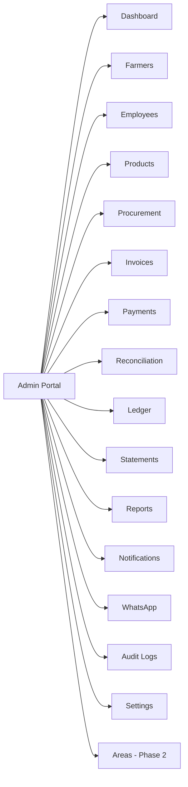
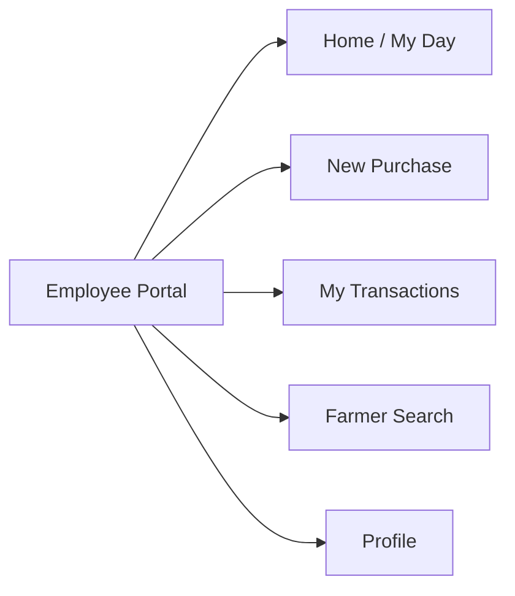
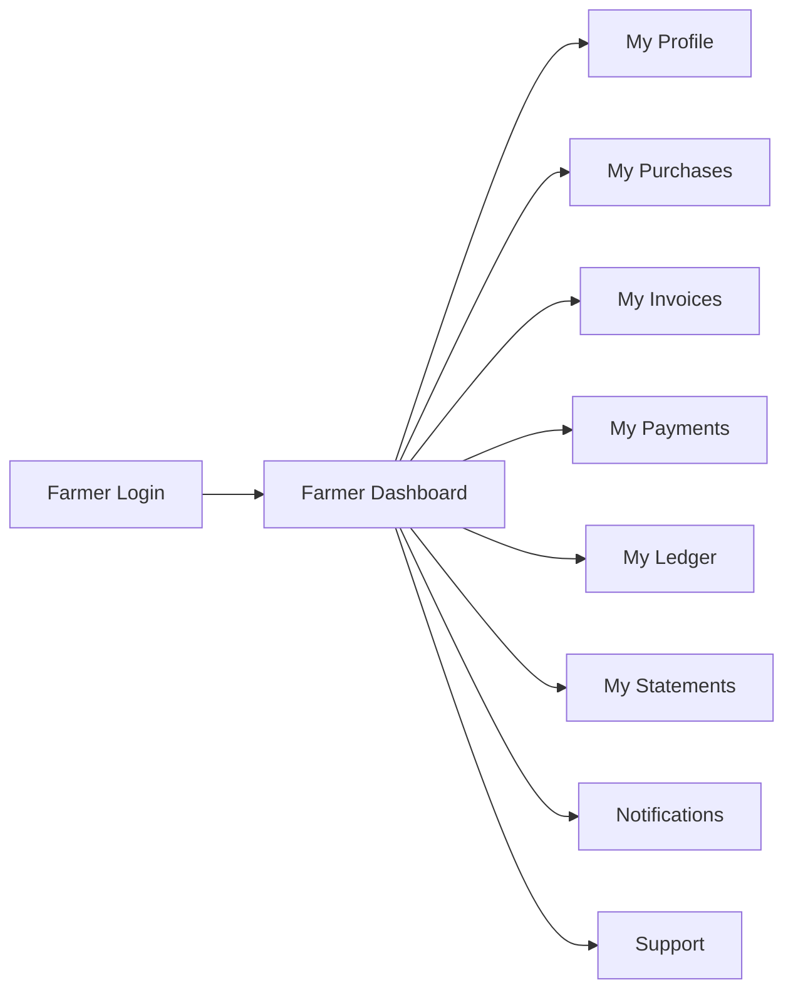

# Agri Procurement & Farmer Management System
## UI/UX Specification — Information Architecture & Screens

---

## 1. Document Information

| Item | Value |
|---|---|
| Product name | Agri Procurement & Farmer Management System |
| Document | UI/UX Specification — Information Architecture & Screens |
| Version | v1.0 |
| Status | Draft — aligned to PRD v1.0, FRS v1.0, Module Spec v1.0, Farmer Portal Spec v1.0, RBAC v1.0, API Spec v1.0 |
| Date | 2026-09-16 |
| Author role | Senior Product Designer & UX Architect |
| Purpose | Information architecture and screen-level specification for the Admin Portal, Employee Portal and Farmer Portal: navigation, layout, components, states, validations, permissions and farmer-centred UX principles |
| Source | 1. `docs/01_PRODUCT_REQUIREMENTS_DOCUMENT.md` 2. `docs/06_FUNCTIONAL_REQUIREMENTS.md` 3. `docs/07_FARMER_PORTAL_SPECIFICATION.md` 4. `docs/08…13_SPECIFICATIONS` (procurement/invoice, payment/reconciliation, ledger/statement, WhatsApp, reports/dashboard) 5. `docs/12_RBAC_AND_AUTHORIZATION.md` 6. `docs/16_API_SPECIFICATION.md` |

### Conventions

| Tag | Meaning |
|---|---|
| `[NEW]` | Newly approved Farmer Portal requirement |
| `[PROPOSED]` | Design suggestion; not a source requirement — requires approval |
| Phase 2 | Area/chatbot capabilities |
| Undefined | Not specified in the source requirements (see §12) |

### Design rules

1. No frontend code is produced — this is visual/IA specification only.
2. Screens map 1:1 to API resources in `docs/16_API_SPECIFICATION.md` (a screen lists the API it consumes).
3. All three portals share one responsive web shell (`[SOURCE §1]`, N-02/N-03); no native app.
4. Farmer screens are read-only for financial data and strictly scoped to the session farmer (P-ISO-01; `docs/07` §7).
5. Permission requirements below reflect the RBAC matrix (`docs/12`); actionable controls are hidden/disabled per the configurable matrix (`[SOURCE §16]`), but data-scoping is always server-enforced.

---

## 2. UX Principles for Farmers

Farmer-facing design principles (browser-based; `[SOURCE §1]`).

| Principle | Design interpretation |
|---|---|
| **Mobile responsive** | Single responsive layout; touch-first targets (≥44px), sticky primary actions, no horizontal scroll, safe-area aware. Valid on phones, tablets, desktop browsers. |
| **Simple navigation** | A short, flat IA: one top-level section per need (Dashboard, Profile, Purchases, Invoices, Payments, Ledger, Statements). Persistent bottom tab bar / hamburger on mobile; always-visible session (farmer name + logout). Breadcrumbs only where depth exceeds 2. |
| **Clear financial information** | Money formatted with the agreed currency symbol and decimal convention (₹; formatting standard pending OQ-17); amounts always labelled (Net / Outstanding / Paid); never show raw IDs as the primary label — show readable names with the Farmer ID as secondary; balances as prominent number + label, not buried in tables. |
| **Readable typography** | Large minimum base size (≥16px), high-contrast (WCAG AA), generous line spacing, avoid long numeric strings breaking layout; tabular-numeral alignment in financial tables; dates in unambiguous format (dd-mm-yyyy as used in source examples `[SOURCE §7, §12]`). |
| **Minimal complexity** | No jargon, no enterprise navigation, one action per screen; lists paginated server-side with clear "load more"; forms kept to search/login only; empty states written for non-technical users. |
| **Language support considerations** | Portal languages are **not assumed** (OQ-17). The design MUST text-source all strings (hard-coding prohibited) so the UI is translatable later; RTL layout not required now but string extension points must not break. Bilingual fallback and number/locale formatting are **future requirements** pending OQ-17. |
| **Trust & privacy** | Every farmer screen visibly scopes to "Your records"; clear messages when a section has no data; sensitive fields (bank/KYC) masked per display policy (OQ-18). |

---

## 3. Shared Design System (foundation for all portals)

| Component | Specification |
|---|---|
| App shell | Top bar (product name, user chip, logout), primary navigation, content area, toast region, modal/drawer layer. Responsive breakpoints: mobile (<640), tablet (640–1024), desktop (>1024). |
| KPI card | Number (tabular), label, delta/period, link. Used on dashboards. |
| Data table | Server-paginated, sortable columns, row actions, export where permitted; sticky header. |
| Detail card | Entity summary with labelled fields; supports a printable/PDF action. |
| Form panel | Sectioned form, field-level errors, inline server validation messages, submit/back buttons. |
| Stepper | Used only for the guided purchase flow (visualises `[SOURCE §5]` steps). |
| Queue list | Worklist rows with status chip, action drawer (reconciliation). |
| Filter bar | Date range, farmer, product, employee selects + search; feeds query params. |
| Status chip | Matched/Unmatched/Failed/Pending/Duplicate; Generated/Sent/Delivered/Failed/Retry; Issued/Cancelled; Active/Blocked (`[SOURCE §11, §13]`). |
| Empty/Error/Loading | Skeleton loaders; friendly empty states; retriable error panels with trace ID reference. |
| Toast | Success/error notifications, auto-dismiss, non-blocking. |

States are standardised across all screens (§5) so the per-screen tables only list deviations.

---

## 4. State & Permission Conventions (applied to every screen)

| State | Standard behaviour |
|---|---|
| Loading | Skeleton for lists/cards; spinner for actions; disable submit during submit. |
| Empty | Friendly text + suggested next action (e.g., "No purchases yet"); never shows other farmers' data (P-ISO). |
| Error | Inline banner with retry; lists keep last-good header; no partial data from wrong scope. |
| Success | Toast ("Invoice generated", "Payment recorded", "Statement sent"); for create flows show the confirmation surface (§8 E3). |
| Permission | Controls render only if the matrix allows (`[SOURCE §16]`); data calls still 403/404 server-side (RBAC BZ-01). Screens below list the minimum role. |

**AUD labels** in each screen map to `docs/16` API groups; audit logs are server-side (§17) and not a UI responsibility except where the UI shows audit/admin screens.

---

## 5. ADMIN PORTAL

### 5.1 Information Architecture

Left/sidebar navigation on desktop; collapsible hamburger with the same items on mobile. Breadcrumb: Module → Entity → Detail. Quick actions in header: New Farmer, New Purchase (as admin), Export Report.

### A1. Login (Shared with Employee)
- **Purpose:** Authenticate admin/employee (`FR-AUTH-001`).
- **User:** SUPER_ADMIN, EMPLOYEE.
- **Components:** centered auth card, logo, single login form, "secure login" trust mark; forgot/recovery link (`[SOURCE §18]` strong password).
- **Fields:** login ID, password, optional OTP/2FA field (FR-AUTH-003).
- **Actions:** Sign in; show/hide password; (2FA) request/resend code.
- **Validation:** required fields; server validates credentials; rate-limit notice on repeated failures (FR-AUTH-006).
- **Loading:** button spinner. **Empty:** n/a.
- **Error:** "Invalid credentials" (non-disclosing), account-disabled notice, throttling message.
- **Success:** route to role home (Admin → Dashboard; Employee → Purchase Entry).
- **Permission:** Public.
- **API:** POST /auth/login, /auth/refresh.

### A2. Admin Dashboard
- **Purpose:** KPI overview (`[SOURCE §15]`; FR-DSH-001).
- **User:** SUPER_ADMIN.
- **Components:** KPI grid, date filter bar, tables for unreconciled + pending, quick links.
- **Fields/KPIs:** total farmers, active farmers, total employees, today's procurement, today's procurement value, monthly procurement, pending farmer payments, payments made, total outstanding, number of invoices, unreconciled bank transactions.
- **Actions:** change date range (from/to); drill into a KPI (→ related module).
- **Validation:** date range sanity check.
- **Loading:** skeleton KPI grid. **Empty:** zero-state KPIs display 0 with no activity. **Error:** retry banner.
- **Success:** n/a (read). 
- **Permission:** SUPER_ADMIN.
- **API:** GET /admin/dashboard/kpis.

### A3. Farmer Management
- **Screens:** list → create → detail/edit → KYC.
- **Purpose:** Manage the Farmer Master (`[SOURCE §3]`).
- **User:** SUPER_ADMIN.
- **Components:** filter bar, data table, form panel (create/edit), detail card, KYC accordion, status chip.
- **Fields (master `[SOURCE §3]`):** Farmer ID (read-only, auto), name, mobile (registered), address, village, taluka, district, state, bank name/account/IFSC (sensitive — masked by default, reveal on demand `[SOURCE §18]`), registration date, status, products normally supplied, internal remarks. KYC: document type, ref, validation status (OQ-10).
- **Actions:** New Farmer; edit; block/unblock farmer; view KYC; upload KYC (multipart); search by ID/name/mobile.
- **Validation:** required fields; mobile format; IFSC/account format; status transitions (OQ).
- **Loading:** skeleton rows; form submit spinner. **Empty:** "No farmers found". **Error:** field-level + banner; duplicate-mobile conflict (OQ-13).
- **Success:** toast; new Farmer ID shown and confirmed.
- **Permission:** SUPER_ADMIN (employee sees only procurement-scope lookup, §7).
- **API:** POST /farmers, GET/PUT /farmers/{farmerId}, POST/GET /farmers/{farmerId}/kyc; Phase 2 area assignment.
- **Note:** Phase 2 adds "Area" column + assign/reassign (`[SOURCE §23]`).

### A4. Employee Management
- **Purpose:** Manage Employee Master + accounts (`[SOURCE §4]`).
- **User:** SUPER_ADMIN.
- **Components:** table, form, role/status chip.
- **Fields:** Employee ID (auto), name, mobile, email, role, status, credentials setup (secure), Phase 2 area.
- **Actions:** New Employee; edit; reset credentials; disable/enable.
- **Validation:** required fields; role/status valid (OQ-09); uniqueness.
- **Loading/empty/error/success:** standard (§4).
- **Permission:** SUPER_ADMIN.
- **API:** GET/POST /employees, PUT /employees/{employeeId}; Phase 2 area endpoint.

### A5. Product Management
- **Purpose:** Maintain product/unit catalogue (OQ-05).
- **User:** SUPER_ADMIN.
- **Components:** table, form.
- **Fields:** product name, unit, status (future: quality/grade `[SOURCE §20]`).
- **Actions:** add/edit/deactivate product.
- **Validation:** unique name; unit required.
- **Permission:** SUPER_ADMIN (matrix per OQ-05).
- **API:** GET/POST /products, PUT /products/{productId}.

### A6. Procurement (Admin list)
- **Purpose:** View/filter all procurement (`[SOURCE §14]`).
- **User:** SUPER_ADMIN.
- **Components:** filter bar (date, farmer, product, employee), data table, row detail.
- **Fields:** date/time, farmer, invoice, product, quantity, unit, rate, gross, deduction, net, employee.
- **Actions:** view detail; export row set.
- **Permission:** SUPER_ADMIN.
- **API:** GET /procurement (+ filters); GET /procurement/{id}.

### A7. Invoices (Admin)
- **Purpose:** Invoice register (`[SOURCE §14]`).
- **User:** SUPER_ADMIN.
- **Components:** table, status chips (issued/cancelled), PDF action.
- **Fields:** invoice number, date, farmer, product, qty, rate, total, employee, status.
- **Actions:** view detail; view/cancel invoice (cancel permission per OQ-08); PDF (OQ-07).
- **Permission:** SUPER_ADMIN (cancel per matrix).
- **API:** GET /invoices, GET /invoices/{number}, POST /invoices/{number}/cancel, GET …/pdf.

### A8. Payments (Admin)
- **Purpose:** Payment register (`[SOURCE §14]`).
- **User:** SUPER_ADMIN / accounts.
- **Components:** table with status chips, allocation detail.
- **Fields:** payment id/date, farmer, amount, mode, bank ref, UTR, status, allocations.
- **Actions:** view detail; manual status adjust (Q-PAY-05).
- **Permission:** SUPER_ADMIN / accounts (Q-PAY-010).
- **API:** GET /payments, GET /payments/{id}, PATCH /payments/{id}/status.

### A9. Reconciliation Queue
- **Purpose:** Exception/Reconciliation worklist for accounts staff (`[SOURCE §11]`; FR-REC-004).
- **User:** accounts staff (permission-defined).
- **Components:** queue list with status chips (Unmatched/Failed/Pending/Duplicate), detail drawer, resolution actions.
- **Fields:** payment ref, date, amount, farmer, UTR, status, reason/notes.
- **Actions:** filter by status; open item; resolve (match to invoice allocation / retry / adjust / close); add notes.
- **Validation:** resolution valid for state (`docs/09` §29–37); over-allocation guard.
- **Loading:** skeleton queue. **Empty:** "Queue is clear". **Error:** state-conflict toast.
- **Success:** toast; row leaves queue (matched → ledger/no blog update).
- **Permission:** accounts staff (matrix).
- **API:** GET /reconciliation/queue, GET /reconciliation/queue/{id}, POST …/resolve.
- **Note:** resolution with match triggers ledger + payment notification (`[SOURCE §11, §12]`), shown as status update.

### A10. Ledger (Admin view)
- **Purpose:** Farmer-wise ledger (FR-LED-001/002; `[SOURCE §9]`).
- **User:** SUPER_ADMIN (per matrix).
- **Components:** farmer search, ledger table, outstanding summary card, period filter.
- **Fields:** date, invoice, product, quantity, rate, amount, payment, UTR.
- **Actions:** select farmer; filter period; export; drill to invoice/payment.
- **Permission:** SUPER_ADMIN; Phase 2 employee area-scoped variant only via permission matrix.
- **API:** GET /ledger/farmers/{farmerId}, GET …/outstanding.

### A11. Statements (Admin)
- **Purpose:** Statement register + status (`[SOURCE §13]`; FR-MST-005).
- **User:** SUPER_ADMIN.
- **Components:** table with delivery status chips, PDF view, detail.
- **Fields:** period, farmer, opening, closing/outstanding, generated/sent/delivered/failed/retry, retry count.
- **Actions:** view PDF; manual re-generate (proposed, OQ-14); view status history.
- **Permission:** SUPER_ADMIN.
- **API:** GET /statements, GET /statements/{id}, GET …/pdf, POST /statements/generate.

### A12. Reports
- **Purpose:** Report centre (`[SOURCE §14]`; FR-RPT-001…004).
- **User:** SUPER_ADMIN (per matrix).
- **Components:** report-type selector, filter bar, result table/chart, export menu (PDF/Excel/CSV).
- **Reports:** farmer-wise, payment register, UTR register, monthly summary, product-wise, employee-wise (Phase 2 area-wise `[SOURCE §24]`).
- **Actions:** select type; apply filters; generate; export.
- **Validation:** report type/filters valid; date range.
- **Loading:** loader until data. **Empty:** "No data for filters". **Error:** retry.
- **Permission:** SUPER_ADMIN; employee per matrix **with Phase 2 area scope**.
- **API:** GET /reports/{reportType}, GET …/export.

### A13. Notifications (Admin)
- **Purpose:** Notification/message register (admin) (FR-PRT-010 admin view).
- **User:** SUPER_ADMIN.
- **Components:** table with type/status, farmer filter.
- **Fields:** date, farmer, type (purchase/payment/statement), status, summary.
- **Actions:** filter; view farmer history.
- **Permission:** SUPER_ADMIN.
- **API:** GET /notifications, GET /notifications/farmers/{farmerId}.

### A14. WhatsApp (Admin)
- **Purpose:** Outbound message log + delivery status (`[SOURCE §13]`; FR-WH).
- **User:** SUPER_ADMIN.
- **Components:** message table with status chips, detail drawer.
- **Fields:** date, farmer, mobile (masked), type, status (generated/sent/delivered/failed/retry), retry count.
- **Actions:** filter by type/status; view detail; manual retry (proposed, F-06).
- **Permission:** SUPER_ADMIN.
- **API:** GET /whatsapp/messages, GET …/{id}, POST /whatsapp/retry (proposed).
- **Note:** provider/config managed in Settings.

### A15. Audit Logs
- **Purpose:** Audit trail browser (`[SOURCE §2, §17]`; FR-AUD-001).
- **User:** SUPER_ADMIN.
- **Components:** filterable table, record-history drawer.
- **Fields:** user/employee ID, date/time, action, entity, record affected, original value, new value, IP/device.
- **Actions:** filter (actor, entity, action, date); view record change history.
- **Permission:** SUPER_ADMIN (employees none).
- **API:** GET /audit-logs, GET /audit-logs/{entity}/{recordRef}.

### A16. Settings
- **Purpose:** System/integration configuration (`[SOURCE §2]`; M18).
- **User:** SUPER_ADMIN.
- **Components:** tabs (General, Permission Matrix, Banking, WhatsApp).
- **Fields:** operational settings; permission matrix editor (role × module × action × scope, `[SOURCE §16]`); banking/WhatsApp integration config (secured).
- **Actions:** edit & save; test connection.
- **Validation:** config values valid; secrets never displayed.
- **Permission:** SUPER_ADMIN.
- **API:** GET/PUT /settings, PUT /settings/integrations/banking, PUT /settings/integrations/whatsapp.

### A17. Areas (Phase 2)
- **Purpose:** Area management & assignment (`[SOURCE §23]`).
- **User:** SUPER_ADMIN.
- **Components:** area table, farmer/employee assignment drawers.
- **Actions:** create/manage areas; assign farmers; assign/transfer employees (`[SOURCE §22–§23]`).
- **Permission:** SUPER_ADMIN.
- **API:** /admin/areas*, employee/farmer area endpoints (Phase 2).

---

## 6. EMPLOYEE PORTAL

### 6.1 Information Architecture

Minimal IA — one primary task (purchase entry `[SOURCE §5]`); secondary "My Transactions" and profile. Employee does NOT see admin modules (payments, reports, audit) per matrix (`[SOURCE §16]`, `docs/12` §8).

### E1. Login (shared A1)
- **Purpose:** Individual employee login (`[SOURCE §2]`, FR-AUTH-001).
- **User:** EMPLOYEE.
- Same as A1; after login route to E2/E3.

### E2. Home / My Day
- **Purpose:** Start of work; latest own activity and today's summary (lightweight).
- **User:** EMPLOYEE.
- **Components:** quick actions (New Purchase), today's own purchases count, latest confirmations, notice banner.
- **Fields:** today's own transactions summary.
- **Actions:** start new purchase; open a recent confirmation.
- **Loading:** skeleton. **Empty:** "No entries today — start a new purchase". **Error:** retry.
- **Permission:** EMPLOYEE.
- **API:** GET /procurement (own/date filter per matrix); GET /farmer/… search.

### E3. New Purchase (guided entry)
- **Purpose:** Field purchase entry workflow — Login → Select/Search Farmer → Select Product → Enter Weight → Enter Rate → Calculate → Deduction → Confirm → Generate Invoice (`[SOURCE §5]`).
- **User:** EMPLOYEE.
- **Components:** stepper (visualises the 9 steps), form panel, live amount preview card, confirmation panel.
- **Fields:** farmer (via search, `[SOURCE §16]` limited info), product, unit, quantity/weight, rate, gross amount (auto = qty × rate `[SOURCE §5]`), deduction (if applicable), net amount (auto), remarks.
- **Actions:** search/select farmer; select product; enter qty & rate; (permitted) deduction; back/next; confirm & generate invoice.
- **Validation:** farmer in scope (Phase 2 area, E-AR); product valid; qty>0; rate>0; deduction ≤ gross; amounts computed server-side; employee attribution required.
- **Loading:** step transitions; submit spinner (invoice generation).
- **Empty:** product list empty → admin contact message; farmer not found.
- **Error:** server validation inline; farmer out of area (Phase 2) → block + logged.
- **Success:** invoice confirmation panel (E4) replaces form; toast "Invoice F-0001-17 generated".
- **Permission:** EMPLOYEE (procurement entry `[SOURCE §16]`).
- **API:** GET /farmers/search, GET /products, POST /procurement/preview (proposed), POST /procurement.

### E4. Purchase Confirmation
- **Purpose:** Post-generation confirmation (`[SOURCE §7]`).
- **User:** EMPLOYEE (and admin).
- **Components:** confirmation card.
- **Fields:** Farmer, Invoice, Date, Product, Quantity, Rate, Total, Employee (exact set `[SOURCE §7]`).
- **Actions:** print/PDF (OQ-07); "New Purchase" to begin another; WhatsApp notification note displayed pending delivery.
- **Loading:** confirm data loaded. **Empty:** n/a. **Error:** regeneration blocked (numbers never reused `[SOURCE §6]`).
- **Success:** implicit — this screen is the success state of E3.
- **Permission:** creator/admin.
- **API:** POST /procurement response; GET /procurement/{id}.

### E5. My Transactions
- **Purpose:** Employee's own created purchases/invoices (attribution `[SOURCE §2]`).
- **User:** EMPLOYEE.
- **Components:** table with invoice/date/farmer/product/amount; row detail.
- **Fields:** invoice, date, farmer, product, qty, rate, total, status.
- **Actions:** view confirmation; view invoice.
- **Permission:** EMPLOYEE (own records; admin per matrix).
- **API:** GET /procurement (own filter), GET /invoices/{number} (own).

### E6. Farmer Search / Select
- **Purpose:** Find farmer to start entry (FR-FRM-007) — procurement-scope only (`[SOURCE §16]`).
- **User:** EMPLOYEE.
- **Components:** search bar (ID/name/mobile), results list.
- **Fields shown:** Farmer ID, name, village/taluka/district, status. **No bank/KYC fields** (`[SOURCE §16, §18]`).
- **Actions:** select farmer (→ E3); refine search.
- **Validation:** non-empty query.
- **Loading:** debounced search. **Empty:** "No matching farmer". **Error:** out-of-area block (Phase 2).
- **Permission:** EMPLOYEE.
- **API:** GET /farmers/search.

### E7. Profile / Session
- **Purpose:** Employee self view (name, ID, role) + logout.
- **User:** EMPLOYEE.
- **Components:** simple card.
- **Actions:** logout; change password (FR-AUTH-002).
- **Permission:** own session.
- **API:** GET /auth/me, POST /auth/logout.

---

## 7. FARMER PORTAL

### 7.1 Information Architecture

Flat IA (one page per need; §2 "simple navigation"). Mobile: bottom tab bar (Dashboard, Purchases, Ledger, Statements, More). Desktop: top nav. All screens read-only for finances and own-data-only (P-ISO).

### F1. Farmer Login
- **Purpose:** Farmer authentication and session scoped to one Farmer ID (FR-PRT-001; `[NEW]`).
- **User:** FARMER.
- **Components:** mobile-optimised auth card, OTP flow (Proposed Enhancement; method pending OQ-02).
- **Fields:** registered mobile (seed identity `[SOURCE §3]`), OTP (proposed).
- **Actions:** request code; submit; resend code (rate limited).
- **Validation:** mobile registered (non-disclosing); OTP validity/expiry.
- **Loading:** sending code; verifying. **Empty:** n/a.
- **Error:** "This number is not registered" (safe); invalid/expired OTP; too many attempts.
- **Success:** route to Farmer Dashboard.
- **Permission:** Public (this flow creates the farmer session).
- **API:** POST /auth/farmer/otp/request, /verify (proposed).

### F2. Farmer Dashboard
- **Purpose:** Own position at a glance (FR-PRT-003; widgets OQ-01).
- **User:** FARMER.
- **Components:** KPI cards (own outstanding, recent purchases, recent payments, latest statement), quick nav tiles.
- **Fields:** outstanding balance (prominent), last purchase (date/amount), last payment (amount/UTR/masked), latest statement period.
- **Actions:** navigate to sections; (future) statement download.
- **Loading:** skeleton cards. **Empty:** friendly "No activity yet — contact your collection team".
- **Error:** retry; never other farmers' data (P-ISO-01/02).
- **Success:** n/a (read).
- **Permission:** FARMER — own data.
- **API:** GET /farmer/me/dashboard.

### F3. My Profile
- **Purpose:** View own master data (FR-PRT-004; edit scope OQ-18).
- **User:** FARMER.
- **Components:** profile card, sensitive-data reveal (OQ-18).
- **Fields:** Farmer ID, name, mobile, address, village/taluka/district/state, bank name/account/IFSC (masked by policy OQ-18), KYC status, registration date, status.
- **Actions:** reveal sensitive fields where permitted (OQ-18); edit where business approves (OQ-18).
- **Validation:** format checks if editing enabled (mobile/IFSC).
- **Loading/empty/error/success:** standard; **Error** masks sensitive data on failure.
- **Permission:** FARMER — own only (P-ISO-06).
- **API:** GET /farmer/me/profile.

### F4. My Purchases
- **Purpose:** Own purchases list (FR-PRT-005).
- **User:** FARMER.
- **Components:** paginated list/detail.
- **Fields:** date/time, product, quantity/unit, rate, gross, deduction, net, remarks, invoice reference.
- **Actions:** open detail; link to invoice.
- **Validation:** none beyond scope.
- **Loading:** skeleton. **Empty:** "No purchases recorded yet". **Error:** retry.
- **Permission:** FARMER — own only.
- **API:** GET /farmer/me/purchases.

### F5. My Invoices
- **Purpose:** Own invoices + status (FR-PRT-006).
- **User:** FARMER.
- **Components:** list, invoice detail, PDF (pending OQ-07).
- **Fields:** invoice number, date, product, quantity, rate, total, status (issued/cancelled).
- **Actions:** view detail; (proposed) view/print invoice.
- **Validation:** ownership validated server-side (P-ISO-01) — UI never requests another farmer's number.
- **Loading/empty/error/success:** standard; **Error** for foreign invoice → generic error (no leak).
- **Permission:** FARMER — own only.
- **API:** GET /farmer/me/invoices, GET /farmer/me/invoices/{number}.

### F6. My Payments
- **Purpose:** Own payments (FR-PRT-007).
- **User:** FARMER.
- **Components:** paginated list/detail.
- **Fields:** payment date, amount, mode, bank reference, UTR, status, allocation to invoices.
- **Actions:** view detail; link to invoices.
- **Loading/empty/error/success:** standard ("No payments yet").
- **Permission:** FARMER — own only (UTR of the payee shown, `docs/07` §13).
- **API:** GET /farmer/me/payments.

### F7. My Ledger
- **Purpose:** Own ledger + outstanding (FR-PRT-008; `[SOURCE §9]`).
- **User:** FARMER.
- **Components:** outstanding summary, ledger table, period filter.
- **Fields:** date, invoice, product, quantity, rate, amount, payment (Paid/Pending), UTR.
- **Actions:** filter by period; navigate to invoice/payment details.
- **Loading:** skeleton. **Empty:** "No ledger entries yet".
- **Permission:** FARMER — own only (FR-LED-001/002; P-ISO-01).
- **API:** GET /farmer/me/ledger.

### F8. My Statements
- **Purpose:** Own monthly statements + PDF download (FR-PRT-009; `[SOURCE §13]`).
- **User:** FARMER.
- **Components:** period list, statement summary, PDF download action.
- **Fields:** period, opening balance (if any), closing/outstanding, delivery status if shown (undefined).
- **Actions:** download/view PDF (ownership-checked server-side).
- **Loading:** list skeleton; PDF loading. **Empty:** "No statement available for this period yet".
- **Error:** download failure → retry (no foreign statement).
- **Permission:** FARMER — own statements only.
- **API:** GET /farmer/me/statements, GET …/statements/{id}/pdf.

### F9. Notifications
- **Purpose:** Own notification history (FR-PRT-010).
- **User:** FARMER.
- **Components:** list with type chips.
- **Fields:** type (purchase/payment/statement), date, summary, link.
- **Actions:** view; open linked invoice/payment/statement; mark read (proposed P-FF-02).
- **Loading/empty/error/success:** standard ("No messages yet").
- **Permission:** FARMER — own only.
- **API:** GET /farmer/me/notifications, PATCH …/{id}/read (proposed).

### F10. Support
- **Purpose:** Contact channel (FR-PRT-011; channel undefined OQ-16).
- **User:** FARMER.
- **Components:** contact card (channel per business decision), FAQ/short guidance.
- **Fields:** channel contact; optionally farmer context (undefined).
- **Actions:** contact via channel; (future) submit request.
- **Loading/empty/error/success:** n/a / channel-info on outage.
- **Permission:** FARMER (authenticated).
- **API:** none (static) pending OQ-16.

---

## 8. Screen-to-API Traceability

| Screen | API group (`docs/16`) |
|---|---|
| A2 Dashboard | Group 2 |
| A3 Farmer | Group 4 |
| A4 Employee / A5 Products | Groups 3, 6 |
| A6–A8 / E3–E5 | Groups 7, 8, 9 |
| A9 / A10–A12 | Groups 10, 11, 12, 15 |
| A13 / A14 / A15 | Groups 14, 13, 16 |
| A16 / A17 | Groups 17, 2 (Phase 2) |
| E3–E6 | Groups 7, 4 (search), 6 |
| F1–F10 | Group 5 (auth for F1 = Group 1) |

---

## 9. Accessibility & Non-Functional (Design)

- WCAG AA contrast and keyboard/touch accessibility; focus management for modals/drawers.
- Server-authoritative data: portal never renders client-derived balances.
- Performance: lists paginated; dashboards cached per policy; no heavy client bundles on farmer mobile browsers (PRD-NFR-008).
- Internationalisation-ready string layer (no hard-coded user-visible text) for future languages (OQ-17).
- One session per principal; forced logout on rule changes (audit `[SOURCE §17]`).

---

## 10. Open Questions — UI/UX

| ID | Question | Origin |
|---|---|---|
| Q-UX-01 | Farmer dashboard widget set | OQ-01 |
| Q-UX-02 | Farmer login method UI (OTP vs credentials) | OQ-02 |
| Q-UX-03 | Portal language(s)/number & currency format | OQ-17 |
| Q-UX-04 | What a farmer may view/edit (bank/KYC) | OQ-18 |
| Q-UX-05 | Invoice printable/PDF in portal | OQ-07 |
| Q-UX-06 | Employee access to specific modules in the matrix UI | OQ-09 / Q-RBAC-02 |
| Q-UX-07 | Employee "My Day"/dashboard existence | Undefined (proposed, lightweight) |
| Q-UX-08 | Statement/notification retention windows in UI | Undefined (OQ-11 related) |
| Q-UX-09 | Support channel UI | OQ-16 |
| Q-UX-10 | Area/manager assignment UX (Phase 2) | `[SOURCE §23]` |

---

*End of UI/UX Specification v1.0. Next in sequence: `18_SECURITY_SPECIFICATION.md`.*