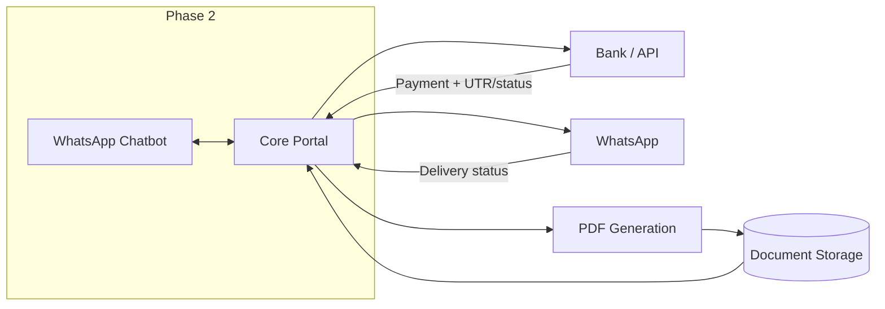
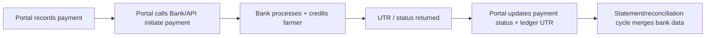

# Agri Procurement & Farmer Management System
## External Integrations Specification

---

## 1. Document Information

| Item | Value |
|---|---|
| Product name | Agri Procurement & Farmer Management System |
| Document | External Integrations Specification |
| Version | v1.0 |
| Status | Draft — provider-neutral; identifies required/anticipated integrations, their contracts and failure behaviour |
| Date | 2026-09-16 |
| Author role | Senior Integration / Solutions Architect |
| Purpose | Specify all external integrations (Banking/API, WhatsApp, PDF generation, document storage) covering purpose, workflow, data contract, direction of flow, security, failure, retry, timeout, rate limits, logging, audit, dependency, fallback, configuration and open questions |
| Primary source | `AgriProcurement & Farmer Management.pdf` — §8, §10–§13, §21 (WhatsApp/payment/statement) |
| Aligned specs | `docs/09_PAYMENT`, `docs/10_LEDGER`, `docs/11_WHATSAPP`, `docs/14_AUDIT`, `docs/15_DATABASE`, `docs/16_API`, `docs/18_SECURITY`, `docs/13_REPORTS` |

### Conventions

| Tag | Meaning |
|---|---|
| `[SOURCE §n]` | Statement from the original PDF section `n` |
| `[NEW]` | Newly approved Farmer Portal requirement |
| `[PROPOSED]` | Design addition — needs approval |
| `[UNDEFINED]` / OQ | Not specified; tracked open question (see per-integration § and §10) |
| Provider-neutral | No vendor/provider assumed unless the source names one (only **WhatsApp** is source-named). Marketing names appear only as examples in open questions. |

### Provider neutrality rule

Except WhatsApp (specified in the source `[SOURCE §8, §12, §13, §21]`), **no banking provider, PDF engine, or storage vendor is selected**. Every contract below defines behaviour, not brand. Vendor decisions are open questions (Q-INT-*).

---

## 2. Integration Landscape Overview

| ID | Integration | Category | Direction primary | Source basis |
|---|---|---|---|---|
| INT-01 | Banking / API | Payment + reconciliation | Outbound (payment init) + Inbound (status/UTR/webhook/statement) | `[SOURCE §10, §11]` |
| INT-02 | WhatsApp | Farmer notifications + statements | Outbound (Phase 1); bidirectional (Phase 2 chatbot) | `[SOURCE §8, §12, §13, §21]` |
| INT-03 | PDF generation | Statement/invoice/report artefacts | Outbound (data → PDF) | `[SOURCE §13]` (statement), OQ-07 (invoice PDF) |
| INT-04 | File / document storage | KYC, PDF artefacts, report exports, bank files | Bidirectional (store/retrieve) | `[UNDEFINED]` — "if required"; future-ready §20 (KYC) |

---

## 3. INT-01 — Banking / API

### 3.1 Purpose
Initiate farmer payments via the bank, capture UTR/status, and reconcile against the bank statement (`[SOURCE §10, §11]`). The portal is the control surface: payment entries, status tracking (Matched/Unmatched/Failed/Pending/Duplicate `[SOURCE §11]`), and the reconciliation queue (`docs/09`, `docs/13` K-11).

### 3.2 Business Workflow
**Desired workflow (source):** `Portal → Bank/API → Payment → UTR/status → Portal`

1. Payment actioned (or approved) in portal → request to bank.
2. Bank returns a reference (pending acceptance).
3. Asynchronous status/UTR arrives (poll or webhook / bank statement `[UNDEFINED]`).
4. Portal updates PAYMENT.status and ledger UTR (`[SOURCE §9, §10]`).
5. Reconciliation matches portal payments vs bank statement/UTR (`[SOURCE §11]`).

### 3.3 Data Exchanged

| Direction | Payload (provider-neutral) |
|---|---|
| Request (Portal → Bank) | Farmer identity (ID), registered farmer name, bank account number, IFSC, credit amount, payment reference/id, mode, request idempotency key |
| Response (Bank → Portal) | Bank/external reference, acceptance status, request id |
| Status/UTR (Bank → Portal) | Final status (success/failed/unknown), UTR, settlement date, credited amount |
| Reconciliation (Bank → Portal) | Bank statement/transaction extract (file or feed) with UTR/amounts/date |

Sensitive fields (bank account, IFSC, UTR) handled per `docs/18` §11 — masked display, encrypted at rest, never in logs. Farmer-bank data minimisation pending Q-PAY-001/Q-PAY-002.

### 3.4 Direction of Data Flow
Primary **outbound** (payment initiation) with **asynchronous inbound** (status/UTR) plus **inbound batch** for reconciliation. Synchronous success path is not assumed (payments settle asynchronously — status vocabulary `[SOURCE §11]`). The portal is the system of record; bank data is authoritative for settlement outcome.

### 3.5 Authentication
- Portal → Bank: provider-specified credential (API key, client certificate/mTLS, or mutual auth) stored in the secrets manager (`docs/18` §23). **Method `[UNDEFINED]` — provider dependent (Q-INT-03).**
- Bank → Portal inbound status/webhook: signed/verifiable messages; replay protection. Signature scheme pending Q-PAY-003.

### 3.6 Security
- TLS ≥ 1.2/1.3 end-to-end (`docs/18` §13, `[PROPOSED]`).
- Secrets: keys/certs never in code or config repo; rotation, role-segregated access (`docs/18` §23).
- No bank account/IFSC/UTR in logs, URLs, or errors (`[PROPOSED]`; `docs/18` §11).
- Idempotency keys prevent duplicate credits (OQ-13) — dedup at the request boundary.
- Provider-scoped data minimisation and DPA review pending Q-INT-15/Q-SEC-20.

### 3.7 Failure Scenarios
| Scenario | Behaviour |
|---|---|
| Request rejected (validation/insufficient balance) | Payment stays Pending/rejected with error reason; operator action via reconciliation queue |
| Timeout (no response) | Payment marked Pending; state machine resolved by reconciliation (`[SOURCE §11]` Pending/Unmatched) |
| Unknown/external failure | Pending; never auto-credited in portal without bank confirmation |
| Status never arrives | Reconciliation cycle resolves via statement/match (statuses `[SOURCE §11]`) |
| Duplicate request resubmission | Idempotency key absorbs; no double credit (OQ-13) |
| Duplicate payment detected | Payment marked Duplicate (`[SOURCE §11]`); resolution workflow |
| Bank statement mismatch | Unmatched entries enter reconciliation queue (PM-06, `docs/13`) |

### 3.8 Retry
- Safe, idempotent retry on transient network failures only (exponential backoff + jitter) — `[PROPOSED]`.
- **Business-level retry** (bank decline/error) is a **manual/operator action** from the reconciliation queue, not automatic (avoid duplicate credits). Approved retries reuse the same idempotency scope rules (Q-INT-04).
- Max automatic attempts per request and cooldown window `[UNDEFINED]` (Q-INT-05).

### 3.9 Timeout
- Synchronous request timeout (e.g., 15–30 s connect/2-min overall `[PROPOSED]`); beyond it the payment is treated as Pending and resolved asynchronously (never client-failed without bank confirmation). Values `[UNDEFINED]` (Q-INT-05).

### 3.10 Rate Limits
- Provider/API rate limits `[UNDEFINED]`; the portal must queue/throttle bursts (payment runs) and surface limit exhaustion in the reconciliation/status view. Limits learned from provider at selection (Q-INT-06).

### 3.11 Logging
- Request/response metadata logged **without sensitive fields** (payment id, external ref, status, latency, error code). Payloads of account/UTR **masked or excluded** (`docs/18` §11). Trace IDs correlate API ↔ webhook ↔ audit.

### 3.12 Audit
- Every transition of PAYMENT.status is an audit event with actor/system, before/after state (`[SOURCE §17]`, `docs/14`); UTR attachment to a payment is audited; external reference stored for traceability.

### 3.13 Dependency & 3.14 Fallback
- **Dependency:** banking integration is high-impact; portal payment actions depend on it for status truth. Portal remains usable but degraded: payment recording may proceed with status Pending, never assumed-paid (`[SOURCE §11]` viability).
- **Fallback:** manual payment entry/status update by accounts staff (the existing design keeps the portal authoritative); reconciliation can proceed from bank statement/UTR even when the real-time API is down. Proposal: state "bank unreachable" banner on payment screens. Fallback decision Q-INT-07.

### 3.15 Configuration
- Base URLs per environment, credential refs (secrets manager), idempotency namespace, status classifications, webhook/signing config, batch/statement ingestion config. Managed via Settings (`docs/16` Group 17, `docs/17` A16).

### 3.16 Open Questions
| ID | Question |
|---|---|
| Q-INT-03 | Banking provider & API protocol (REST/SFTP/FTP; status via webhook vs polling vs statement) |
| Q-INT-04 | Idempotency/retry semantics aligned with provider |
| Q-INT-05 | Timeout/retry budgets |
| Q-INT-06 | Rate/volume ceilings and burst policy |
| Q-INT-07 | Fallback mode approvals (manual entry always allowed?) |
| Q-INT-08 | Bank statement file format & ingestion schedule |
| Q-INT-15 | Bank-vendor DPA/data-residency and contractual security obligations |
| Existing | Q-PAY series (`docs/09`), Q-SEC-10, Q-SEC-20 |

---

## 4. INT-02 — WhatsApp

### 4.1 Purpose
Deliver notifications to farmers — purchase, payment, statement (`[SOURCE §8, §12]`) — including the monthly statement on the 1st (`[SOURCE §13]`). Phase 2 adds a chatbot (`[SOURCE §21]`). WhatsApp is **source-specified** (`[SOURCE §8, §21]`); the business/technology provider under WhatsApp is `[UNDEFINED]` (Q-WH-01, Q-INT-09).

### 4.2 Business Workflow
1. Business event triggers (purchase confirmed, payment UTR captured, statement generated) for a farmer.
2. Portal composes a message (with statement PDF where applicable `[SOURCE §12, §13]`).
3. Portal → WhatsApp API send; status callback (Generated/Sent/Delivered/Failed/Retry per `docs/11`).
4. Failure triggers retry policy (`docs/11` F-06).
5. Phase 2: farmer replies/commands → chatbot → responses (`[SOURCE §21]`), scope restricted to own data (P-ISO).

### 4.3 Data Exchanged
| Direction | Payload |
|---|---|
| Outbound | Farmer mobile (registered `[SOURCE §3]`), message type, message content, optional PDF (statement), template/command reference (`docs/11` 9 commands Phase 2) |
| Inbound (status) | Message ID, delivery status, timestamp |
| Inbound (Phase 2) | Farmer text/menu input |
Outbound phone numbers are PII — minimised, masked in logs (`docs/18`).

### 4.4 Direction of Data Flow
Phase 1: **outbound** with **inbound status callbacks**. Phase 2: **bidirectional** conversational channel; inbound requests are identity-scoped to the requesting farmer (P-ISO; `docs/11`).

### 4.5 Authentication
Provider API credentials (token/key) via secrets manager. Inbound (status, chatbot): verifiable signatures + replay protection. Identification of a farmer on inbound chat via registered mobile matching (OQ-17/lang, Q-WH-06).

### 4.6 Security
- Mobile numbers held minimised; no cross-farmer leakage in chatbot responses (P-ISO; E-FR-01).
- Message content may contain financial figures — treat as sensitive; no content in logs (masked).
- Statement PDFs addressed only to the owning farmer; delivery guarantees per `docs/11` (Undelivered/Retry).
- Provider security/DPA obligations reviewed pending Q-WH-08/Q-INT-15.

### 4.7 Failure Scenarios
| Scenario | Behaviour |
|---|---|
| Send failure (invalid number) | Marked Failed + Retry policy (`[SOURCE §13]` logic in `docs/11`) |
| Undelivered (no green ticks) | Retry window; reported Undelivered; cancellation rules OQ-06 |
| Farmer without WhatsApp | Notification channel falls back (see 4.14); delivery semantics `[UNDEFINED]` (Q-WH-04) |
| Statement PDF not attached | Send text-only with portal link (proposed, Q-WH-07) |
| Phase 2 inbound outside commands | Friendly reply + help (docs/11 command set) |

### 4.8 Retry
- Retry with backoff on transient failures; max attempts and interval per `docs/11` F-06 (`[PROPOSED]` values Q-WH-03).
- Cancelled/replaced numbers → marked failed, no retry (OQ-06).

### 4.9 Timeout
Send request timeout `[PROPOSED]` (e.g., 30 s); delivery confirmation is asynchronous status, not part of the send timeout. Values `[UNDEFINED]` (Q-WH-03).

### 4.10 Rate Limits
Provider daily/session limits (message volume, unreachable-rate thresholds) `[UNDEFINED]`; portal should queue statements (1st-of-month burst per `[SOURCE §13]`) within provider ceilings and spread sends. Policy Q-WH-08.

### 4.11 Logging
Message id, type, status transitions, retry count, latency — **no message body, no phone number in clear** (masked per `docs/18` OQ-18/`docs/11`).

### 4.12 Audit
Notification lifecycle is audited (`[SOURCE §17]`, `docs/14` WHATSAPP_MESSAGE events): generation, send attempt, status change; sensitive payloads not persisted in audit values.

### 4.13 Dependency & 4.14 Fallback
- **Dependency:** message-sending pipeline must not block core transaction commits (decoupled/async queue). Notification outage does not degrade procurement/payment integrity.
- **Fallback:** in-portal Notification inbox (`[NEW]`, `docs/17` F9) always available; retry queue holds messages; proposed SMS fallback `[UNDEFINED]` (Q-WH-09). Manual statement re-send (`docs/13` Q-RPT-04).

### 4.15 Configuration
Provider credential refs, sender/template identifiers, status webhook config, retry policy, 1st-of-month statement job trigger, Phase 2 menu/commands (`docs/11` §8 config as proposed).

### 4.16 Open Questions
| ID | Question |
|---|---|
| Q-INT-09 | WhatsApp business/API provider (template approval, opt-in semantics) |
| Q-INT-10 | Template/text localisation (Q-WH-06, OQ-17) |
| Q-INT-11 | Delivery/permission status semantics (green ticks, blocked numbers) |
| Q-INT-15 | Provider DPA/data-residency/security obligations |
| Existing | Q-WH-01…09 (`docs/11`), Q-INT-07 (fallback), OQ-17 (languages) |

---

## 5. INT-03 — PDF Generation

### 5.1 Purpose
Produce paginated, printer/WhatsApp-ready artefacts: **monthly statements** (`[SOURCE §13]`), invoices (OQ-07), and report exports (`[SOURCE §14]` PDF). Internal capability — a library or internal service, **not an external vendor choice** (Q-INT-12).

### 5.2 Business Workflow
1. Trigger: statement job (1st monthly `[SOURCE §13]`), invoice generation, report export request.
2. Service renders template + data (`docs/13` columns, `docs/10` statement layout — layout Undefined Q-RPT-01).
3. PDF artefact stored (INT-04) and/or dispatched (WhatsApp INT-02, portal download `[NEW]`).
4. Download/redelivery uses stored artefact (no re-render churn).

### 5.3 Data Exchanged
In: template identifier + data payload (farmer header, purchases/payments, outstanding per `docs/10`). Out: PDF binary (+ optional content-hash). No PII beyond the document content itself.

### 5.4 Direction of Data Flow
Internal: **Portal → PDF engine** (generation); **engine → storage/WhatsApp/portal** (artefact distribution). No inbound external surface.

### 5.5 Authentication
Internal-to-internal auth (service token) `[PROPOSED]`; PDF delivery to external targets governed by the target integration (WhatsApp creds, signed portal download).

### 5.6 Security
- PDFs may contain financial + bank data → stored encrypted at rest (`docs/18` §14), served via signed expiring URLs (`[PROPOSED]`), never public paths.
- Metadata scrubbing (no author server paths) `[PROPOSED]`; audit of generation/download (`docs/13` §18).

### 5.7 Failure Scenarios; 5.8 Retry; 5.9 Timeout
| Scenario | Behaviour |
|---|---|
| Rendering failure (data/config) | Mark artefact failed; retry job with backoff (`[PROPOSED]`, max attempts Q-INT-05); operator visibility |
| Timeout on large statements | Async generation; streaming; per-document timeout `[PROPOSED]` |
| Storage unavailable | Generation queues until storage returns (INT-04 dependency) |

Idempotent regeneration: regeneration does **not** reuse invoice numbers (`[SOURCE §6]` rule) — re-render of an existing artefact must not create new identity.

### 5.10 Rate Limits
Concurrency cap on renders (batch statement runs). Throughput sized for 10k→50k farmers monthly (`[SOURCE §1, §19]`), e.g., 1st-of-month peak (Q-INT-13).

### 5.11 Logging & 5.12 Audit
Log render id, template, timing, size (no content). Audit events: generated, downloaded, regenerated (`[SOURCE §17]`).

### 5.13 Dependency & 5.14 Fallback
- **Dependency:** statement dispatch (WhatsApp/portal) depends on PDF artefact.
- **Fallback:** text-only notification if PDF render fails (Q-WH-07); regenerate-on-demand from stored transaction data (safe — no number reuse).

### 5.15 Configuration
Template registry, fonts/units/formatting (Q-RPT-03), storage namespace, async job settings.

### 5.16 Open Questions
| ID | Question |
|---|---|
| Q-INT-12 | PDF engine/library and licensing |
| Q-INT-13 | Peak rendering capacity on 1st-of-month statement runs |
| Q-INT-14 | PDF layout/formatting standard (ties Q-RPT-01, Q-RPT-03) |
| Existing | OQ-07 (invoice PDF), Q-RPT-03 (number/currency/date formats) |

---

## 6. INT-04 — File / Document Storage (if required)

### 6.1 Purpose
Optional/anticipated object storage for: **KYC documents** (future-ready `[SOURCE §20]`, E-06 `docs/15`), PDF artefacts (INT-03), report export archives, and bank statement files (INT-01). Conditional — confirm need at implementation (Q-INT-16).

### 6.2 Business Workflow
Upload (authorized staff/admin) → private store → signed URL → viewer/browser; downloads logged. Bank files: ingestion → parse → reconciliation; artefacts retained per retention policy (OQ-11).

### 6.3 Data Exchanged
Documents in/out with metadata (entity ref, type, staged status). KYC documents are highly sensitive (masked, access-controlled — `docs/18` §12).

### 6.4 Direction of Data Flow
Bidirectional between portal and store; external exposure only via signed, expiring URLs (no public read).

### 6.5 Authentication
Service credential for store access (sts/policies per doc class) `[PROPOSED]`; no end-user store credentials.

### 6.6 Security
Encryption at rest (`docs/18` §14); AV scan queue on upload (`docs/18` §19; Q-SEC-13); access logging; retention/anonymisation per OQ-11.

### 6.7 Failure Scenarios; 6.8 Retry; 6.9 Timeout
| Scenario | Behaviour |
|---|---|
| Upload failure | Retry with backoff; fail job gracefully for KYC (operator re-upload), never silently drop |
| Storage outage | Portal degrades: PDF/statement distribution delayed (queue); core transactions unaffected |
| Quota exceeded | Alert + config to raise; staged files not lost |

### 6.10 Rate Limits
Per-user upload caps; concurrent transfer limits `[PROPOSED]`.

### 6.11 Logging & 6.12 Audit
Object id, owner, type, size (no content). Every upload/download/delete audited with actor (`docs/14` KYC/audit events; `docs/18` §12).

### 6.13 Dependency & 6.14 Fallback
- **Dependency:** KYC and PDF artefacts; not on transaction path.
- **Fallback:** DB BLOB option (proposed) if object store unavailable; generation-on-demand re-proof.

### 6.15 Configuration
Namespace/buckets, retention, size caps, signed URL TTLs.

### 6.16 Open Questions
| ID | Question |
|---|---|
| Q-INT-16 | Is document storage actually required in Phase 1 (KYC §20 future-ready)? |
| Q-INT-17 | Storage provider/approach (object store vs DB BLOB) |
| Q-INT-18 | Retention & deletion schedules (ties OQ-11) |
| Existing | Q-SEC-08, Q-SEC-13, Q-RPT-03 |

---

## 7. Cross-Cutting Integration Concerns

| Concern | Rule | Source |
|---|---|---|
| Secrets | All integration credentials in the secrets manager; none in code/repo | `docs/18` §23 `[PROPOSED]` |
| Transport | TLS ≥ 1.2 everywhere; partner TLS termination reviewed | `docs/18` §13, Q-SEC-10 |
| Idempotency | Mutation of external calls idempotent (payment = key example) | OQ-13 |
| Logging | Never log account/UTR/mobile in clear; correlatable trace id | `docs/18` §11/§20 |
| Audit | External-triggered state changes mirrored into audit events | `[SOURCE §17]`, `docs/14` |
| Failure isolation | External outages degrade but never corrupt core transaction integrity | derived `docs/18` |
| Configuration | Central settings module; per-environment; changes audited | `[SOURCE §16]`; `docs/16` G17 |

---

## 8. Integration Dependency Summary

| Flow | Depends on | Degrades to |
|---|---|---|
| Payment action/status | INT-01 | Manual entry + reconciliation from statement; Pending semantics |
| Purchase/payment notification | INT-02 | In-portal notifications; retry queue |
| Monthly statement dispatch | INT-03 → INT-02 | Text notification + portal download (proposed) |
| Invoice/statement download | INT-03 → INT-04 | Regenerate from store or on-demand |
| KYC upload/view (future) | INT-04 | N/A until adopted (Q-INT-16) |

---

## 9. Source Reaffirmation

| Fact | Source |
|---|---|
| Bank payment/UTR/status model with Matched/Unmatched/Failed/Pending/Duplicate | `[SOURCE §10, §11]` |
| Desired workflow Portal → Bank → Payment → UTR/status → Portal | `[SOURCE §10, §11]` (mandated workflow) |
| WhatsApp notification for purchase/payment/statement | `[SOURCE §8, §12, §13]` |
| Monthly statement sent via WhatsApp on 1st | `[SOURCE §13]` |
| Phase 2 chatbot on WhatsApp | `[SOURCE §21]` |
| Statements are usual PDF format | `[SOURCE §13, §12]` |
| Farmer bank account/IFSC in master data | `[SOURCE §3]` |

---

## 10. Consolidated Integration Open Questions

| ID | Integration | Question |
|---|---|---|
| Q-INT-03 | Banking | Provider, API protocol, status mechanism |
| Q-INT-04 | Banking | Idempotency/retry semantics |
| Q-INT-05 | Banking/PDF | Timeout & retry budgets |
| Q-INT-06 | Banking | Rate/volume ceilings |
| Q-INT-07 | Banking | Fallback mode approvals |
| Q-INT-08 | Banking | Statement file format & schedule |
| Q-INT-09 | WhatsApp | Provider & template/opt-in semantics |
| Q-INT-10 | WhatsApp | Message language/localisation |
| Q-INT-11 | WhatsApp | Delivery/permission status meaning |
| Q-INT-12 | PDF | Engine/library selection |
| Q-INT-13 | PDF | 1st-of-month batch capacity |
| Q-INT-14 | PDF | Layout/format standard |
| Q-INT-15 | All | Provider DPA/data-residency/security obligations (ties Q-SEC-20) |
| Q-INT-16 | Storage | Phase 1 requirement confirmation |
| Q-INT-17 | Storage | Provider/approach |
| Q-INT-18 | Storage | Retention/deletion |

---

*End of External Integrations Specification v1.0. Next in sequence: `20_NON_FUNCTIONAL_REQUIREMENTS_AND_SCALABILITY.md`.*