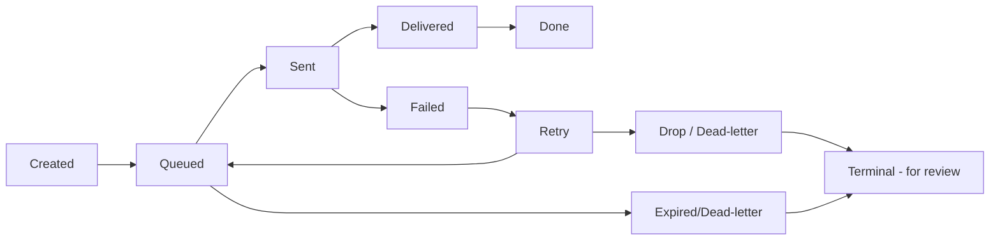

# Agri Procurement & Farmer Management System
## Notification Specification

---

## 1. Document Information

| Item | Value |
|---|---|
| Product name | Agri Procurement & Farmer Management System |
| Document | Notification Specification |
| Version | v1.0 |
| Status | Draft — covers source-mandated notifications (purchase, payment, monthly statement) over WhatsApp, plus the `[NEW]` in-portal Farmer Portal notifications |
| Date | 2026-09-16 |
| Author role | Senior Solutions / Integration Architect |
| Purpose | Specify the notification system: event catalogue, channels, lifecycle/status model, delivery tracking, failure & retry, and audit |
| Primary source | `AgriProcurement & Farmer Management.pdf` — §8, §12, §13, §21 |
| Aligned specs | `docs/07_FARMER_PORTAL…`, `docs/09_PAYMENT…`, `docs/10_LEDGER…`, `docs/11_WHATSAPP…` (message status model F-06, delivery semantics), `docs/14_AUDIT…`, `docs/18_SECURITY…`, `docs/19_EXTERNAL_INTEGRATIONS…` |

### Conventions

| Tag | Meaning |
|---|---|
| `[SOURCE §n]` | Statement from the original PDF section `n` |
| `[NEW]` | Newly approved Farmer Portal requirement |
| `[PROPOSED]` | Design addition — requires approval before implementation |
| `[UNDEFINED]` / OQ | Not specified in the source; tracked open question (§12) |

### Scope & channel rules

1. **Source-mandated channels:** WhatsApp for purchase/payment/statement notifications (`[SOURCE §8, §12, §13]`). In-portal notifications are `[NEW]` (Farmer Portal requirement).
2. **SMS / email / push are NOT assumed** — where they appear they are explicitly `[PROPOSED]` (e.g., fallbacks, OTP).
3. The notification lifecycle in §4 is `[PROPOSED]` technical model (aligned to `docs/11`); the source defines only the WhatsApp delivery states (Sent/Delivered green-tick semantics, failed/retry per statement fulfilment `[SOURCE §13]`).

---

## 2. Notification Events — Source Mandate

| Event | Source | Channel (source) |
|---|---|---|
| Purchase notification | Purchase made → farmer informed with invoice/net amount | WhatsApp `[SOURCE §8]` |
| Payment notification | Payment done → amount + UTR notified | WhatsApp `[SOURCE §12]` |
| Monthly statement | Statement on 1st of each month as PDF | WhatsApp `[SOURCE §13]` |

In-portal equivalents for farmers are `[NEW]`: My Notifications screen with history and (proposed) read-state (`docs/07` §16, `docs/17` F9).

---

## 3. Notification Channels

| Channel | Status | Notes |
|---|---|---|
| WhatsApp (outbound) | `[SOURCE §8, §12, §13]` | Primary source channel; delivery status via provider callbacks (`docs/11`, `docs/19` INT-02) |
| In-portal (Farmer Portal) `[NEW]` | `[NEW]` | History + (proposed) read/unread; available even when WhatsApp fails |
| SMS | `[PROPOSED]` | Fallback only; not required by source; pending Q-NTF-08 |
| Email | `[PROPOSED]` | Admin-side alerting only; not farmer-facing (pending Q-NTF-09) |
| Push | `[PROPOSED]` | No native app (web portal only) — out of scope unless future mobile (`[NEW]` no app in Phase 1) |

---

## 4. Notification Lifecycle

> The source defines WhatsApp delivery semantics (Sent → Delivered via green ticks `[SOURCE §13]` context; failed → retry). The full **Created → Queued → …** pipeline is a `[PROPOSED]` technical model consistent with `docs/11` (MessageStatus: Generated / Sent / Delivered / Failed / Retry).

| State | Meaning | Notes |
|---|---|---|
| Created | Event accepted; notification record + audit entry created | `[PROPOSED]` |
| Queued | Enqueued for channel dispatch (async; not blocking transactions) | `[PROPOSED]` (decoupling rule `docs/19`) |
| Sent | Handed to provider (e.g., WhatsApp send accepted) | Corresponds to WhatsApp "Sent" (single tick) |
| Delivered | Confirmed delivered (WhatsApp double/green tick); in-portal: read (proposed P-FF-02) | `[SOURCE §13]` delivery semantics for statements |
| Failed | Send failed / marked failed after retries | Source retry requirement for statements `[SOURCE §13]` |
| Retry | Scheduled retry within policy | Policy F-06 (`docs/11`); max attempts `[UNDEFINED]` (Q-NTF-04) |
| Terminal (review/dead-letter) | After retry budget exhausted — surfaced for manual review; never silent | `[PROPOSED]` |

**Rules**
- One logical notification can target multiple channels (WhatsApp + in-portal); status tracks **per channel** with a single logical parent (status = worst/failing channel for visibility; each channel state kept).
- Queueing/failure must not block the core transaction that created the event (`docs/19` §8).

---

## 5. Notification Event Matrix

| Event | Recipient | Channel | Trigger | Data | Status Tracking |
|---|---|---|---|---|---|
| Purchase notification | Farmer (purchase owner) | WhatsApp + In-portal `[NEW]` | Purchase/invoice confirmed (invoice + net amount) `[SOURCE §8]` | Invoice number, date, product, quantity, rate, gross, deduction, net amount | WhatsApp: Sent/Delivered/Failed/Retry; In-portal: delivered-on-view (read proposed) |
| Payment notification | Farmer (payee) | WhatsApp + In-portal `[NEW]` | Payment recorded/UTR captured `[SOURCE §12]` | Payment amount, UTR, bank reference (masked display), date | WhatsApp states; In-portal states; UTR-sensitive (masked per OQ-18) |
| Monthly statement | Farmer (statement owner) | WhatsApp (PDF) + In-portal `[NEW]` | 1st-of-month statement job `[SOURCE §13]` | Statement period, opening, purchases, payments, closing/outstanding (values per `docs/10`), PDF artefact | WhatsApp states; PDF generation state (INT-03); Undelivered → retry `[SOURCE §13]` |
| OTP delivery `[PROPOSED]` | Farmer | WhatsApp/SMS `[PROPOSED]` | Farmer login OTP request | OTP (masked in logs/audit), expiry, attempt count | Verify-only channel; never persisted in audit values (Q-NTF-10, OQ-02) |
| Statement/job failure alert (admin) `[PROPOSED]` | SUPER_ADMIN | In-portal admin / email `[PROPOSED]` | Statement batch or WhatsApp pipeline failure | Batch id, failure reason, count, retry status | Admin alert states; feeds reconciliation/monitoring |
| Reconciliation resolution notice `[PROPOSED]` | Farmer | In-portal `[NEW]` (+ WhatsApp optional) | Payment matched/changed after reconciliation (status change to farmer-relevant state) | Payment id, UTR, resolved status | In-portal states; dedup vs original payment notice (Q-NTF-11) |

*Matrix covers the three source-mandated notifications; `[PROPOSED]` rows are additions for approval. No SMS/email/push assumed outside proposed rows.*

---

## 6. WhatsApp Notifications

- Outbound messages for the three events via the WhatsApp integration (`docs/19` INT-02; provider under WhatsApp `[UNDEFINED]` Q-INT-09).
- Content composition: purchase (invoice + net amount `[SOURCE §8]`), payment (amount + UTR `[SOURCE §12]`), statement (PDF attachment `[SOURCE §13]`).
- Delivery status reported by provider callbacks → status model (`docs/11`); statement undelivered → retry `[SOURCE §13]`.
- Message content may contain financial figures — provider content security/DPA per Q-INT-15; number masking in logs (`docs/18` §11).

---

## 7. In-Portal Notifications (Farmer Portal) `[NEW]`

- Farmer Portal provides a notification surface (screen F9 `docs/17`; history FR-PRT-010).
- `[NEW]` design:
  - Same events mirrored in-portal (purchase, payment, statement) with deep-links to My Purchases / My Payments / My Statements.
  - Read/unread marker `[PROPOSED]` (P-FF-02); unread badge.
  - Works even when WhatsApp delivery fails or farmer lacks WhatsApp (fallback + coexistence).
  - Scrollable history with retention window (OQ-11; Q-NTF-05).
  - Own-data only (P-ISO) — notifications target the session Farmer ID.

---

## 8. Delivery Tracking

- **WhatsApp:** provider-reported states (Sent single-tick → Delivered double/green-tick `[SOURCE §13]` context); Undelivered/expired → Failed → Retry (`docs/11` F-06). Per-message status stored; cancelled numbers → no retry (OQ-06).
- **In-portal:** delivered-on-render (viewed) state `[PROPOSED]`; explicit read state `[PROPOSED]` (P-FF-02).
- **Statement PDF** additionally tracks artefact generation (INT-03) separate from channel delivery; retry covers the whole send.

---

## 9. Failed Notification

| Failure class | Behaviour |
|---|---|
| Provider send error (auth/template) | Failed immediately; surfaced; operator review (dead-letter) |
| Undelivered (no tick / number invalid) | Marked Failed/Undelivered; retry per policy; cancelled number = no retry (OQ-06) |
| Statement PDF not generated (INT-03 down) | Notification fails and lists in failed queue; text-only fallback `[PROPOSED]` Q-WH-07 |
| Farmer has no WhatsApp | Channel fails → in-portal remains the delivery path; SMS fallback `[PROPOSED]` (Q-NTF-08) |
| Failed notifications reporting | Failure register with per-farmer retry status; feeds admin visibility (`[PROPOSED]`) |

---

## 10. Retry

- Policy per `docs/11` F-06 (WhatsApp retry with expiry/limits); exact max attempts, backoff and expiry `[UNDEFINED]` (Q-NTF-04) — `[PROPOSED]` default: bounded attempts with exponential backoff, then terminal for manual review.
- Regeneration safety: retries must not duplicate financial artefacts or message identities; no invoice renumbering (OQ-07/`[SOURCE §6]` rule).
- Statement retry per `[SOURCE §13]` (source explicitly indicates retry for statement delivery).
- In-portal: no retry needed (immediate), read-state only.

---

## 11. Notification Audit

- Every lifecycle transition is an audit event (`[SOURCE §17]`, `docs/14` WHATSAPP_MESSAGE / NOTIFICATION catalogues): created, queued, sent, delivered, failed, retried, dead-lettered — with actor (system/operator), channel, timestamp, trace id.
- Audit values never contain message body, OTP, UTR, or phone numbers in clear (masked per `docs/18` §11, `docs/18` §20).
- Manual re-sends and operator interventions (retry approvals, dead-letter resolution) audited with actor identity.
- Cross-reference to external integration logs via trace/message id (`docs/19` §7).

---

## 12. Open Questions

| ID | Question |
|---|---|
| Q-NTF-01 | Exact WhatsApp message text/templates for purchase, payment, statement (ties Q-WH-06, Q-INT-10) |
| Q-NTF-02 | In-portal notification retention window (ties OQ-11) |
| Q-NTF-03 | Whether in-portal read/receipt state is required (P-FF-02) |
| Q-NTF-04 | Retry counts/backoff/expiry (= F-06 details; max attempts) |
| Q-NTF-05 | Notification volume/lifecycle limits per farmer |
| Q-NTF-06 | Statement "undelivered" semantics & user action (ties Q-WH-04) |
| Q-NTF-07 | Suppression rules (e.g., cancelled invoice — no notification? OQ) |
| Q-NTF-08 | SMS fallback approval |
| Q-NTF-09 | Admin alert channels (email) approval |
| Q-NTF-10 | OTP-with-notification lifecycle & expiry (ties OQ-02, Q-SEC-02) |
| Q-NTF-11 | Dedup rules when reconciliation changes a payment already notified |
| Reused | Q-WH series (`docs/11`), Q-INT series (`docs/19`), Q-SEC-02 (farmer auth/OTP), OQ-11 (retention) |

---

## 13. Source Reaffirmation

| Fact | Source |
|---|---|
| Purchase notification on WhatsApp with invoice + net amount | `[SOURCE §8]` |
| Payment notification on WhatsApp with amount + UTR | `[SOURCE §12]` |
| Monthly statement on WhatsApp as PDF on 1st of month | `[SOURCE §13]` |
| Statement delivery retry / non-delivery handling | `[SOURCE §13]` |
| Phase 2 WhatsApp chatbot (extends notification scope) | `[SOURCE §21]` |
| Lifecycle (Created…Retry), in-portal channel, SMS/email/push: technical model / proposals | `[PROPOSED]` — not stated in source |

---

*End of Notification Specification v1.0. Next in sequence: `21_NON_FUNCTIONAL_REQUIREMENTS_AND_SCALABILITY.md`.*